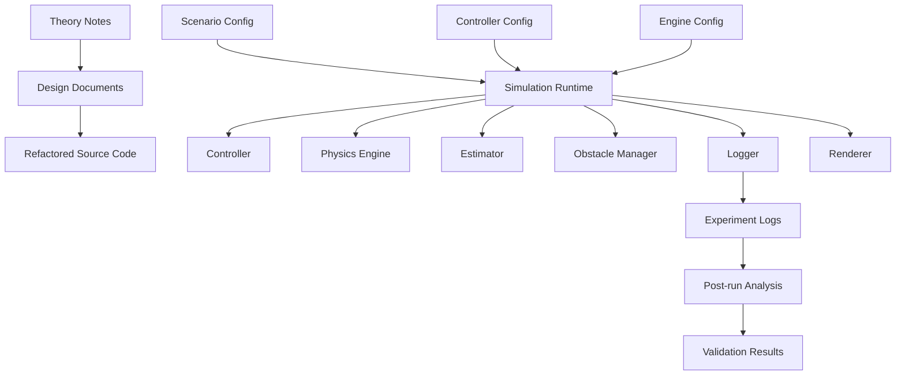
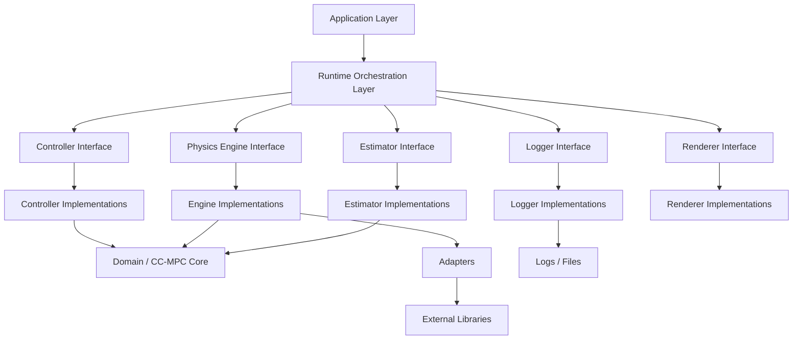
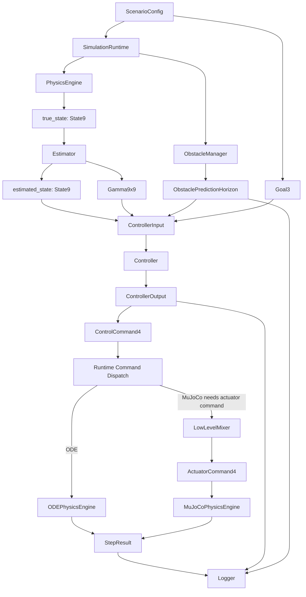

# 02_ARCHITECTURE.md

> Status: Draft
> Scope: Ideal design after refactor
> Project: Quadrotor CC-MPC Simulation
> Related documents:
>
> * `03_RUNTIME_FLOW.md`
> * `04_DATA_MODEL.md`
> * `05_ENGINE_INTERFACE.md`
> * `06_CONTROLLER_INTERFACE.md`
> * `ADR/ADR-001-engine-abstraction.md`
> * `ADR/ADR-002-single-thread-vs-mpc-thread.md`
> * `ADR/ADR-003-state-vector-definition.md`
> * `ADR/ADR-004-control-command-definition.md`

---

## 1. Purpose

This document defines the high-level software architecture of the refactored quadrotor CC-MPC simulation.

The goal is to transform the current demo-oriented implementation into a modular, testable, research-grade simulation architecture.

This document describes:

1. System boundaries.
2. Architectural layers.
3. Module responsibilities.
4. Dependency rules.
5. Runtime orchestration.
6. Engine/controller separation.
7. Data ownership.
8. Package layout.
9. Extension points.
10. Testing and validation expectations.

This document is normative.
After refactor, source code shall conform to this architecture instead of treating current demo scripts as the final system design.

---

## 2. Architectural Goals

The refactored architecture shall satisfy the following goals.

### 2.1 Correctness

The architecture shall make data meaning explicit.

The following concepts shall not be ambiguous:

```text
state
control
actuator command
physics engine
controller
estimator
obstacle prediction
logger
runtime
```

The system shall use canonical data contracts defined in `04_DATA_MODEL.md`.

---

### 2.2 Replaceability

The architecture shall allow replacing major components without changing unrelated modules.

Examples:

```text
ODEPhysicsEngine    -> MuJoCoPhysicsEngine
CCMPCController     -> PIDController
IdealEstimator      -> VIOEstimator
CSVLogger           -> ParquetLogger
NullRenderer        -> MuJoCoViewerRenderer
```

Replacement shall be achieved through interfaces, not by editing runtime logic everywhere.

---

### 2.3 Reproducibility

The reference runtime shall be deterministic single-thread mode.

Given the same:

```text
scenario
config
initial state
random seed
controller settings
solver settings
physics backend
```

the simulation should produce the same trajectory and log output within numerical tolerance.

---

### 2.4 Debuggability

The architecture shall make it possible to determine whether a failure came from:

```text
controller
dynamics model
physics engine
mixer
estimator
obstacle manager
runtime dispatch
configuration
logger
```

Each layer shall expose enough diagnostics to support debugging.

---

### 2.5 Research Extensibility

The architecture shall support future research extensions, including:

```text
new physics backends
new controller types
full Newton-Euler model
new obstacle prediction models
new uncertainty propagation methods
multi-agent extensions
hardware-in-the-loop experiments
```

These extensions shall not require rewriting the entire simulation.

---

## 3. Non-Goals

This architecture does not attempt to:

1. Define the full mathematical derivation of CC-MPC.
2. Define every solver constraint.
3. Define the full MuJoCo XML structure.
4. Provide a real-time deployment architecture for onboard flight.
5. Replace validation experiments.
6. Guarantee physical equivalence between ODE and MuJoCo engines.
7. Define a GUI application architecture.

Those concerns are handled in other documents or future milestones.

---

## 4. System Context

The simulation system sits between theory, experiment configuration, numerical optimization, physics simulation, and result analysis.



The system is not a single monolithic script.
It is a collection of modules connected by explicit interfaces.

---

## 5. Architectural Style

The refactored system shall use a layered architecture with explicit module boundaries.

The main layers are:

```text
Application Layer
Runtime Orchestration Layer
Interface Layer
Domain Layer
Adapter Layer
Infrastructure Layer
Experiment Layer
```

High-level dependency direction:

```text
Application
    -> Runtime
        -> Interfaces
            -> Domain
            -> Adapters
                -> Infrastructure
```

Lower-level modules shall not depend on higher-level modules.

---

## 6. Layered Architecture



---

## 7. Layer Responsibilities

### 7.1 Application Layer

The application layer is the entry point for running experiments.

Responsibilities:

```text
parse CLI arguments
select config files
call config loader
create SimulationApp
start simulation run
return process exit code
```

Example files:

```text
scripts/run_simulation.py
scripts/benchmark.py
scripts/replay_log.py
```

The application layer shall not implement controller logic, physics stepping, or solver details.

---

### 7.2 Runtime Orchestration Layer

The runtime layer coordinates all modules.

Responsibilities:

```text
initialize modules
own main loop
call estimator
call obstacle manager
call controller
dispatch command to engine
call logger
call renderer
check termination conditions
collect metrics
```

Example files:

```text
simulation/runtime/app.py
simulation/runtime/loop.py
simulation/runtime/dispatch.py
simulation/runtime/timing.py
simulation/runtime/termination.py
```

The runtime is the only layer allowed to orchestrate cross-module interactions.

---

### 7.3 Interface Layer

The interface layer defines stable contracts.

Core interfaces:

```text
PhysicsEngine
Controller
Estimator
LowLevelMixer
Logger
Renderer
ObstacleManager
```

The interface layer shall define types such as:

```text
StepResult
ControllerInput
ControllerOutput
ControllerDiagnostics
EngineMetadata
ControllerMetadata
LogRecord
```

The purpose is to keep implementation details hidden behind stable APIs.

---

### 7.4 Domain Layer

The domain layer contains project-specific mathematical and control logic.

Examples:

```text
CC-MPC formulation
quadrotor reduced dynamics
linearization
covariance propagation
chance constraints
obstacle geometry
control allocation
state validation
```

Example files:

```text
ccmpc/dynamics.py
ccmpc/ccmpc.py
ccmpc/uncertainty.py
ccmpc/obstacle.py
ccmpc/mixer.py
ccmpc/utils.py
```

The domain layer may depend on NumPy, SciPy, and CVXPY where appropriate.

The domain layer shall not depend on runtime, CLI scripts, logger, or renderer.

---

### 7.5 Adapter Layer

The adapter layer converts between canonical project data and external-library data.

Examples:

```text
State9 <-> MuJoCo qpos/qvel
Euler ZYX <-> quaternion
ActuatorCommand4 -> MuJoCo ctrl
Config YAML -> typed config objects
LogRecord -> CSV row
```

Example files:

```text
simulation/engines/adapters/mujoco_state_adapter.py
simulation/engines/adapters/mujoco_actuator_adapter.py
simulation/config/loader.py
simulation/logging/csv_adapter.py
```

Adapters shall be explicit.
No module shall silently reinterpret state ordering, units, or frame conventions.

---

### 7.6 Infrastructure Layer

The infrastructure layer handles external libraries and I/O.

Examples:

```text
MuJoCo
CVXPY solver backend
file system
CSV writer
plotting backend
viewer backend
random seed control
```

Infrastructure details shall not leak into controller or runtime data contracts.

---

### 7.7 Experiment Layer

The experiment layer contains scenarios, configs, logs, and benchmark scripts.

Examples:

```text
config/
models/
logs/
results/
scripts/
```

Experiment files are inputs and outputs.
They shall not define the software architecture implicitly.

---

## 8. Proposed Package Layout

Recommended refactored layout:

```text
quadrotor_ccmpc/
├── ccmpc/
│   ├── __init__.py
│   ├── types.py
│   ├── dynamics.py
│   ├── linearization.py
│   ├── uncertainty.py
│   ├── obstacle.py
│   ├── mixer.py
│   ├── utils.py
│   └── controllers/
│       ├── __init__.py
│       ├── ccmpc_controller.py
│       ├── fallback_controller.py
│       └── solver_adapter.py
│
├── simulation/
│   ├── __init__.py
│   ├── app.py
│   ├── config/
│   │   ├── __init__.py
│   │   ├── schema.py
│   │   ├── loader.py
│   │   └── validation.py
│   │
│   ├── runtime/
│   │   ├── __init__.py
│   │   ├── loop.py
│   │   ├── timing.py
│   │   ├── dispatch.py
│   │   ├── termination.py
│   │   ├── metrics.py
│   │   └── errors.py
│   │
│   ├── engines/
│   │   ├── __init__.py
│   │   ├── base.py
│   │   ├── metadata.py
│   │   ├── factory.py
│   │   ├── ode_engine.py
│   │   ├── mujoco_engine.py
│   │   └── adapters/
│   │       ├── __init__.py
│   │       ├── mujoco_state_adapter.py
│   │       └── mujoco_actuator_adapter.py
│   │
│   ├── controllers/
│   │   ├── __init__.py
│   │   ├── base.py
│   │   ├── metadata.py
│   │   └── factory.py
│   │
│   ├── estimation/
│   │   ├── __init__.py
│   │   ├── base.py
│   │   ├── ideal_estimator.py
│   │   └── noisy_estimator.py
│   │
│   ├── obstacles/
│   │   ├── __init__.py
│   │   ├── manager.py
│   │   └── prediction.py
│   │
│   ├── logging/
│   │   ├── __init__.py
│   │   ├── base.py
│   │   ├── records.py
│   │   ├── csv_logger.py
│   │   └── summary.py
│   │
│   └── rendering/
│       ├── __init__.py
│       ├── base.py
│       ├── null_renderer.py
│       └── matplotlib_renderer.py
│
├── config/
│   ├── mpc.yaml
│   ├── simulation.yaml
│   └── scenarios/
│
├── models/
│   └── quadrotor.xml
│
├── scripts/
│   ├── run_simulation.py
│   ├── benchmark.py
│   └── replay_log.py
│
├── tests/
│   ├── unit/
│   ├── integration/
│   └── regression/
│
└── docs/
    └── design/
```

---

## 9. Core Modules

### 9.1 `ccmpc/types.py`

Defines canonical data types.

Examples:

```text
State9
Goal3
ControlCommand4
ActuatorCommand4
Trajectory9
ControlTrajectory4
Gamma9x9
Sigma3x3
```

This module shall not depend on physics engine implementations.

---

### 9.2 `simulation/runtime`

Owns orchestration.

Key files:

| File             | Responsibility             |
| ---------------- | -------------------------- |
| `loop.py`        | deterministic runtime loop |
| `timing.py`      | due-time helpers           |
| `dispatch.py`    | command dispatch           |
| `termination.py` | termination checks         |
| `metrics.py`     | step metrics               |
| `errors.py`      | runtime errors             |

The runtime shall depend on interfaces, not concrete implementations where possible.

---

### 9.3 `simulation/engines`

Owns physics backend abstraction.

Key files:

| File               | Responsibility                                                    |
| ------------------ | ----------------------------------------------------------------- |
| `base.py`          | `PhysicsEngine` protocol/base class                               |
| `metadata.py`      | `EngineMetadata`, `EngineType`, `EngineCommandType`, `StepResult` |
| `factory.py`       | create engine from config                                         |
| `ode_engine.py`    | reduced ODE engine                                                |
| `mujoco_engine.py` | MuJoCo engine                                                     |
| `adapters/`        | MuJoCo state/control conversion                                   |

---

### 9.4 `simulation/controllers`

Owns controller interface and controller factories.

Key files:

| File          | Responsibility                                     |
| ------------- | -------------------------------------------------- |
| `base.py`     | `Controller` interface                             |
| `metadata.py` | `ControllerInput`, `ControllerOutput`, diagnostics |
| `factory.py`  | create controller from config                      |

The actual CC-MPC implementation may remain in `ccmpc/controllers/`.

---

### 9.5 `ccmpc/controllers`

Owns concrete controller implementations.

Key files:

| File                     | Responsibility                                    |
| ------------------------ | ------------------------------------------------- |
| `ccmpc_controller.py`    | wraps CC-MPC solver behind `Controller` interface |
| `fallback_controller.py` | fallback commands                                 |
| `solver_adapter.py`      | CVXPY/CLARABEL interaction                        |

---

### 9.6 `simulation/estimation`

Owns state-estimation abstraction.

Initial implementations:

```text
IdealEstimator
NoisyStateEstimator
```

Future implementations:

```text
VIOEstimator
EKFEstimator
ExternalEstimatorAdapter
```

Estimator output shall be:

```text
estimated_state: State9
covariance: Gamma9x9
```

---

### 9.7 `simulation/obstacles`

Owns obstacle runtime state and prediction.

Responsibilities:

```text
load obstacle specs
maintain obstacle runtime state
predict obstacle horizon
provide obstacle data to controller
compute collision metrics
```

Obstacle detection from raw images shall not be implemented inside the controller.

---

### 9.8 `simulation/logging`

Owns run output.

Responsibilities:

```text
create LogRecord
write CSV or structured logs
write run metadata
write final summary
ensure logs are immutable snapshots
```

Logger shall not call controller, engine, or mixer directly.

---

### 9.9 `simulation/rendering`

Owns visualization.

Initial renderers:

```text
NullRenderer
MatplotlibRenderer
```

Optional future renderers:

```text
MuJoCoViewerRenderer
Open3DRenderer
WebRenderer
```

Renderer shall read snapshots only.
Renderer shall not mutate physics state.

---

## 10. Dependency Rules

### 10.1 Allowed dependency direction

Allowed:

```text
scripts -> simulation.app
simulation.app -> simulation.runtime
simulation.runtime -> interfaces
simulation.runtime -> factories
interfaces -> ccmpc.types
concrete implementations -> domain modules
adapters -> external libraries
logger -> LogRecord
renderer -> render packet
```

---

### 10.2 Disallowed dependencies

Disallowed:

```text
ccmpc.dynamics -> simulation.runtime
ccmpc.ccmpc -> simulation.engines.mujoco_engine
controller -> MuJoCo qpos/qvel
controller -> logger
physics engine -> controller
physics engine -> logger
logger -> physics engine
renderer -> physics engine internals
config loader -> controller solve loop
```

---

### 10.3 Import rule

Domain modules shall not import runtime modules.

Bad:

```python
from simulation.runtime.loop import SimulationRuntime
```

inside:

```text
ccmpc/dynamics.py
ccmpc/ccmpc.py
ccmpc/uncertainty.py
```

Good:

```python
from ccmpc.types import State9, ControlCommand4
```

---

## 11. Data Flow

The canonical data flow is:



---

## 12. Runtime Architecture

The runtime shall implement the reference deterministic flow:

```text
true_state
-> estimated_state
-> obstacle prediction
-> controller output
-> command dispatch
-> physics step
-> log
-> render
-> termination check
```

The detailed runtime flow is defined in `03_RUNTIME_FLOW.md`.

The runtime shall be the only module responsible for coordinating cross-module calls.

---

## 13. Controller Architecture

The controller layer shall expose a stable interface.

Input:

```text
ControllerInput
```

Output:

```text
ControllerOutput
```

The high-level controller output shall always be:

```text
ControlCommand4
```

The controller shall not output rotor thrust.

Rotor thrust belongs to:

```text
LowLevelMixer
```

or actuator-level engine adapters.

---

## 14. Physics Engine Architecture

The physics layer shall expose a stable `PhysicsEngine` interface.

Every engine shall expose:

```text
State9
```

at its public boundary.

The ODE engine may consume:

```text
ControlCommand4
```

The MuJoCo rotor-force engine should consume:

```text
ActuatorCommand4
```

The runtime decides which command path is required by inspecting `EngineMetadata`.

---

## 15. Adapter Architecture

Adapters are required whenever data crosses a representation boundary.

Examples:

```text
State9 <-> MuJoCo qpos/qvel
Euler ZYX <-> quaternion
ActuatorCommand4 -> MuJoCo ctrl
YAML -> typed config
LogRecord -> CSV row
```

Adapters shall be tested independently.

Adapters shall not silently change:

```text
state ordering
unit convention
coordinate frame
quaternion order
rotor ordering
command semantics
```

---

## 16. Configuration Architecture

Configuration shall be loaded and validated before runtime begins.

The runtime shall receive typed config objects.

Bad:

```python
controller = CCMPCController()
controller.load_yaml("mpc.yaml")
```

Good:

```python
config = load_app_config(path)
controller = create_controller(config.controller)
```

Recommended config ownership:

| Config             | Owner              |
| ------------------ | ------------------ |
| `AppConfig`        | application        |
| `RuntimeConfig`    | runtime            |
| `ScenarioConfig`   | scenario loader    |
| `ControllerConfig` | controller factory |
| `EngineConfig`     | engine factory     |
| `LoggingConfig`    | logger factory     |
| `RenderingConfig`  | renderer factory   |

---

## 17. Logging Architecture

Logging shall be snapshot-based.

The runtime builds:

```text
LogRecord
```

The logger writes:

```text
CSV
JSONL
Parquet
summary file
```

depending on implementation.

Logger shall not mutate runtime state.

Logger shall not call:

```text
controller.compute_command()
engine.step()
mixer.compute()
```

The logger receives data.
It does not produce control or physics behavior.

---

## 18. Rendering Architecture

Rendering shall be optional.

The simulation must run in headless mode.

Renderer input shall be a snapshot or render packet containing:

```text
true_state
estimated_state
goal
obstacles
predicted trajectory
current command
metrics
```

Renderer shall not read MuJoCo internals unless it is specifically a MuJoCo viewer renderer.

Renderer shall not mutate simulation state.

---

## 19. Error Handling Architecture

Errors shall be classified by layer.

| Layer      | Example error           | Handling                              |
| ---------- | ----------------------- | ------------------------------------- |
| Config     | invalid timestep        | fail before run                       |
| Runtime    | unsupported engine mode | fail before run                       |
| Controller | infeasible QP           | fallback or terminate                 |
| Engine     | NaN state               | terminate                             |
| Mixer      | invalid thrust          | fallback or terminate                 |
| Logger     | cannot write file       | terminate or continue based on config |
| Renderer   | viewer closed           | disable renderer or terminate         |

Recommended exception hierarchy:

```text
SimulationError
ConfigError
RuntimeError
ControllerError
EngineError
MixerError
LoggingError
RenderingError
```

Runtime shall convert module errors into a final `RunSummary`.

---

## 20. Testing Architecture

The project shall use layered tests.

### 20.1 Unit tests

Unit tests validate individual modules.

Examples:

```text
State9 validation
ControlCommand4 validation
Euler/quaternion conversion
ODE dynamics step
covariance propagation
obstacle prediction
mixer output bounds
chance constraint RHS
```

---

### 20.2 Interface tests

Interface tests validate contracts.

Examples:

```text
PhysicsEngine returns State9
Controller returns ControlCommand4
Logger accepts LogRecord
MuJoCo adapter round-trip
runtime dispatch uses mixer for MuJoCo
runtime dispatch skips mixer for ODE
```

---

### 20.3 Integration tests

Integration tests validate multi-module behavior.

Examples:

```text
ODE engine + controller + logger
MuJoCo engine + mixer + logger
scenario loading + runtime loop
controller failure + fallback
goal reached termination
collision termination
```

---

### 20.4 Regression tests

Regression tests protect expected behavior.

Examples:

```text
same scenario produces same final goal distance
no NaN in trajectory
solver failure rate below threshold
no collision in known safe scenario
log schema unchanged
```

---

## 21. Validation Architecture

Validation shall be separated from normal runtime.

Recommended validation structure:

```text
tests/
├── unit/
├── integration/
├── regression/
└── validation/
```

Validation scripts may run longer experiments and generate reports.

Validation topics:

```text
state mapping correctness
ODE vs MuJoCo qualitative behavior
controller convergence
chance-constraint satisfaction
obstacle avoidance
logging completeness
runtime determinism
```

Detailed validation plan shall be defined in `09_VALIDATION_PLAN.md`.

---

## 22. Extension Points

The architecture shall support extension through interfaces.

### 22.1 New controller

To add a new controller:

```text
implement Controller interface
return ControllerOutput
register in controller factory
add tests
```

No engine changes should be required.

---

### 22.2 New physics engine

To add a new physics engine:

```text
implement PhysicsEngine interface
declare EngineMetadata
provide adapters if needed
register in engine factory
add tests
```

No controller changes should be required.

---

### 22.3 New logger

To add a new logger:

```text
implement Logger interface
accept LogRecord
register in logger factory
add schema tests
```

No controller or engine changes should be required.

---

### 22.4 New estimator

To add a new estimator:

```text
implement Estimator interface
return estimated_state and covariance
register in estimator factory
add tests
```

No controller interface changes should be required if output remains canonical.

---

## 23. Architectural Invariants

The following invariants shall always hold.

### Invariant 1: Canonical state

All public simulation state shall be:

```text
State9 = [x, y, z, vx, vy, vz, roll, pitch, yaw]
```

---

### Invariant 2: Controller output

High-level controllers shall output:

```text
ControlCommand4 = [phi_c, theta_c, vz_c, psi_dot_c]
```

---

### Invariant 3: Actuator command separation

Rotor thrust shall be represented as:

```text
ActuatorCommand4 = [T1, T2, T3, T4]
```

and shall not be confused with `ControlCommand4`.

---

### Invariant 4: Engine boundary

Physics engines shall expose `State9`.

Engine internals shall stay internal.

---

### Invariant 5: Runtime owns orchestration

Only runtime coordinates controller, engine, mixer, logger, renderer, and termination.

---

### Invariant 6: Logger is passive

Logger records snapshots.
Logger does not affect simulation behavior.

---

### Invariant 7: Renderer is passive

Renderer displays snapshots.
Renderer does not affect simulation behavior.

---

## 24. Migration Plan

### Phase 1: Introduce canonical types

Create:

```text
State9
ControlCommand4
ActuatorCommand4
Trajectory9
Gamma9x9
LogRecord
```

---

### Phase 2: Introduce interfaces

Create:

```text
PhysicsEngine
Controller
Estimator
LowLevelMixer
Logger
Renderer
```

---

### Phase 3: Wrap current ODE implementation

Move current reduced dynamics stepping behind:

```text
ODEPhysicsEngine
```

---

### Phase 4: Wrap current MuJoCo implementation

Move MuJoCo state and actuator handling behind:

```text
MuJoCoPhysicsEngine
MuJoCoStateAdapter
MuJoCoActuatorAdapter
```

---

### Phase 5: Wrap current CC-MPC solver

Expose solver through:

```text
CCMPCController
```

that implements:

```text
Controller
```

---

### Phase 6: Implement deterministic runtime

Replace script-specific loops with:

```text
SimulationRuntime
```

---

### Phase 7: Implement logging and validation

Add:

```text
LogRecord
CSVLogger
RunSummary
Validation tests
```

---

### Phase 8: Retire demo scripts as architecture source

Keep demo scripts only as thin entry points or examples.

They shall not define core architecture.

---

## 25. Risks and Mitigations

### Risk 1: Over-abstraction

Too many interfaces can slow implementation.

Mitigation:

```text
keep interfaces small
only abstract stable boundaries
avoid abstracting every helper function
```

---

### Risk 2: Adapter bugs

State conversion between MuJoCo and `State9` may be wrong.

Mitigation:

```text
round-trip tests
reset/get_state consistency test
quaternion normalization test
Euler convention test
```

---

### Risk 3: Runtime becomes a god object

Runtime may become too large.

Mitigation:

```text
split runtime into loop, timing, dispatch, termination, metrics
keep module internals outside runtime
```

---

### Risk 4: Controller and engine model mismatch

Controller prediction model may not match physics backend.

Mitigation:

```text
document engine/controller model pairing
log engine type and controller dynamics type
add validation experiments
```

---

### Risk 5: Logs become incomplete

If logs omit command or solver info, debugging becomes difficult.

Mitigation:

```text
define required LogRecord fields
test log schema
store run metadata
store controller diagnostics
```

---

## 26. Acceptance Criteria

This architecture document is accepted when:

1. Layer boundaries are defined.
2. Package layout is defined.
3. Module responsibilities are defined.
4. Dependency rules are defined.
5. Runtime orchestration responsibility is clear.
6. Controller and engine are separated.
7. Data contracts are tied to `DATA_MODEL.md`.
8. ODE and MuJoCo are replaceable through `PhysicsEngine`.
9. Logging and rendering are passive modules.
10. Migration plan is defined.
11. Tests and validation architecture are specified.

---

## 27. Summary

The refactored quadrotor CC-MPC simulation shall use a modular layered architecture.

The central design decisions are:

```text
State9 is the canonical state.
ControlCommand4 is the canonical high-level controller command.
ActuatorCommand4 is the canonical actuator-level command.
Physics engines are abstracted behind PhysicsEngine.
Controllers are abstracted behind Controller.
Runtime owns orchestration.
Adapters isolate engine-specific representations.
Logger and renderer are passive consumers of snapshots.
Deterministic single-thread runtime is the reference mode.
```

This architecture makes the project easier to debug, validate, extend, and use for academic research.

---

## 28. Related Documents

```text
docs/design/00_SIMULATION_VISION.md
docs/design/01_REQUIREMENTS.md
docs/design/03_RUNTIME_FLOW.md
docs/design/04_DATA_MODEL.md
docs/design/05_ENGINE_INTERFACE.md
docs/design/06_CONTROLLER_INTERFACE.md
docs/design/07_SCENARIO_CONFIG.md
docs/design/08_LOGGING_AND_METRICS.md
docs/design/09_VALIDATION_PLAN.md
docs/design/10_KNOWN_LIMITATIONS.md
docs/design/11_REFACTOR_PLAN.md

docs/design/ADR/ADR-001-engine-abstraction.md
docs/design/ADR/ADR-002-single-thread-vs-mpc-thread.md
docs/design/ADR/ADR-003-state-vector-definition.md
docs/design/ADR/ADR-004-control-command-definition.md

docs/theory/02_Quadrotor_Dynamics.md
docs/theory/06_Quaternion.md
docs/theory/10_State_Space_Model.md
docs/theory/11_MPC.md
docs/theory/12_CCMPC.md
docs/theory/14_Covariance_Propagation.md
docs/theory/18_Implementation_Notes.md
```
