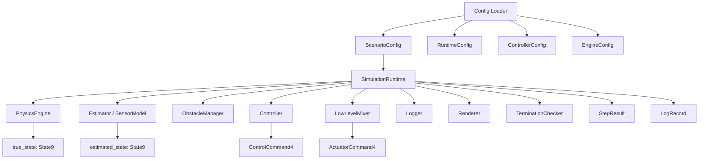
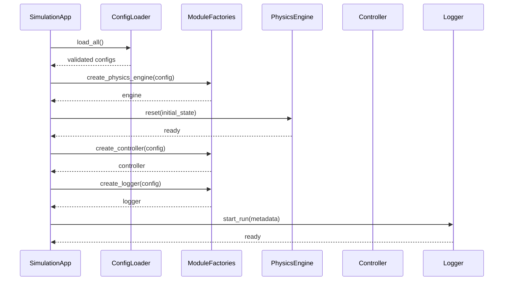
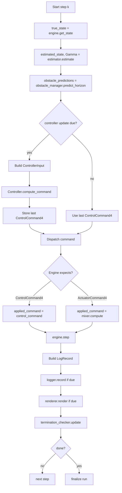
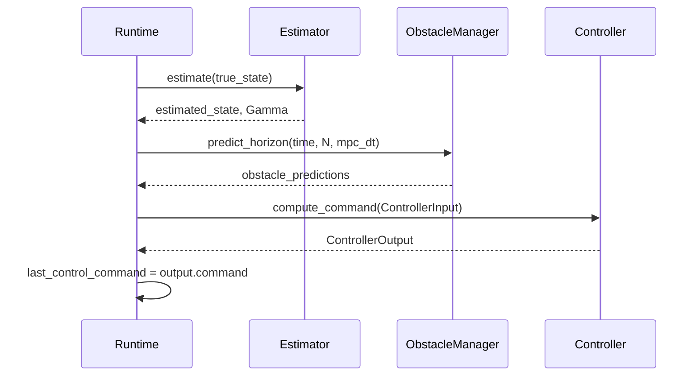
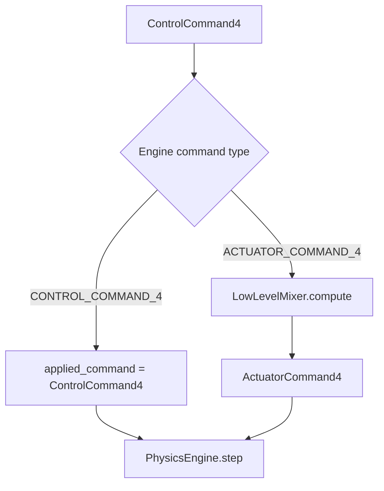
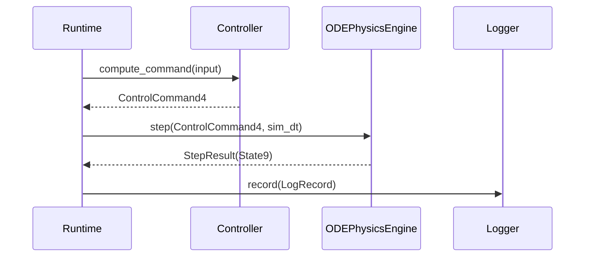
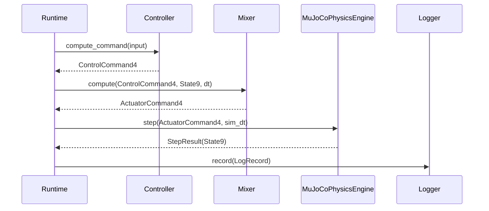

# 03_RUNTIME_FLOW.md

> Status: Draft
> Scope: Ideal design after refactor
> Project: Quadrotor CC-MPC Simulation
> Related documents:
>
> * `04_DATA_MODEL.md`
> * `05_ENGINE_INTERFACE.md`
> * `06_CONTROLLER_INTERFACE.md`
> * `ADR/ADR-001-engine-abstraction.md`
> * `ADR/ADR-002-single-thread-vs-mpc-thread.md`
> * `ADR/ADR-003-state-vector-definition.md`
> * `ADR/ADR-004-control-command-definition.md`

---

## 1. Purpose

This document defines the runtime execution flow of the refactored quadrotor CC-MPC simulation.

It specifies:

1. How the simulation is initialized.
2. How one simulation step is executed.
3. How physics, estimator, obstacle manager, controller, mixer, logger, and renderer interact.
4. How different update rates are coordinated.
5. How `ControlCommand4` and `ActuatorCommand4` are dispatched.
6. How solver failure, physics failure, and termination conditions are handled.
7. How deterministic and real-time runtime modes differ.

This document defines orchestration logic only.

It does not define:

```text id="n0iwjl"
MPC optimization internals
ODE dynamics equations
MuJoCo XML details
Low-level mixer equations
Scenario YAML schema
CSV column schema
```

Those are defined in separate documents.

---

## 2. Runtime Design Goal

The refactored runtime shall be an orchestrator.

It shall coordinate modules, but it shall not own their internal logic.

The runtime shall orchestrate:

```text id="g7ixd7"
PhysicsEngine
Estimator / SensorModel
ObstacleManager
Controller
LowLevelMixer
Logger
Renderer
TerminationChecker
MetricsCollector
```

The runtime shall not implement:

```text id="pwbqfl"
quadrotor dynamics
MPC solver details
MuJoCo state conversion
rotor mixing equations
obstacle detection internals
CSV serialization internals
plotting internals
```

---

## 3. Runtime Architecture



---

## 4. Runtime Responsibilities

The runtime shall be responsible for:

```text id="mbsra8"
loading already-validated config objects
creating simulation modules through factories
resetting modules before run
maintaining global simulation step index
maintaining simulation time
deciding when controller should run
deciding whether mixer is needed
calling PhysicsEngine.step()
calling Logger.record()
calling Renderer.render() if enabled
checking termination conditions
handling runtime-level errors
```

The runtime shall not be responsible for:

```text id="8csf67"
parsing raw YAML inside the loop
solving MPC directly
writing CSV directly
reading MuJoCo qpos/qvel directly
modifying controller internals
mutating logger records after creation
```

---

## 5. Data Contracts Used by Runtime

The runtime shall use the canonical data contracts defined in `04_DATA_MODEL.md`.

Core data types:

| Data Type                   | Runtime Usage                        |
| --------------------------- | ------------------------------------ |
| `State9`                    | true state and estimated state       |
| `Goal3`                     | goal position                        |
| `ControlCommand4`           | high-level controller output         |
| `ActuatorCommand4`          | low-level physics actuator command   |
| `Trajectory9`               | predicted MPC trajectory             |
| `ControlTrajectory4`        | predicted MPC command sequence       |
| `Gamma9x9`                  | state covariance                     |
| `ObstaclePredictionHorizon` | obstacle prediction over MPC horizon |
| `ControllerInput`           | package sent to controller           |
| `ControllerOutput`          | package returned by controller       |
| `StepResult`                | physics step result                  |
| `LogRecord`                 | logging snapshot                     |

---

## 6. Runtime Modes

The refactored simulation shall support three runtime modes.

---

### 6.1 Deterministic single-thread mode

This is the default mode for research, debugging, testing, and reproducible experiments.

Properties:

```text id="eyu34x"
single process
single main loop
deterministic execution order
physics stepping and controller calls occur in fixed order
no background controller thread
no race condition between physics and MPC
```

Recommended default:

```yaml id="ypvfin"
runtime:
  mode: deterministic_single_thread
```

This mode shall be used for:

```text id="sqhz9p"
unit tests
integration tests
regression tests
paper-style experiments
CSV generation
debugging controller failures
debugging engine mismatch
```

---

### 6.2 Real-time viewer mode

This mode allows visualization while simulation runs.

Properties:

```text id="5mo5x9"
may run with wall-clock pacing
may render at lower rate than physics
may use MuJoCo viewer
may skip rendering frames if needed
physics/controller order remains deterministic if single-threaded
```

Recommended config:

```yaml id="8q25wz"
runtime:
  mode: realtime_viewer
  realtime_factor: 1.0
  render_enabled: true
```

This mode is for visual inspection, not primary regression testing.

---

### 6.3 Threaded runtime mode

Threaded mode may be used if real-time visualization or high-frequency physics requires it.

Properties:

```text id="i2oi5l"
physics may run in one thread
controller may run in another thread
shared state requires synchronization
commands may be delayed
runtime must handle stale controller output
```

Threaded mode is not the default.

The final decision on single-thread versus MPC-thread architecture shall be documented in:

```text id="8nek2n"
ADR/ADR-002-single-thread-vs-mpc-thread.md
```

Until that ADR is accepted, deterministic single-thread mode shall be treated as the reference runtime.

---

## 7. Timing Model

The runtime shall distinguish four time intervals.

| Name            | Meaning                             |
| --------------- | ----------------------------------- |
| `sim_dt`        | Physics simulation timestep         |
| `controller_dt` | Controller update period            |
| `mpc_dt`        | MPC prediction timestep             |
| `render_dt`     | Renderer update period              |
| `log_dt`        | Logger update period if downsampled |

---

### 7.1 Recommended relationship

For deterministic simulation:

```text id="7n99et"
controller_dt = k_control * sim_dt
render_dt     = k_render  * sim_dt
log_dt        = k_log     * sim_dt
```

where:

```text id="b3h5ct"
k_control, k_render, k_log are positive integers
```

Recommended validation:

```text id="p48s4y"
controller_dt % sim_dt == 0 within tolerance
render_dt % sim_dt == 0 within tolerance
log_dt % sim_dt == 0 within tolerance
```

---

### 7.2 MPC timestep

`mpc_dt` is the discretization interval used inside the MPC prediction model.

Usually:

```text id="z172wr"
mpc_dt == controller_dt
```

However, this is not strictly required.

If:

```text id="7kvapl"
mpc_dt != controller_dt
```

the controller interface shall document how command application timing is handled.

Recommended initial policy:

```text id="czbhzc"
mpc_dt == controller_dt
```

---

### 7.3 Physics timestep

`sim_dt` is the timestep passed to the physics engine.

For ODE:

```text id="y7d92h"
ODEPhysicsEngine.step(command, sim_dt)
```

For MuJoCo:

```text id="o4ybbl"
MuJoCoPhysicsEngine.step(command, sim_dt)
```

MuJoCo may internally subdivide `sim_dt` into several MuJoCo substeps.

---

### 7.4 Command hold policy

If the controller runs slower than physics:

```text id="ylx0kn"
controller_dt > sim_dt
```

then the runtime shall hold the last valid command between controller updates.

Recommended policy:

```text id="m6qrdn"
zero-order hold
```

Meaning:

```text id="m19rb4"
use last_control_command until next controller cycle
```

For MuJoCo actuator-level simulation:

```text id="yw18ty"
hold last_actuator_command
```

unless the mixer must be recomputed every physics step.

---

## 8. Initialization Flow

The runtime initialization shall execute in the following order.

```text id="j3akt5"
1. Load configuration.
2. Validate configuration.
3. Load scenario.
4. Build initial State9.
5. Build Goal3.
6. Build ObstacleManager.
7. Create PhysicsEngine through engine factory.
8. Reset PhysicsEngine with initial State9.
9. Create Estimator / SensorModel.
10. Create Controller through controller factory.
11. Create LowLevelMixer if needed.
12. Create Logger.
13. Create Renderer if enabled.
14. Initialize TerminationChecker.
15. Initialize MetricsCollector.
16. Enter runtime loop.
```

---

### 8.1 Initialization sequence diagram



---

## 9. One Runtime Step

A runtime step is one physics step.

At each runtime step, the simulation shall execute:

```text id="lic6ha"
1. Read true_state from PhysicsEngine.
2. Estimate state and covariance.
3. Update or predict obstacles.
4. Decide whether controller update is due.
5. If due, call Controller.compute_command().
6. Dispatch command depending on engine command type.
7. Step PhysicsEngine.
8. Build LogRecord.
9. Record log if logging is due.
10. Render if rendering is due.
11. Check termination conditions.
12. Advance runtime counters.
```

---

## 10. Reference Single-Thread Runtime Flow

This is the normative flow for deterministic simulation.



---

## 11. Detailed Step Order

### 11.1 Read true state

The runtime shall read the current true state from the engine.

```python id="oz1ixb"
true_state = engine.get_state()
```

Rules:

```text id="s2ujws"
true_state must be State9
true_state must not contain NaN or Inf
runtime must not access engine internals
```

---

### 11.2 Estimate state

The runtime shall pass `true_state` to the estimator or sensor model.

```python id="th3cxo"
estimated_state, covariance = estimator.estimate(true_state)
```

The estimator may be:

```text id="0d8i28"
IdealEstimator
NoisyStateEstimator
VIOModel
ExternalEstimatorAdapter
```

In ideal mode:

```text id="gvf7ek"
estimated_state = true_state
```

But the controller input field shall still be named:

```text id="2zaz48"
estimated_state
```

---

### 11.3 Predict obstacles

The runtime shall request obstacle predictions from the obstacle manager.

```python id="e0iu8n"
obstacle_predictions = obstacle_manager.predict_horizon(
    time=current_time,
    horizon_steps=controller_config.horizon_steps,
    dt=controller_config.timestep,
)
```

Obstacle prediction may use:

```text id="rj8h7l"
static obstacle model
constant velocity model
tracked obstacle state
sensor-detected obstacle state
```

The controller shall not directly read raw sensor data.

---

### 11.4 Decide controller update

The runtime shall determine whether the controller should run at the current step.

```python id="o9qj0o"
controller_due = step_index % controller_period_steps == 0
```

Where:

```text id="xtlcjg"
controller_period_steps = round(controller_dt / sim_dt)
```

If `controller_due` is true, the runtime shall call the controller.

If false, it shall reuse the last valid control command.

---

### 11.5 Build ControllerInput

When controller update is due:

```python id="3n1k9f"
controller_input = ControllerInput(
    time=current_time,
    estimated_state=estimated_state,
    goal=scenario.goal,
    covariance=covariance,
    obstacle_predictions=obstacle_predictions,
    previous_solution=None,
    reference_trajectory=None,
    config=controller_config,
)
```

The runtime shall not pass:

```text id="5hyrjy"
MuJoCo qpos
MuJoCo qvel
MuJoCo MjData
rotor thrust
logger object
renderer object
```

to the controller.

---

### 11.6 Call controller

```python id="qwke7t"
controller_output = controller.compute_command(controller_input)
```

The controller shall return:

```text id="48ehxo"
ControllerOutput
```

The runtime shall extract:

```python id="296by3"
control_command = controller_output.command
```

The command shall be:

```text id="ev5kn7"
ControlCommand4
```

---

### 11.7 Use previous command if controller is not due

If the controller is not due, the runtime shall use:

```text id="7ec3hs"
last_control_command
```

If `last_control_command` does not exist, the runtime shall use a safe initial command.

Recommended safe initial command:

```text id="qk8n7k"
ControlCommand4 = [0, 0, 0, 0]
```

or a configured hover command.

---

### 11.8 Dispatch command to engine

The runtime shall inspect engine metadata.

```python id="gt9tfi"
metadata = engine.get_metadata()
```

If engine expects `ControlCommand4`:

```python id="ubtxk4"
applied_command = control_command
```

If engine expects `ActuatorCommand4`:

```python id="z35tv8"
applied_command = mixer.compute(
    command=control_command,
    state=true_state,
    previous_state=previous_true_state,
    dt=sim_dt,
)
```

The runtime shall not directly reinterpret `ControlCommand4` as rotor thrust.

---

### 11.9 Step physics engine

```python id="86tnn1"
step_result = engine.step(
    command=applied_command,
    dt=sim_dt,
)
```

The result shall contain:

```text id="lm7gs9"
time
dt
true_state
applied_command
success
status
engine_info
```

If `step_result.success` is false, runtime shall enter error handling.

---

### 11.10 Build LogRecord

The runtime shall build a log snapshot.

```python id="2hnwh8"
log_record = LogRecord(
    step=step_index,
    time=step_result.time,
    true_state=step_result.true_state,
    estimated_state=estimated_state,
    control_command=control_command,
    actuator_command=applied_command if is_actuator_command else None,
    predicted_trajectory=controller_output.predicted_trajectory,
    control_trajectory=controller_output.control_trajectory,
    solver_status=controller_output.diagnostics.status,
    solver_time_ms=controller_output.diagnostics.solve_time_ms,
    goal_distance=goal_distance,
    collision_flag=collision_flag,
)
```

The logger shall record snapshots only.

The logger shall not mutate runtime state.

---

### 11.11 Render if due

If rendering is enabled and render update is due:

```python id="xt3i4n"
renderer.render(render_packet)
```

The render packet may include:

```text id="lhhp7r"
true_state
estimated_state
goal
obstacles
predicted_trajectory
current command
```

Renderer shall not mutate engine state.

---

### 11.12 Check termination

The runtime shall check termination after physics step and logging.

Termination conditions may include:

```text id="tgws0b"
goal reached
collision detected
maximum simulation time reached
maximum step count reached
altitude violation
numerical failure
solver failure policy triggered
user interrupt
```

If termination is true, runtime shall finalize the run.

---

## 12. Controller Update Flow

A controller update is a slower loop nested inside physics stepping.



Controller output contains:

```text id="gnmwt9"
first command to apply now
predicted state trajectory
planned control sequence
diagnostics
```

Only the first command shall be applied.

---

## 13. Command Dispatch Flow



Dispatch rules:

| Engine command type  | Runtime action                           |
| -------------------- | ---------------------------------------- |
| `CONTROL_COMMAND_4`  | pass `ControlCommand4` directly          |
| `ACTUATOR_COMMAND_4` | call mixer, then pass `ActuatorCommand4` |
| unsupported          | raise runtime error                      |

---

## 14. ODE Runtime Flow

For ODE simulation:

```text id="dim3b2"
ControllerOutput.command -> ControlCommand4
ControlCommand4 -> ODEPhysicsEngine.step()
ODEPhysicsEngine -> State9
```

No mixer is required.

Sequence:



---

## 15. MuJoCo Runtime Flow

For MuJoCo rotor-force simulation:

```text id="tca4x8"
ControllerOutput.command -> ControlCommand4
ControlCommand4 -> LowLevelMixer
LowLevelMixer -> ActuatorCommand4
ActuatorCommand4 -> MuJoCoPhysicsEngine.step()
MuJoCoPhysicsEngine -> State9
```

Sequence:



---

## 16. Logging Flow

The runtime shall build `LogRecord` from data produced during the step.

Logging data sources:

| Source             | Data                                          |
| ------------------ | --------------------------------------------- |
| PhysicsEngine      | `true_state`, `engine_info`                   |
| Estimator          | `estimated_state`, `Gamma9x9`                 |
| Controller         | `ControlCommand4`, `Trajectory9`, diagnostics |
| Mixer              | `ActuatorCommand4`                            |
| ObstacleManager    | obstacle states and predictions               |
| TerminationChecker | goal/collision status                         |
| Runtime            | step index, time, mode                        |

Logger shall not call:

```text id="uhufnk"
controller.compute_command()
engine.step()
mixer.compute()
```

Logger receives only data from runtime.

---

## 17. Termination Flow

Termination shall be checked after each physics step.

Recommended conditions:

```python id="5cwgmo"
class TerminationReason(str, Enum):
    GOAL_REACHED = "goal_reached"
    COLLISION = "collision"
    MAX_TIME = "max_time"
    MAX_STEPS = "max_steps"
    ALTITUDE_VIOLATION = "altitude_violation"
    NUMERICAL_FAILURE = "numerical_failure"
    SOLVER_FAILURE = "solver_failure"
    USER_INTERRUPT = "user_interrupt"
```

Termination result:

```python id="y09kpi"
@dataclass(frozen=True)
class TerminationStatus:
    done: bool
    reason: TerminationReason | None
    message: str
```

The runtime shall include termination status in final run summary.

---

## 18. Error Handling

Runtime errors shall be classified.

| Error type             | Example            | Recommended handling                  |
| ---------------------- | ------------------ | ------------------------------------- |
| Config error           | invalid `sim_dt`   | fail before run                       |
| Engine error           | NaN state          | terminate run                         |
| Controller input error | invalid covariance | terminate or fallback                 |
| Solver failure         | infeasible QP      | use fallback                          |
| Mixer error            | invalid thrust     | terminate or fallback                 |
| Logger error           | cannot write file  | terminate or continue based on config |
| Renderer error         | viewer closed      | disable renderer or terminate         |

---

### 18.1 Solver failure policy

If controller returns fallback output:

```text id="8lh5qa"
diagnostics.fallback_used == True
```

runtime may continue.

If controller returns no valid command:

```text id="pxu2nu"
command is None
```

runtime shall apply emergency policy.

Recommended emergency command:

```text id="n76m49"
ControlCommand4 = [0, 0, 0, 0]
```

or configured safe descent:

```text id="3rhc98"
ControlCommand4 = [0, 0, vz_descent, 0]
```

The emergency policy shall be configurable.

---

### 18.2 Engine failure policy

If `PhysicsEngine.step()` fails:

```text id="6qupwc"
StepResult.success == False
```

runtime shall:

```text id="swjylj"
record failure log
mark termination reason
finalize run
```

Recommended termination reason:

```text id="v5t8w6"
NUMERICAL_FAILURE
```

---

### 18.3 Timeout policy

If controller solve time exceeds deadline:

```text id="r87x9l"
solve_time_ms > controller_deadline_ms
```

runtime may:

```text id="yzu6mh"
accept output but mark late
use previous valid command
use fallback command
terminate run
```

Recommended initial policy for deterministic experiments:

```text id="5pjzpb"
accept output and mark late
```

Recommended policy for real-time simulation:

```text id="t4z08j"
use previous valid command or fallback
```

---

## 19. Multi-Rate Runtime

The runtime shall support different rates.

Example:

```yaml id="by3ip4"
runtime:
  sim_dt: 0.01
  controller_dt: 0.06
  render_dt: 0.03
  log_dt: 0.01
```

This means:

```text id="k3t7zo"
physics runs at 100 Hz
controller runs at about 16.7 Hz
renderer runs at about 33.3 Hz
logger records at 100 Hz
```

The controller command is held between controller updates.

---

### 19.1 Multi-rate pseudocode

```python id="3e362d"
for step_index in range(max_steps):
    current_time = engine.get_time()

    true_state = engine.get_state()
    estimated_state, covariance = estimator.estimate(true_state)

    if is_due(current_time, next_controller_time):
        controller_output = run_controller(...)
        last_control_command = controller_output.command
        next_controller_time += controller_dt

    applied_command = dispatch_command(
        control_command=last_control_command,
        engine=engine,
        mixer=mixer,
        true_state=true_state,
        previous_true_state=previous_true_state,
        dt=sim_dt,
    )

    step_result = engine.step(applied_command, sim_dt)

    if is_due(step_result.time, next_log_time):
        logger.record(...)
        next_log_time += log_dt

    if render_enabled and is_due(step_result.time, next_render_time):
        renderer.render(...)
        next_render_time += render_dt

    if termination_checker.done(...):
        break

    previous_true_state = true_state
```

---

## 20. Deterministic Runtime Requirements

For deterministic mode, the runtime shall guarantee:

```text id="e8rf2g"
fixed module call order
fixed timestep
no background controller updates
no wall-clock sleeps affecting simulation state
no shared mutable state between threads
fixed random seed if stochastic models are enabled
deterministic logging order
```

Recommended deterministic loop:

```text id="e8h7iq"
read state
estimate
predict obstacles
controller if due
dispatch command
step engine
log
render optional
check termination
```

---

## 21. Real-Time Viewer Runtime Requirements

For real-time viewer mode, the runtime may pace simulation according to wall-clock time.

Additional fields:

```yaml id="f0qzd2"
runtime:
  realtime_factor: 1.0
  allow_frame_skip: true
```

Rules:

```text id="2w0xsy"
physics correctness has priority over rendering
rendering may be skipped
controller output must not be skipped silently
late controller output must be reported
```

Real-time mode shall not be used as the primary regression-test mode.

---

## 22. Threaded Runtime Requirements

Threaded runtime is optional and shall be finalized in `ADR-002`.

If implemented, it shall use explicit shared data structures.

Required shared state:

```python id="qedvkz"
@dataclass
class SharedRuntimeState:
    true_state: State9
    estimated_state: State9 | None
    last_control_command: ControlCommand4
    last_controller_output: ControllerOutput | None
    lock: object
```

Rules:

```text id="mqkbzc"
shared state must be protected by lock or lock-free atomic design
controller must handle stale state
physics must handle stale command
logger must record timestamps for state and command separately
```

Threaded runtime must record:

```text id="yhm5s9"
state_timestamp
command_timestamp
controller_latency_ms
command_age_ms
```

---

## 23. Main Runtime Pseudocode

```python id="yau6na"
def run_simulation(config: AppConfig) -> RunSummary:
    scenario = load_scenario(config.scenario)
    engine = create_physics_engine(config.engine)
    controller = create_controller(config.controller)
    estimator = create_estimator(config.estimator)
    obstacle_manager = create_obstacle_manager(scenario.obstacles)
    mixer = create_mixer(config.mixer) if mixer_required(config.engine) else None
    logger = create_logger(config.logging)
    renderer = create_renderer(config.rendering)
    termination_checker = create_termination_checker(config.runtime)

    engine.reset(scenario.initial_state)
    controller.reset()
    logger.start_run(config=config, scenario=scenario)

    previous_true_state = engine.get_state()
    last_control_command = ControlCommand4.zeros()
    last_controller_output = None

    for step_index in range(config.runtime.max_steps):
        current_time = engine.get_time()

        true_state = engine.get_state()

        estimated_state, covariance = estimator.estimate(
            true_state=true_state,
            time=current_time,
        )

        obstacle_predictions = obstacle_manager.predict_horizon(
            time=current_time,
            horizon_steps=config.controller.horizon_steps,
            dt=config.controller.timestep,
        )

        controller_due = is_controller_due(
            step_index=step_index,
            sim_dt=config.runtime.sim_dt,
            controller_dt=config.runtime.controller_dt,
        )

        if controller_due:
            controller_input = ControllerInput(
                time=current_time,
                estimated_state=estimated_state,
                goal=scenario.goal,
                covariance=covariance,
                obstacle_predictions=obstacle_predictions,
                previous_solution=last_controller_output,
                reference_trajectory=None,
                config=config.controller,
            )

            last_controller_output = controller.compute_command(controller_input)
            last_control_command = last_controller_output.command

        applied_command = dispatch_command(
            control_command=last_control_command,
            engine=engine,
            mixer=mixer,
            true_state=true_state,
            previous_true_state=previous_true_state,
            dt=config.runtime.sim_dt,
        )

        step_result = engine.step(
            command=applied_command,
            dt=config.runtime.sim_dt,
        )

        metrics = compute_step_metrics(
            true_state=step_result.true_state,
            goal=scenario.goal,
            obstacles=obstacle_manager.current_obstacles(),
        )

        log_record = build_log_record(
            step_index=step_index,
            time=step_result.time,
            true_state=step_result.true_state,
            estimated_state=estimated_state,
            control_command=last_control_command,
            applied_command=applied_command,
            controller_output=last_controller_output,
            obstacle_predictions=obstacle_predictions,
            step_result=step_result,
            metrics=metrics,
        )

        if is_logging_due(...):
            logger.record(log_record)

        if renderer.enabled and is_render_due(...):
            renderer.render(log_record)

        termination_status = termination_checker.check(
            step_result=step_result,
            metrics=metrics,
            controller_output=last_controller_output,
        )

        if termination_status.done:
            break

        previous_true_state = step_result.true_state

    logger.finish_run()
    engine.close()
    renderer.close()

    return build_run_summary(...)
```

---

## 24. Command Dispatch Function

```python id="ntxg2o"
def dispatch_command(
    control_command: ControlCommand4,
    engine: PhysicsEngine,
    mixer: LowLevelMixer | None,
    true_state: State9,
    previous_true_state: State9,
    dt: float,
):
    metadata = engine.get_metadata()

    if metadata.command_type == EngineCommandType.CONTROL_COMMAND_4:
        return control_command

    if metadata.command_type == EngineCommandType.ACTUATOR_COMMAND_4:
        if mixer is None:
            raise RuntimeError("Engine requires ActuatorCommand4 but mixer is None")

        return mixer.compute(
            command=control_command,
            state=true_state,
            previous_state=previous_true_state,
            dt=dt,
        )

    raise RuntimeError(f"Unsupported engine command type: {metadata.command_type}")
```

---

## 25. Validation Rules

---

### 25.1 Runtime config validation

Before run:

```text id="b0mpf8"
sim_dt > 0
controller_dt > 0
max_steps > 0
max_time > 0
controller_dt is compatible with sim_dt
engine is known
controller is known
```

---

### 25.2 Runtime data validation

Each step:

```text id="mu3ko7"
true_state is valid State9
estimated_state is valid State9
covariance is valid if controller requires it
control_command is valid ControlCommand4
applied_command matches engine expected command type
step_result.true_state is valid State9
```

---

### 25.3 Runtime order validation

The following order shall be preserved in deterministic mode:

```text id="nc0cjh"
engine.get_state()
estimator.estimate()
obstacle_manager.predict_horizon()
controller.compute_command() if due
dispatch_command()
engine.step()
logger.record()
renderer.render()
termination_checker.check()
```

---

## 26. Required Tests

Runtime tests shall include:

```text id="zs5zsf"
test_runtime_initialization_order
test_runtime_single_step_ode
test_runtime_single_step_mujoco_with_mixer
test_runtime_controller_due_logic
test_runtime_zero_order_hold_between_controller_steps
test_runtime_logs_true_and_estimated_state
test_runtime_terminates_on_goal_reached
test_runtime_terminates_on_collision
test_runtime_terminates_on_engine_failure
test_runtime_uses_fallback_on_solver_failure
test_runtime_dispatches_control_command_to_ode
test_runtime_dispatches_actuator_command_to_mujoco
test_runtime_does_not_pass_mujoco_state_to_controller
test_runtime_reproducible_with_fixed_seed
```

---

## 27. Recommended File Layout

```text id="ymh9vy"
simulation/
├── runtime/
│   ├── __init__.py
│   ├── app.py
│   ├── loop.py
│   ├── timing.py
│   ├── dispatch.py
│   ├── termination.py
│   ├── metrics.py
│   └── errors.py
```

Suggested responsibilities:

| File             | Responsibility                    |
| ---------------- | --------------------------------- |
| `app.py`         | High-level simulation application |
| `loop.py`        | Main runtime loop                 |
| `timing.py`      | due-time and multi-rate helpers   |
| `dispatch.py`    | command dispatch logic            |
| `termination.py` | termination conditions            |
| `metrics.py`     | per-step metrics                  |
| `errors.py`      | runtime exception types           |

---

## 28. Acceptance Criteria

This document is accepted when:

1. Runtime initialization order is defined.
2. One-step runtime order is defined.
3. Deterministic single-thread mode is the reference mode.
4. Controller update timing is defined.
5. Command hold policy is defined.
6. ODE command dispatch is defined.
7. MuJoCo command dispatch through mixer is defined.
8. Logging position in the loop is defined.
9. Termination checks are defined.
10. Runtime error handling is defined.
11. Tests for runtime orchestration are specified.

---

## 29. Summary

The runtime shall act as the orchestrator of the simulation.

The reference deterministic step order is:

```text id="z8e3f7"
true_state
-> estimated_state
-> obstacle_predictions
-> controller output if due
-> command dispatch
-> physics step
-> logging
-> rendering
-> termination check
```

The controller returns:

```text id="x2wiwg"
ControlCommand4
```

The runtime dispatches it as:

```text id="d3711t"
ODE:    ControlCommand4 -> PhysicsEngine.step()
MuJoCo: ControlCommand4 -> Mixer -> ActuatorCommand4 -> PhysicsEngine.step()
```

The runtime shall not mix controller logic, physics internals, logging format, and rendering behavior in one script.

The default runtime shall be deterministic single-thread mode.

Threaded mode may be added later, but it must be explicitly documented and tested.

---

## 30. Related Documents

```text id="at54vn"
docs/design/04_DATA_MODEL.md
docs/design/05_ENGINE_INTERFACE.md
docs/design/06_CONTROLLER_INTERFACE.md
docs/design/07_SCENARIO_CONFIG.md
docs/design/08_LOGGING_AND_METRICS.md
docs/design/09_VALIDATION_PLAN.md
docs/design/ADR/ADR-001-engine-abstraction.md
docs/design/ADR/ADR-002-single-thread-vs-mpc-thread.md
docs/design/ADR/ADR-003-state-vector-definition.md
docs/design/ADR/ADR-004-control-command-definition.md
docs/theory/09_Discretization.md
docs/theory/11_MPC.md
docs/theory/12_CCMPC.md
docs/theory/16_Optimization.md
docs/theory/17_Solver.md
docs/theory/18_Implementation_Notes.md
```
