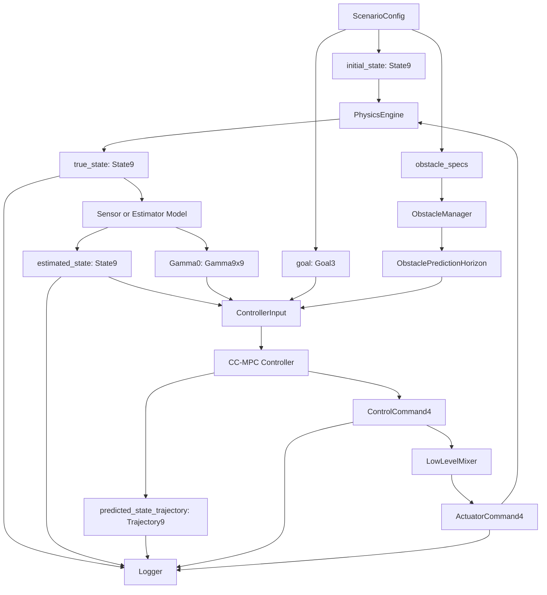
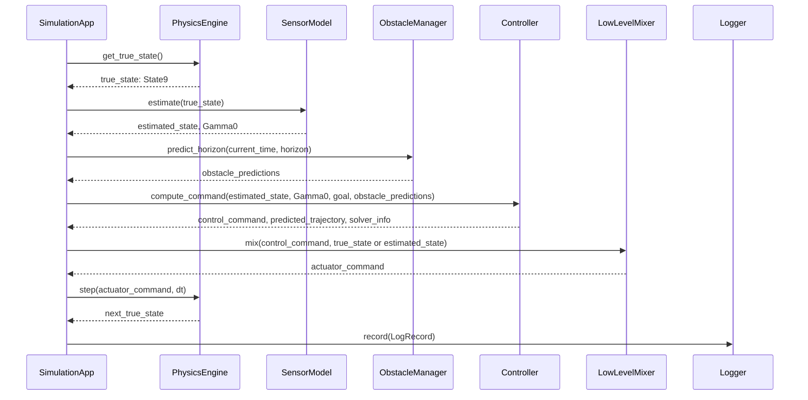

# DATA_MODEL.md

> Status: Draft
> Scope: Ideal design after refactor
> Project: Quadrotor CC-MPC Simulation
> Purpose: Define the canonical data contracts used by the simulation, controller, physics engines, perception, logging, and visualization modules.

---

## 1. Purpose

This document defines the canonical data model for the refactored quadrotor CC-MPC simulation.

The goal is to eliminate ambiguity in the simulation code by defining:

1. The canonical state representation.
2. The canonical control representation.
3. Coordinate frames and unit conventions.
4. Runtime state categories such as `true_state`, `estimated_state`, and `predicted_state`.
5. Obstacle, trajectory, uncertainty, MuJoCo adapter, and logging data models.
6. Validation rules that every simulation module must satisfy.

This document is a normative design document.
After refactor, all simulation modules shall follow this data model.

---

## 2. Scope

This document covers the data exchanged between the following modules:

```text
simulation/
├── app.py
├── world.py
├── scenario.py
├── engines/
│   ├── base.py
│   ├── ode_engine.py
│   └── mujoco_engine.py
├── runtime/
├── logging/
└── visualization/

ccmpc/
├── controller/
├── dynamics/
├── perception/
├── low_level/
└── math/
```

This document does not define:

1. The full MPC optimization problem.
2. The solver implementation.
3. The detailed MuJoCo XML model.
4. Visualization rendering details.
5. File I/O format beyond the required schema-level data fields.

Those topics shall be defined in separate documents:

```text
05_ENGINE_INTERFACE.md
06_CONTROLLER_INTERFACE.md
07_SCENARIO_CONFIG.md
08_LOGGING_AND_METRICS.md
MPC_SOLVER.md
DYNAMICS.md
LOW_LEVEL.md
PERCEPTION.md
```

---

## 3. Source of Truth

This data model is derived from the project theory notes and the intended refactored architecture.

Primary theory sources:

```text
docs/theory/02_Quadrotor_Dynamics.md
docs/theory/03_Coordinate_Frames.md
docs/theory/05_Euler_Angles.md
docs/theory/06_Quaternion.md
docs/theory/10_State_Space_Model.md
docs/theory/14_Covariance_Propagation.md
docs/theory/15_Obstacle_Avoidance.md
docs/theory/19_Glossary.md
```

Primary source-code references in the current implementation:

```text
ccmpc/dynamics.py
ccmpc/ccmpc.py
ccmpc/mujoco_dynamics.py
ccmpc/mixer.py
ccmpc/obstacle.py
ccmpc/sensor.py
ccmpc/uncertainty.py
ccmpc/utils.py
sim_demo_nosim.py
sim_demo_mujoco.py
config/mpc.yaml
config/simulation.yaml
models/quadrotor.xml
```

The refactored source code shall conform to this document rather than treating the current demo scripts as the final architecture.

---

## 4. Design Rules

### 4.1 Canonical state rule

The simulation shall use `State9` as the canonical state representation.

```text
State9 = [x, y, z, vx, vy, vz, roll, pitch, yaw]
```

Mathematical notation:

$$
\mathbf{x}
=

\begin{bmatrix}
x & y & z & v_x & v_y & v_z & \phi & \theta & \psi
\end{bmatrix}^T
\in \mathbb{R}^9
$$

Alias convention:

```text
roll  = phi   = φ
pitch = theta = θ
yaw   = psi   = ψ
```

No module shall use an alternative state ordering without an explicit adapter.

---

### 4.2 Canonical control rule

The controller-level command shall be `ControlCommand4`.

```text
ControlCommand4 = [phi_c, theta_c, vz_c, psi_dot_c]
```

Mathematical notation:

$$
\mathbf{u}
=

\begin{bmatrix}
\phi_c & \theta_c & v_{z,c} & \dot{\psi}_c
\end{bmatrix}^T
\in \mathbb{R}^4
$$

`ControlCommand4` is not rotor thrust.

Rotor thrust shall be represented separately as `ActuatorCommand4`.

---

### 4.3 Engine-internal data rule

Physics engines may use internal representations, but those representations shall not leak into the controller API.

Examples:

```text
MuJoCo qpos/qvel/quaternion -> internal engine data
ODE State9                 -> canonical simulation data
MPC State9                 -> canonical controller data
```

Every physics engine shall expose and consume canonical data through a defined adapter.

---

### 4.4 No ambiguous state variable rule

At architecture level, the variable name `state` is ambiguous and shall be avoided in public interfaces.

Use explicit names:

```text
true_state
estimated_state
predicted_state
logged_state
initial_state
next_state
```

Short local variables such as `x` are allowed only inside math-heavy functions where the meaning is documented.

---

### 4.5 Units rule

All public data shall use SI units unless explicitly stated otherwise.

```text
position    -> meter
velocity    -> meter / second
angle       -> radian
angular rate -> radian / second
time        -> second
force       -> Newton
covariance  -> squared unit of the associated variable
```

Degrees may appear only in user-facing configuration files or visualization labels.
Before entering the controller, all angular values shall be converted to radians.

---

### 4.6 Frame rule

All canonical `State9` position and velocity components shall be expressed in the world frame.

Body-frame and camera-frame values are allowed only in perception, sensor, or engine-adapter modules and must be explicitly named.

Examples:

```text
p_world
p_body
p_camera
v_world
```

Do not name a vector `p` or `v` in public APIs unless the frame is clear from the type.

---

### 4.7 Covariance rule

Uncertainty is a first-class part of the data model.

The system shall distinguish:

```text
Gamma9x9 -> full state covariance
Sigma3x3 -> position covariance
W9x9     -> process noise covariance
R9x9     -> measurement noise covariance
```

The position covariance used in chance constraints shall be extracted from the full state covariance:

$$
\boldsymbol{\Sigma}
=

\boldsymbol{\Gamma}_{0:3,0:3}
$$

---

## 5. Coordinate Frames

The refactored simulation shall use three standard frames:

1. World frame `W`
2. Body frame `B`
3. Camera frame `C`

---

### 5.1 World frame `W`

The world frame is the canonical inertial frame for simulation.

```text
X_W: horizontal reference axis
Y_W: horizontal lateral axis
Z_W: upward
```

Properties:

| Property            | Value                                                      |
| ------------------- | ---------------------------------------------------------- |
| Frame type          | Inertial simulation frame                                  |
| Gravity direction   | Negative Z                                                 |
| Altitude convention | `z > 0` means above ground                                 |
| Used by             | State9 position, State9 velocity, goal, obstacles, logging |

The gravity vector in world frame is:

$$
\mathbf{g}^W
=

\begin{bmatrix}
0 \
0 \
-g
\end{bmatrix}
$$

---

### 5.2 Body frame `B`

The body frame is attached to the quadrotor center of mass.

```text
X_B: forward
Y_B: left
Z_B: upward
```

Properties:

| Property               | Value                                                          |
| ---------------------- | -------------------------------------------------------------- |
| Origin                 | Quadrotor center of mass                                       |
| Rotates with quadrotor | Yes                                                            |
| Used by                | Attitude, thrust direction, sensor mounting, low-level control |

---

### 5.3 Camera frame `C`

The camera frame is attached to the forward-facing camera.

```text
X_C: forward / depth direction
Y_C: right
Z_C: down
```

Properties:

| Property                    | Value                                              |
| --------------------------- | -------------------------------------------------- |
| Origin                      | Camera optical center                              |
| Used by                     | Depth sensing, obstacle detection, FOV constraints |
| Canonical controller frame? | No                                                 |

The camera frame shall be converted to body/world frame before data enters the controller.

---

### 5.4 Body-to-world rotation

The canonical attitude convention is ZYX Euler:

$$
\mathbf{R}_B^W
=

\mathbf{R}_Z(\psi)
\mathbf{R}_Y(\theta)
\mathbf{R}_X(\phi)
$$

Where:

| Symbol   | Meaning |
| -------- | ------- |
| $\phi$   | Roll    |
| $\theta$ | Pitch   |
| $\psi$   | Yaw     |

---

### 5.5 World-to-body yaw-only transform

For FOV and simplified perception checks, yaw-only transformation may be used:

$$
\mathbf{p}^B
=

\mathbf{R}*Z(\psi)^T
\left(
\mathbf{p}^W - \mathbf{p}*{\text{body}}^W
\right)
$$

This shall be documented explicitly whenever used, because it ignores roll and pitch.

---

## 6. Units

The following units shall be used across all public data models.

| Quantity               |      Unit | Example                      |
| ---------------------- | --------: | ---------------------------- |
| Position               |         m | `x`, `y`, `z`                |
| Velocity               |       m/s | `vx`, `vy`, `vz`             |
| Acceleration           |      m/s² | gravity                      |
| Angle                  |       rad | `roll`, `pitch`, `yaw`       |
| Angular rate           |     rad/s | `psi_dot_c`                  |
| Time                   |         s | `dt`, `t`, `elapsed_time`    |
| Force                  |         N | rotor thrust                 |
| Covariance of position |        m² | `Sigma_position`             |
| Covariance of velocity | `(m/s)^2` | velocity block of `Gamma9x9` |
| Covariance of attitude |      rad² | attitude block of `Gamma9x9` |

Validation rule:

```text
All config values using degrees shall be converted to radians immediately after config loading.
```

---

## 7. Canonical State: `State9`

### 7.1 Definition

`State9` is the canonical simulation and controller state.

```text
State9 = [x, y, z, vx, vy, vz, roll, pitch, yaw]
```

Mathematically:

$$
\mathbf{x}
=

\begin{bmatrix}
\mathbf{p} \
\mathbf{v} \
\boldsymbol{\eta}
\end{bmatrix}
=

\begin{bmatrix}
x \
y \
z \
v_x \
v_y \
v_z \
\phi \
\theta \
\psi
\end{bmatrix}
\in
\mathbb{R}^9
$$

Where:

$$
\mathbf{p}
=

\begin{bmatrix}
x & y & z
\end{bmatrix}^T
$$

$$
\mathbf{v}
=

\begin{bmatrix}
v_x & v_y & v_z
\end{bmatrix}^T
$$

$$
\boldsymbol{\eta}
=

\begin{bmatrix}
\phi & \theta & \psi
\end{bmatrix}^T
$$

---

### 7.2 Field definition

| Index | Field   | Symbol   | Unit | Frame    | Meaning                           |
| ----: | ------- | -------- | ---- | -------- | --------------------------------- |
|     0 | `x`     | $x$      | m    | World    | Position along world X            |
|     1 | `y`     | $y$      | m    | World    | Position along world Y            |
|     2 | `z`     | $z$      | m    | World    | Altitude / position along world Z |
|     3 | `vx`    | $v_x$    | m/s  | World    | Velocity along world X            |
|     4 | `vy`    | $v_y$    | m/s  | World    | Velocity along world Y            |
|     5 | `vz`    | $v_z$    | m/s  | World    | Velocity along world Z            |
|     6 | `roll`  | $\phi$   | rad  | Attitude | Roll angle                        |
|     7 | `pitch` | $\theta$ | rad  | Attitude | Pitch angle                       |
|     8 | `yaw`   | $\psi$   | rad  | Attitude | Yaw angle                         |

---

### 7.3 Suggested Python type

The implementation may use a dataclass wrapper around a NumPy array.

```python
from dataclasses import dataclass
import numpy as np

@dataclass(frozen=True)
class State9:
    data: np.ndarray

    def __post_init__(self):
        if self.data.shape != (9,):
            raise ValueError("State9 must have shape (9,)")
```

Convenience properties may be added:

```python
@property
def position(self) -> np.ndarray:
    return self.data[0:3]

@property
def velocity(self) -> np.ndarray:
    return self.data[3:6]

@property
def attitude(self) -> np.ndarray:
    return self.data[6:9]
```

---

### 7.4 Validity constraints

A valid `State9` shall satisfy:

| Constraint    | Rule                                                        |
| ------------- | ----------------------------------------------------------- |
| Shape         | `(9,)`                                                      |
| Finite values | No NaN or Inf                                               |
| Altitude      | `z >= z_min` unless explicitly testing ground collision     |
| Roll range    | Should respect configured attitude bounds                   |
| Pitch range   | Should respect configured attitude bounds                   |
| Yaw           | Should be normalized to `[-pi, pi]` or documented otherwise |

Suggested validation:

```python
def validate_state9(x: np.ndarray) -> None:
    assert x.shape == (9,)
    assert np.all(np.isfinite(x))
```

---

### 7.5 State-space dynamics interface

The canonical continuous-time dynamics shall use:

$$
\dot{\mathbf{x}}
=

\mathbf{f}(\mathbf{x},\mathbf{u})
$$

The canonical discrete-time dynamics shall use:

$$
\mathbf{x}_{k+1}
=

\mathbf{f}_d(\mathbf{x}_k,\mathbf{u}_k)
$$

For stochastic modeling:

$$
\mathbf{x}_{k+1}
=

\mathbf{f}_d(\mathbf{x}_k,\mathbf{u}_k)
+
\boldsymbol{\omega}_k
$$

where:

$$
\boldsymbol{\omega}_k
\sim
\mathcal{N}
(
\mathbf{0},
\mathbf{Q}_k
)
$$

---

## 8. Control Data Model

The refactored simulation shall distinguish between:

1. High-level controller command.
2. Low-level actuator command.

---

## 8.1 `ControlCommand4`

### Definition

`ControlCommand4` is the command produced by the high-level controller.

```text
ControlCommand4 = [phi_c, theta_c, vz_c, psi_dot_c]
```

Mathematically:

$$
\mathbf{u}
=

\begin{bmatrix}
\phi_c \
\theta_c \
v_{z,c} \
\dot{\psi}_c
\end{bmatrix}
\in
\mathbb{R}^4
$$

---

### Field definition

| Index | Field       | Symbol         | Unit  | Meaning                     |
| ----: | ----------- | -------------- | ----- | --------------------------- |
|     0 | `phi_c`     | $\phi_c$       | rad   | Commanded roll angle        |
|     1 | `theta_c`   | $\theta_c$     | rad   | Commanded pitch angle       |
|     2 | `vz_c`      | $v_{z,c}$      | m/s   | Commanded vertical velocity |
|     3 | `psi_dot_c` | $\dot{\psi}_c$ | rad/s | Commanded yaw rate          |

---

### Important rule

`ControlCommand4` shall not be interpreted as rotor thrust, torque, PWM, motor speed, or MuJoCo actuator control.

It is a high-level command.

The conversion from `ControlCommand4` to actuator-level command shall be performed by a low-level mixer.

```text
ControlCommand4 -> LowLevelMixer -> ActuatorCommand4
```

---

### Suggested Python type

```python
@dataclass(frozen=True)
class ControlCommand4:
    data: np.ndarray

    def __post_init__(self):
        if self.data.shape != (4,):
            raise ValueError("ControlCommand4 must have shape (4,)")
```

---

### Validity constraints

| Field       | Constraint                                |
| ----------- | ----------------------------------------- |
| `phi_c`     | within configured roll-command limit      |
| `theta_c`   | within configured pitch-command limit     |
| `vz_c`      | within configured vertical-velocity limit |
| `psi_dot_c` | within configured yaw-rate limit          |
| all fields  | finite values only                        |

---

## 8.2 `ActuatorCommand4`

### Definition

`ActuatorCommand4` is the low-level actuator command applied to the physical or simulated quadrotor.

For MuJoCo rotor-force simulation, it represents rotor thrust:

```text
ActuatorCommand4 = [T1, T2, T3, T4]
```

Mathematically:

$$
\mathbf{T}
=

\begin{bmatrix}
T_1 \
T_2 \
T_3 \
T_4
\end{bmatrix}
\in
\mathbb{R}^4
$$

---

### Field definition

| Index | Field | Unit | Meaning        |
| ----: | ----- | ---- | -------------- |
|     0 | `T1`  | N    | Rotor 1 thrust |
|     1 | `T2`  | N    | Rotor 2 thrust |
|     2 | `T3`  | N    | Rotor 3 thrust |
|     3 | `T4`  | N    | Rotor 4 thrust |

---

### Validity constraints

| Constraint    | Rule                      |
| ------------- | ------------------------- |
| Shape         | `(4,)`                    |
| Finite values | No NaN or Inf             |
| Lower bound   | `T_i >= 0`                |
| Upper bound   | `T_i <= max_rotor_thrust` |

---

### Relationship with controller command

The mixer shall implement:

$$
\mathbf{T}
=

\text{Mixer}
(
\mathbf{u},
\mathbf{x}
)
$$

where:

| Symbol       | Meaning          |
| ------------ | ---------------- |
| $\mathbf{T}$ | ActuatorCommand4 |
| $\mathbf{u}$ | ControlCommand4  |
| $\mathbf{x}$ | Current State9   |

This conversion may depend on current attitude and vertical velocity.

---

## 9. Attitude Representation

The refactored system shall use Euler angles as the canonical attitude representation and quaternion only as an internal adapter representation.

---

## 9.1 Euler ZYX as canonical attitude

The attitude block of `State9` shall be:

```text
[roll, pitch, yaw] = [phi, theta, psi]
```

The canonical rotation convention is:

$$
\mathbf{R}_B^W
=

\mathbf{R}_Z(\psi)
\mathbf{R}_Y(\theta)
\mathbf{R}_X(\phi)
$$

Where:

| Field   | Symbol   | Unit | Meaning                             |
| ------- | -------- | ---- | ----------------------------------- |
| `roll`  | $\phi$   | rad  | Rotation around body X              |
| `pitch` | $\theta$ | rad  | Rotation around body/intermediate Y |
| `yaw`   | $\psi$   | rad  | Rotation around world Z             |

---

## 9.2 Quaternion as engine/internal representation

Quaternion shall be used only where required by external systems or numerical engines.

Examples:

```text
MuJoCo qpos orientation
VIO internal attitude representation
Interpolation utilities
```

Quaternion shall not be passed directly to the MPC controller.

If a physics engine uses quaternion internally, it must provide:

```text
State9 -> EngineState
EngineState -> State9
```

For MuJoCo:

```text
State9 attitude [roll, pitch, yaw]
        |
        v
Quaternion [w, x, y, z]
        |
        v
MuJoCo qpos[3:7]
```

And in reverse:

```text
MuJoCo qpos[3:7]
        |
        v
Quaternion [w, x, y, z]
        |
        v
State9 attitude [roll, pitch, yaw]
```

---

### Quaternion format

The canonical quaternion storage order shall be:

```text
[w, x, y, z]
```

Any external library using a different ordering must be wrapped by an adapter.

---

## 10. Runtime State Types

The refactored simulation shall distinguish different meanings of state.

---

## 10.1 `true_state`

### Definition

`true_state` is the actual simulated state produced by the physics engine.

```text
true_state: State9
```

Owner:

```text
PhysicsEngine
```

Used by:

```text
SensorModel
Logger
Renderer
CollisionChecker
```

Not directly owned by:

```text
Controller
```

The controller may receive `true_state` only in ideal full-state simulation mode.
In realistic simulation mode, the controller shall receive `estimated_state`.

---

## 10.2 `estimated_state`

### Definition

`estimated_state` is the state estimate passed to the controller.

```text
estimated_state: State9
```

It may be generated from:

```text
true_state + measurement_noise
true_state + VIO_drift + measurement_noise
motion-capture estimate
external estimator
```

Mathematically:

$$
\hat{\mathbf{x}}_k
=
\mathbf{x}^{true}_k
+
\mathbf{b}_k
+
\boldsymbol{\nu}_k
$$

where:

| Symbol                | Meaning                 |
| --------------------- | ----------------------- |
| $\hat{\mathbf{x}}_k$  | estimated_state         |
| $\mathbf{x}^{true}_k$ | true_state              |
| $\mathbf{b}_k$        | estimator bias or drift |
| $\boldsymbol{\nu}_k$  | measurement noise       |

Owner:

```text
SensorModel / Estimator
```

Used by:

```text
Controller
Logger
```

---

## 10.3 `predicted_state`

### Definition

`predicted_state` is a future state predicted by the controller.

For MPC, this is usually a trajectory:

```text
predicted_state_trajectory: Trajectory9
```

Shape:

```text
(N + 1, 9)
```

or internally:

```text
(9, N + 1)
```

The project shall pick one canonical storage layout and adapt at module boundaries.

Recommended canonical layout for high-level Python APIs:

```text
Trajectory9.states.shape == (N + 1, 9)
```

Reason:

```text
trajectory[k] naturally returns State9 at timestep k
```

---

## 10.4 `logged_state`

### Definition

`logged_state` is a snapshot of simulation data recorded by the logger.

It may include:

```text
time
true_state
estimated_state
control_command
actuator_command
predicted_trajectory
solver_info
metrics
```

`logged_state` is not an input to the controller or physics engine.

---

## 11. Scenario Data Model

`ScenarioConfig` defines the initial conditions and environment for a simulation run.

---

### 11.1 Required fields

```yaml
start: [x, y, z, vx, vy, vz, roll, pitch, yaw]
goal: [x, y, z]
obstacles: []
goal_threshold: 0.4
sim_timestep: 0.02
```

---

### 11.2 `ScenarioConfig`

| Field             | Type                 | Unit  | Required | Meaning                                            |
| ----------------- | -------------------- | ----- | -------- | -------------------------------------------------- |
| `start`           | `State9`             | mixed | Yes      | Initial quadrotor state                            |
| `goal`            | `Goal3`              | m     | Yes      | Goal position in world frame                       |
| `obstacles`       | `list[ObstacleSpec]` | mixed | Yes      | Static or moving obstacles                         |
| `goal_threshold`  | `float`              | m     | Yes      | Distance threshold for success                     |
| `sim_timestep`    | `float`              | s     | Yes      | Physics simulation timestep                        |
| `target_altitude` | `float`              | m     | Optional | Optional altitude target if used by scenario logic |

---

### 11.3 `Goal3`

`Goal3` is a 3D position in world frame.

```text
Goal3 = [x_goal, y_goal, z_goal]
```

Mathematically:

$$
\mathbf{p}_g
=

\begin{bmatrix}
x_g \
y_g \
z_g
\end{bmatrix}
\in
\mathbb{R}^3
$$

Field definition:

| Index | Field    | Unit | Frame |
| ----: | -------- | ---- | ----- |
|     0 | `x_goal` | m    | World |
|     1 | `y_goal` | m    | World |
|     2 | `z_goal` | m    | World |

---

### 11.4 Scenario validation rules

A valid scenario shall satisfy:

```text
len(start) == 9
len(goal) == 3
sim_timestep > 0
goal_threshold > 0
all numeric fields finite
obstacle sizes positive
```

If `target_altitude` is present but unused by the runtime, the config loader shall either reject it or mark it as ignored with a warning.

---

## 12. Obstacle Data Model

The simulation shall represent obstacles using world-frame ellipsoidal obstacle data.

---

## 12.1 `ObstacleSpec`

`ObstacleSpec` is the configuration-time representation.

Example:

```yaml
position: [2.5, 1.0, 1.5]
size: [0.8, 0.8, 1.5]
yaw: 0.0
velocity: [0.2, 0.0, 0.0]
```

Field definition:

| Field             | Type                  | Unit             | Frame                 | Meaning                                    |
| ----------------- | --------------------- | ---------------- | --------------------- | ------------------------------------------ |
| `position`        | `Position3`           | m                | World                 | Initial obstacle center                    |
| `size`            | `Size3`               | m                | Obstacle/body-aligned | Box dimensions before ellipsoid conversion |
| `yaw`             | `float`               | rad              | World yaw             | Obstacle orientation                       |
| `velocity`        | `Velocity3`           | m/s              | World                 | Constant velocity prediction               |
| `pos_uncertainty` | `float` or `Sigma3x3` | m or m²          | World                 | Position uncertainty                       |
| `vel_uncertainty` | `float` or `Sigma3x3` | m/s or `(m/s)^2` | World                 | Velocity uncertainty                       |

---

## 12.2 `ObstacleState`

`ObstacleState` is the runtime obstacle representation.

Recommended fields:

```python
@dataclass
class ObstacleState:
    position: np.ndarray      # shape (3,)
    velocity: np.ndarray      # shape (3,)
    axes: np.ndarray          # shape (3,)
    yaw: float
    rotation: np.ndarray      # shape (3, 3)
    Sigma: np.ndarray         # shape (3, 3)
    Sigma_v: np.ndarray       # shape (3, 3)
```

---

## 12.3 Box-to-ellipsoid conversion

Obstacle config may define box dimensions:

```text
size = [length, width, height]
```

The ellipsoid semi-axes shall be:

$$
\begin{bmatrix}
a_o \
b_o \
c_o
\end{bmatrix}
=

\frac{\sqrt{3}}{2}
\begin{bmatrix}
l_o \
w_o \
h_o
\end{bmatrix}
$$

where:

| Symbol        | Meaning             |
| ------------- | ------------------- |
| $l_o$         | obstacle box length |
| $w_o$         | obstacle box width  |
| $h_o$         | obstacle box height |
| $a_o,b_o,c_o$ | ellipsoid semi-axes |

---

## 12.4 Obstacle prediction

For moving obstacles, the runtime shall use constant-velocity prediction unless another prediction model is explicitly selected.

$$
\hat{\mathbf{p}}_o^{k+1}
=

\hat{\mathbf{p}}_o^k
+
\hat{\mathbf{v}}_o^k
\Delta t
$$

$$
\hat{\mathbf{v}}_o^{k+1}
=

\hat{\mathbf{v}}_o^k
$$

$$
\boldsymbol{\Sigma}_o^{k+1}
=

\boldsymbol{\Sigma}*o^k
+
\boldsymbol{\Sigma}*{o,v}
\Delta t^2
$$

---

## 12.5 Collision matrix

The collision matrix for a spherical MAV and ellipsoidal obstacle shall be:

$$
\boldsymbol{\Omega}_{io}
=

\mathbf{R}_o^T
\operatorname{diag}
\left(
\frac{1}{(a_o+r_i)^2},
\frac{1}{(b_o+r_i)^2},
\frac{1}{(c_o+r_i)^2}
\right)
\mathbf{R}_o
$$

where:

| Symbol                     | Meaning                      |
| -------------------------- | ---------------------------- |
| $r_i$                      | MAV collision radius         |
| $a_o,b_o,c_o$              | obstacle ellipsoid semi-axes |
| $\mathbf{R}_o$             | obstacle rotation matrix     |
| $\boldsymbol{\Omega}_{io}$ | collision matrix             |

---

## 13. Trajectory Data Model

The refactored system shall define explicit trajectory types.

---

## 13.1 `Trajectory9`

`Trajectory9` stores a sequence of `State9`.

Recommended canonical shape:

```text
states.shape == (N + 1, 9)
```

Where:

| Axis   | Meaning         |
| ------ | --------------- |
| axis 0 | time index      |
| axis 1 | state dimension |

Access pattern:

```python
x_k = trajectory.states[k]
```

---

## 13.2 `ControlTrajectory4`

`ControlTrajectory4` stores a sequence of `ControlCommand4`.

Recommended canonical shape:

```text
controls.shape == (N, 4)
```

Access pattern:

```python
u_k = control_trajectory.controls[k]
```

---

## 13.3 `ActuatorTrajectory4`

`ActuatorTrajectory4` stores actuator commands over time.

Recommended canonical shape:

```text
actuators.shape == (M, 4)
```

Where `M` may differ from `N` because physics step rate may be higher than MPC rate.

---

## 13.4 Trajectory timing

Every trajectory shall define:

```text
dt
t0
num_steps
```

Recommended type:

```python
@dataclass
class Trajectory9:
    states: np.ndarray
    dt: float
    t0: float = 0.0
```

The absolute time at index `k` is:

$$
t_k
=
t_0
+
k\Delta t
$$

---

## 14. Uncertainty Data Model

Uncertainty is required for chance-constrained MPC.

---

## 14.1 `Gamma9x9`

`Gamma9x9` is the full state covariance.

```text
Gamma9x9.shape == (9, 9)
```

Mathematically:

$$
\boldsymbol{\Gamma}
\in
\mathbb{R}^{9 \times 9}
$$

Block structure:

$$
\boldsymbol{\Gamma}
=

\begin{bmatrix}
\boldsymbol{\Gamma}*{pp} & \boldsymbol{\Gamma}*{pv} & \boldsymbol{\Gamma}*{p\eta} \
\boldsymbol{\Gamma}*{vp} & \boldsymbol{\Gamma}*{vv} & \boldsymbol{\Gamma}*{v\eta} \
\boldsymbol{\Gamma}*{\eta p} & \boldsymbol{\Gamma}*{\eta v} & \boldsymbol{\Gamma}_{\eta\eta}
\end{bmatrix}
$$

Where:

| Block                            | Meaning             |
| -------------------------------- | ------------------- |
| $\boldsymbol{\Gamma}_{pp}$       | Position covariance |
| $\boldsymbol{\Gamma}_{vv}$       | Velocity covariance |
| $\boldsymbol{\Gamma}_{\eta\eta}$ | Attitude covariance |
| off-diagonal blocks              | Cross-covariance    |

---

## 14.2 `Sigma3x3`

`Sigma3x3` is the position covariance used by chance constraints.

```text
Sigma3x3 = Gamma9x9[0:3, 0:3]
```

Mathematically:

$$
\boldsymbol{\Sigma}
=

\boldsymbol{\Gamma}_{0:3,0:3}
$$

---

## 14.3 Process noise covariance

The process noise covariance shall be represented as `W9x9`.

```text
W9x9.shape == (9, 9)
```

The stochastic model is:

$$
\mathbf{x}_{k+1}
=

\mathbf{f}_d(\mathbf{x}_k,\mathbf{u}_k)
+
\boldsymbol{\omega}_k
$$

$$
\boldsymbol{\omega}_k
\sim
\mathcal{N}
(
\mathbf{0},
\mathbf{W}_k
)
$$

---

## 14.4 Covariance propagation

The covariance propagation rule shall be:

$$
\boldsymbol{\Gamma}^{k+1}
=

\mathbf{F}^k
\boldsymbol{\Gamma}^{k}
\mathbf{F}^{kT}
+
\mathbf{W}^{k}
$$

Where:

| Symbol                      | Meaning                       |
| --------------------------- | ----------------------------- |
| $\boldsymbol{\Gamma}^{k}$   | State covariance at step k    |
| $\mathbf{F}^{k}$            | State transition Jacobian     |
| $\mathbf{W}^{k}$            | Process noise covariance      |
| $\boldsymbol{\Gamma}^{k+1}$ | State covariance at next step |

---

## 14.5 Measurement noise

Measurement noise shall be represented separately from process noise.

Recommended model:

$$
\mathbf{y}_k
=

\mathbf{h}(\mathbf{x}_k)
+
\boldsymbol{\nu}_k
$$

$$
\boldsymbol{\nu}_k
\sim
\mathcal{N}
(
\mathbf{0},
\mathbf{R}_k
)
$$

Where:

| Symbol               | Meaning                |
| -------------------- | ---------------------- |
| $\mathbf{y}_k$       | measurement            |
| $\mathbf{h}$         | observation function   |
| $\boldsymbol{\nu}_k$ | measurement noise      |
| $\mathbf{R}_k$       | measurement covariance |

---

## 14.6 VIO drift state

If VIO drift is simulated, the bias shall be represented explicitly.

```text
vio_bias: State9-like vector
```

Suggested model:

$$
\mathbf{b}_{k+1}
=

\mathbf{b}*k
+
\mathbf{w}*{b,k}
$$

Estimated state:

$$
\hat{\mathbf{x}}_k
=

\mathbf{x}^{true}_k
+
\mathbf{b}_k
+
\boldsymbol{\nu}_k
$$

---

## 15. MuJoCo Adapter Data

MuJoCo shall be treated as a physics backend with its own internal data representation.

---

## 15.1 Canonical adapter responsibility

The MuJoCo engine adapter shall provide:

```text
State9 -> MuJoCo qpos/qvel
MuJoCo qpos/qvel -> State9
ControlCommand4 -> ActuatorCommand4 -> MuJoCo ctrl
```

The controller shall never depend on MuJoCo `qpos`, `qvel`, `ctrl`, or quaternion.

---

## 15.2 MuJoCo state representation

Typical MuJoCo free-body representation:

```text
qpos = [x, y, z, qw, qx, qy, qz]
qvel = [vx, vy, vz, wx, wy, wz]
```

Only the adapter may access this representation directly.

---

## 15.3 Mapping from `State9` to MuJoCo

Required conversion:

```text
State9.position -> qpos[0:3]
State9.attitude Euler ZYX -> quaternion [w, x, y, z] -> qpos[3:7]
State9.velocity -> qvel[0:3]
```

Angular velocity mapping from Euler rates is not part of `State9`.
If the engine requires angular velocity initialization, the adapter shall define the default behavior explicitly.

Recommended default:

```text
qvel[3:6] = [0, 0, 0] at reset
```

unless angular velocity is added to the canonical state in a future ADR.

---

## 15.4 Mapping from MuJoCo to `State9`

Required conversion:

```text
qpos[0:3] -> State9.position
qvel[0:3] -> State9.velocity
qpos[3:7] quaternion -> Euler ZYX -> State9.attitude
```

---

## 15.5 MuJoCo control mapping

MuJoCo actuator control shall receive `ActuatorCommand4`, not `ControlCommand4`.

Correct flow:

```text
CCMPC -> ControlCommand4 -> Mixer -> ActuatorCommand4 -> MuJoCo ctrl
```

Incorrect flow:

```text
CCMPC -> ControlCommand4 -> MuJoCo ctrl
```

---

## 16. Logging Data Model

The logger shall record enough data to debug the full simulation pipeline.

---

## 16.1 `LogRecord`

Each simulation step shall produce a `LogRecord`.

Recommended fields:

```python
@dataclass
class LogRecord:
    step: int
    time: float

    true_state: State9 | None
    estimated_state: State9 | None

    control_command: ControlCommand4 | None
    actuator_command: ActuatorCommand4 | None

    goal: np.ndarray | None
    obstacle_states: list | None

    predicted_trajectory: Trajectory9 | None
    control_trajectory: ControlTrajectory4 | None

    solver_status: str | None
    solver_time_ms: float | None
    solver_cost: float | None

    goal_distance: float | None
    cross_track_error: float | None
    heading_error: float | None
    collision_flag: bool | None
```

---

## 16.2 Required log fields

Minimum required fields:

| Field              | Reason                         |
| ------------------ | ------------------------------ |
| `step`             | Reconstruct simulation order   |
| `time`             | Analyze timing                 |
| `true_state`       | Debug physics                  |
| `estimated_state`  | Debug estimator/sensor noise   |
| `control_command`  | Debug MPC output               |
| `actuator_command` | Debug mixer/physics input      |
| `goal_distance`    | Evaluate navigation            |
| `solver_status`    | Detect optimization failure    |
| `solver_time_ms`   | Evaluate real-time feasibility |

---

## 16.3 Optional log fields

Optional fields:

| Field                  | Reason                        |
| ---------------------- | ----------------------------- |
| `predicted_trajectory` | Debug MPC horizon             |
| `control_trajectory`   | Debug future control sequence |
| `obstacle_states`      | Debug obstacle prediction     |
| `cross_track_error`    | Evaluate path following       |
| `heading_error`        | Evaluate yaw behavior         |
| `collision_flag`       | Evaluate safety               |
| `Gamma9x9`             | Debug uncertainty propagation |
| `Sigma3x3`             | Debug chance constraints      |

---

## 16.4 Logging rule

The logger shall not mutate simulation data.

It shall only receive immutable snapshots or copied arrays.

This prevents logging from introducing side effects into the simulation.

---

## 17. Data Flow

### 17.1 High-level data flow



---

### 17.2 Runtime data ownership

| Data                   | Owner                             | Read by                      | Written by                        |
| ---------------------- | --------------------------------- | ---------------------------- | --------------------------------- |
| `true_state`           | PhysicsEngine                     | Sensor, Logger, Renderer     | PhysicsEngine                     |
| `estimated_state`      | SensorModel / Estimator           | Controller, Logger           | SensorModel                       |
| `predicted_trajectory` | Controller                        | Logger, Renderer             | Controller                        |
| `control_command`      | Controller                        | Mixer, Logger                | Controller                        |
| `actuator_command`     | Mixer                             | PhysicsEngine, Logger        | Mixer                             |
| `obstacle_states`      | ObstacleManager                   | Controller, Logger, Renderer | ObstacleManager                   |
| `Gamma9x9`             | UncertaintyPropagator / Estimator | Controller, Logger           | UncertaintyPropagator / Estimator |

---

### 17.3 One simulation step data flow



---

## 18. Validation Rules

The refactored implementation shall validate data at module boundaries.

---

### 18.1 General numeric validation

All public data shall satisfy:

```text
no NaN
no Inf
correct shape
correct dtype
finite numeric values
```

---

### 18.2 `State9` validation

```text
shape == (9,)
all finite
z is finite
roll/pitch/yaw are finite radians
```

Recommended additional checks:

```text
z >= configured minimum altitude
abs(roll) <= configured max_roll
abs(pitch) <= configured max_pitch
```

---

### 18.3 `ControlCommand4` validation

```text
shape == (4,)
all finite
phi_c within configured bounds
theta_c within configured bounds
vz_c within configured bounds
psi_dot_c within configured bounds
```

---

### 18.4 `ActuatorCommand4` validation

```text
shape == (4,)
all finite
each thrust >= 0
each thrust <= max_rotor_thrust
```

---

### 18.5 Covariance validation

Covariance matrices shall satisfy:

```text
shape is correct
matrix is symmetric
matrix is positive semidefinite within numerical tolerance
diagonal entries are non-negative
```

Suggested check:

```python
def validate_covariance(Sigma: np.ndarray, shape: tuple[int, int]) -> None:
    assert Sigma.shape == shape
    assert np.all(np.isfinite(Sigma))
    assert np.allclose(Sigma, Sigma.T, atol=1e-9)
    eigvals = np.linalg.eigvalsh(Sigma)
    assert np.min(eigvals) >= -1e-9
```

---

### 18.6 Frame validation

Frame validation shall be performed through naming and types.

Bad examples:

```python
def update(p):
    ...
```

Good examples:

```python
def update_position_world(p_world):
    ...

def detect_obstacle_camera(p_camera):
    ...

def transform_body_to_world(p_body, pose_world):
    ...
```

---

### 18.7 Time validation

The simulation shall distinguish:

| Name        | Meaning                         |
| ----------- | ------------------------------- |
| `sim_dt`    | physics simulation timestep     |
| `mpc_dt`    | MPC planning timestep           |
| `render_dt` | visualization timestep          |
| `log_dt`    | logging timestep if downsampled |

Rules:

```text
sim_dt > 0
mpc_dt > 0
render_dt > 0 if rendering is enabled
mpc_dt should be an integer multiple of sim_dt when deterministic stepping is required
```

---

## 19. Open Questions

The following items must be resolved before finalizing the refactor.

| ID     | Question                                                                    | Proposed Resolution                                                                   | Status   |
| ------ | --------------------------------------------------------------------------- | ------------------------------------------------------------------------------------- | -------- |
| DQ-001 | Should canonical trajectory shape be `(N+1, 9)` or `(9, N+1)`?              | Use `(N+1, 9)` for public APIs; adapt internally for CVXPY if needed.                 | Proposed |
| DQ-002 | Should `State9` include angular velocity?                                   | No. Keep `State9` reduced; add engine-internal angular velocity only in adapters.     | Proposed |
| DQ-003 | Should controller receive `true_state` in simple simulation mode?           | Allow only via explicit `IdealEstimator` that returns `estimated_state = true_state`. | Proposed |
| DQ-004 | Should `target_altitude` remain in scenario config?                         | Keep only if a runtime module uses it; otherwise remove.                              | Open     |
| DQ-005 | Should logs store full predicted trajectory every step?                     | Store in debug mode; optional in normal runs.                                         | Proposed |
| DQ-006 | Should obstacle size uncertainty be modeled?                                | Not in initial refactor; position and velocity uncertainty only.                      | Proposed |
| DQ-007 | Should yaw be normalized after every physics step?                          | Yes for canonical `State9`; adapter must normalize.                                   | Proposed |
| DQ-008 | Should `ControlCommand4` be applied by zero-order hold between MPC updates? | Define in `RUNTIME_FLOW.md`.                                                          | Open     |

---

## 20. Summary of Core Data Types

| Data Type            |          Shape | Owner                            | Meaning                          |
| -------------------- | -------------: | -------------------------------- | -------------------------------- |
| `State9`             |         `(9,)` | Physics / Estimator / Controller | Canonical quadrotor state        |
| `Goal3`              |         `(3,)` | Scenario                         | Goal position in world frame     |
| `ControlCommand4`    |         `(4,)` | Controller                       | High-level command               |
| `ActuatorCommand4`   |         `(4,)` | Mixer                            | Rotor thrust or actuator command |
| `Trajectory9`        |     `(N+1, 9)` | Controller                       | Predicted state trajectory       |
| `ControlTrajectory4` |       `(N, 4)` | Controller                       | MPC control sequence             |
| `Gamma9x9`           |       `(9, 9)` | Estimator / Uncertainty module   | Full state covariance            |
| `Sigma3x3`           |       `(3, 3)` | Uncertainty / Obstacle module    | Position covariance              |
| `ObstacleSpec`       |  Config object | Scenario                         | Obstacle definition from config  |
| `ObstacleState`      | Runtime object | ObstacleManager                  | Runtime obstacle state           |
| `LogRecord`          |  Record object | Logger                           | One simulation log row           |

---

## 21. Non-Negotiable Contracts

The following contracts shall not be violated by the refactored implementation.

### Contract 1: State ordering

```text
State9 = [x, y, z, vx, vy, vz, roll, pitch, yaw]
```

No module may use a different order without an explicit adapter.

---

### Contract 2: Control ordering

```text
ControlCommand4 = [phi_c, theta_c, vz_c, psi_dot_c]
```

No module may treat this vector as rotor thrust.

---

### Contract 3: Physics input

Physics engines shall consume either:

```text
ActuatorCommand4
```

or an engine-specific command produced by a documented adapter.

They shall not directly consume `ControlCommand4` unless the engine explicitly models the Bebop-style high-level API.

---

### Contract 4: Controller input

Controllers shall consume:

```text
estimated_state
goal
obstacle_predictions
covariance
```

Controllers shall not depend on MuJoCo internals.

---

### Contract 5: Logging

The logger shall record enough information to distinguish whether a failure originated from:

```text
controller
mixer
physics
estimator
obstacle prediction
solver
configuration
```

At minimum, logs must contain:

```text
true_state
estimated_state
control_command
actuator_command
solver_status
goal_distance
```

---

## 22. Intended Refactor Impact

After this data model is adopted, the codebase should be refactored so that:

1. `sim_demo_nosim.py` and `sim_demo_mujoco.py` no longer define the data model implicitly.
2. All modules import or follow shared data contracts.
3. ODE and MuJoCo engines expose the same public interface.
4. MPC code receives only canonical controller input.
5. The mixer is the only module that converts `ControlCommand4` to `ActuatorCommand4`.
6. Logger records both high-level commands and actuator-level commands.
7. The simulation can be debugged by inspecting data flow rather than guessing from script behavior.

---

## 23. Related Documents

This document should be read before:

```text
03_RUNTIME_FLOW.md
05_ENGINE_INTERFACE.md
06_CONTROLLER_INTERFACE.md
07_SCENARIO_CONFIG.md
08_LOGGING_AND_METRICS.md
ADR/ADR-003-state-vector-definition.md
ADR/ADR-004-control-command-definition.md
```

This document depends on:

```text
docs/theory/02_Quadrotor_Dynamics.md
docs/theory/03_Coordinate_Frames.md
docs/theory/05_Euler_Angles.md
docs/theory/06_Quaternion.md
docs/theory/10_State_Space_Model.md
docs/theory/14_Covariance_Propagation.md
docs/theory/15_Obstacle_Avoidance.md
docs/theory/19_Glossary.md
```
