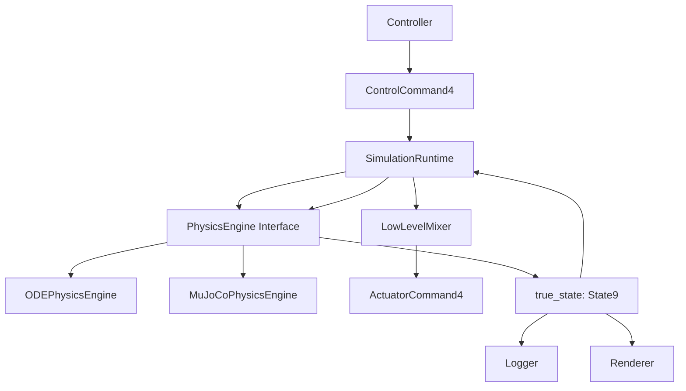
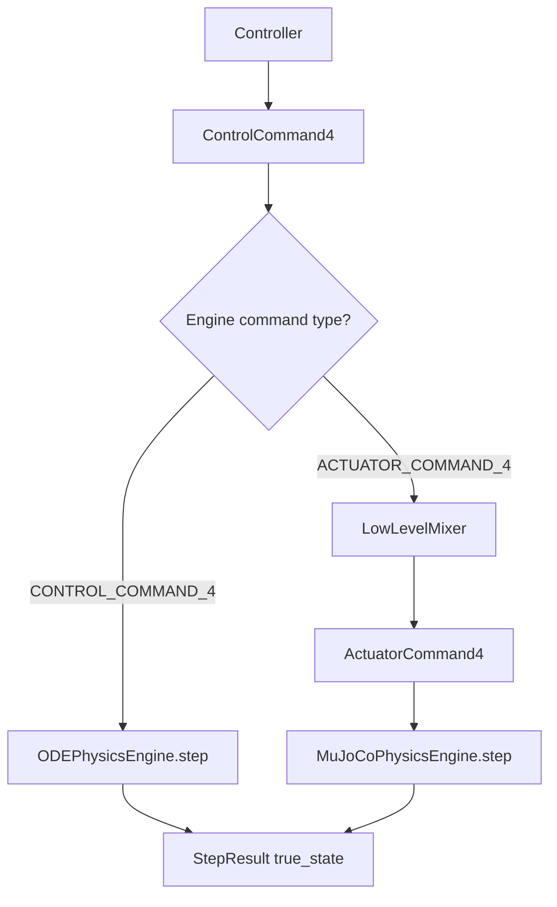

# 05_ENGINE_INTERFACE.md

> Status: Draft
> Scope: Ideal design after refactor
> Project: Quadrotor CC-MPC Simulation
> Related documents:
>
> * `04_DATA_MODEL.md`
> * `ADR/ADR-003-state-vector-definition.md`
> * `ADR/ADR-004-control-command-definition.md`

---

## 1. Purpose

This document defines the standard interface for physics engines in the refactored quadrotor CC-MPC simulation.

The simulation shall support multiple physics backends, including:

```text
ODEPhysicsEngine
MuJoCoPhysicsEngine
FuturePhysicsEngine
```

The purpose of this document is to ensure that all physics engines expose the same public contract, even if their internal representations are different.

The engine interface shall define:

1. How a physics engine is initialized.
2. How it receives commands.
3. How it advances simulation time.
4. How it exposes the current canonical state.
5. How it handles engine-internal representations.
6. How it interacts with controller, mixer, logger, and runtime loop.
7. What validation rules must be enforced at the engine boundary.

---

## 2. Design Goal

The refactored simulation shall make physics engines replaceable.

The runtime should be able to switch between ODE and MuJoCo without changing the controller interface.

Desired architecture:



The controller shall not know whether the backend is ODE, MuJoCo, or another future engine.

---

## 3. Core Principle

Physics engines shall communicate with the rest of the simulation using canonical data types.

Canonical data types:

```text
State9
ControlCommand4
ActuatorCommand4
```

Where:

```text
State9 = [x, y, z, vx, vy, vz, roll, pitch, yaw]
```

```text
ControlCommand4 = [phi_c, theta_c, vz_c, psi_dot_c]
```

```text
ActuatorCommand4 = [T1, T2, T3, T4]
```

A physics engine may use internal data such as:

```text
MuJoCo qpos
MuJoCo qvel
quaternion
body angular velocity
engine-specific actuator vector
```

However, these internal values shall not leak into the controller or simulation runtime unless wrapped by an explicit adapter.

---

## 4. Engine Types

The refactored system shall initially define two engine types.

---

## 4.1 `ODEPhysicsEngine`

`ODEPhysicsEngine` implements the reduced-order quadrotor model.

It directly uses:

```text
State9
ControlCommand4
```

The ODE model is defined as:

$$
\dot{\mathbf{x}}
=

\mathbf{f}(\mathbf{x}, \mathbf{u})
$$

and in discrete time:

$$
\mathbf{x}_{k+1}
=

\mathbf{f}_d(\mathbf{x}_k, \mathbf{u}_k)
$$

Where:

| Symbol         | Data type             |
| -------------- | --------------------- |
| $\mathbf{x}_k$ | `State9`              |
| $\mathbf{u}_k$ | `ControlCommand4`     |
| $\mathbf{f}_d$ | discrete ODE dynamics |

`ODEPhysicsEngine` does not model individual rotors.

Therefore, it may consume `ControlCommand4` directly.

---

## 4.2 `MuJoCoPhysicsEngine`

`MuJoCoPhysicsEngine` implements a higher-fidelity rigid-body simulation using MuJoCo.

It shall expose:

```text
State9
```

at its public boundary.

Internally, it may use:

```text
qpos
qvel
quaternion
MuJoCo data
MuJoCo model
MuJoCo actuator controls
```

MuJoCo rotor-force simulation should consume:

```text
ActuatorCommand4
```

not `ControlCommand4`.

Correct command flow:

```text
Controller
    -> ControlCommand4
    -> LowLevelMixer
    -> ActuatorCommand4
    -> MuJoCoPhysicsEngine
```

Incorrect command flow:

```text
Controller
    -> ControlCommand4
    -> MuJoCoPhysicsEngine actuator ctrl
```

---

## 5. Interface Overview

The base engine interface shall provide the following operations:

```python
class PhysicsEngine:
    def reset(self, initial_state: State9) -> None:
        ...

    def step(self, command, dt: float) -> StepResult:
        ...

    def get_state(self) -> State9:
        ...

    def get_time(self) -> float:
        ...

    def get_metadata(self) -> EngineMetadata:
        ...

    def close(self) -> None:
        ...
```

The exact command type accepted by `step()` depends on the engine type and shall be declared explicitly.

---

## 6. Required Data Types

---

## 6.1 `EngineType`

```python
from enum import Enum

class EngineType(str, Enum):
    ODE = "ode"
    MUJOCO = "mujoco"
```

---

## 6.2 `EngineCommandType`

```python
from enum import Enum

class EngineCommandType(str, Enum):
    CONTROL_COMMAND_4 = "ControlCommand4"
    ACTUATOR_COMMAND_4 = "ActuatorCommand4"
```

Purpose:

```text
Declare whether an engine expects high-level command or actuator-level command.
```

---

## 6.3 `EngineMetadata`

```python
from dataclasses import dataclass

@dataclass(frozen=True)
class EngineMetadata:
    engine_type: EngineType
    command_type: EngineCommandType
    state_type: str
    supports_reset: bool
    supports_rendering: bool
    supports_linearization: bool
    supports_internal_substeps: bool
    notes: str = ""
```

Example for ODE:

```python
EngineMetadata(
    engine_type=EngineType.ODE,
    command_type=EngineCommandType.CONTROL_COMMAND_4,
    state_type="State9",
    supports_reset=True,
    supports_rendering=False,
    supports_linearization=True,
    supports_internal_substeps=False,
)
```

Example for MuJoCo:

```python
EngineMetadata(
    engine_type=EngineType.MUJOCO,
    command_type=EngineCommandType.ACTUATOR_COMMAND_4,
    state_type="State9",
    supports_reset=True,
    supports_rendering=True,
    supports_linearization=True,
    supports_internal_substeps=True,
)
```

---

## 6.4 `StepResult`

Every engine step shall return a `StepResult`.

```python
from dataclasses import dataclass

@dataclass(frozen=True)
class StepResult:
    time: float
    dt: float
    true_state: State9
    applied_command: object
    success: bool
    status: str
    engine_info: dict
```

Required fields:

| Field             | Type                                    | Meaning                    |
| ----------------- | --------------------------------------- | -------------------------- |
| `time`            | `float`                                 | Simulation time after step |
| `dt`              | `float`                                 | Applied timestep           |
| `true_state`      | `State9`                                | State after physics step   |
| `applied_command` | `ControlCommand4` or `ActuatorCommand4` | Command applied to engine  |
| `success`         | `bool`                                  | Whether step succeeded     |
| `status`          | `str`                                   | Diagnostic status          |
| `engine_info`     | `dict`                                  | Engine-specific metadata   |

---

## 7. Base Interface

The base interface shall be expressed as an abstract class or protocol.

Recommended Python protocol:

```python
from typing import Protocol

class PhysicsEngine(Protocol):
    def reset(self, initial_state: State9) -> None:
        ...

    def step(self, command, dt: float) -> StepResult:
        ...

    def get_state(self) -> State9:
        ...

    def get_time(self) -> float:
        ...

    def get_metadata(self) -> EngineMetadata:
        ...

    def close(self) -> None:
        ...
```

If using `abc.ABC`:

```python
from abc import ABC, abstractmethod

class PhysicsEngineBase(ABC):
    @abstractmethod
    def reset(self, initial_state: State9) -> None:
        raise NotImplementedError

    @abstractmethod
    def step(self, command, dt: float) -> StepResult:
        raise NotImplementedError

    @abstractmethod
    def get_state(self) -> State9:
        raise NotImplementedError

    @abstractmethod
    def get_time(self) -> float:
        raise NotImplementedError

    @abstractmethod
    def get_metadata(self) -> EngineMetadata:
        raise NotImplementedError

    def close(self) -> None:
        pass
```

---

## 8. `reset(initial_state)`

### Purpose

Reset the physics engine to a known initial condition.

### Signature

```python
def reset(self, initial_state: State9) -> None:
    ...
```

### Input

| Name            | Type     | Meaning                            |
| --------------- | -------- | ---------------------------------- |
| `initial_state` | `State9` | Initial canonical simulation state |

### Output

None.

### Side effects

The engine internal state is overwritten.

For ODE:

```text
internal_state = initial_state
time = 0
```

For MuJoCo:

```text
State9 -> qpos/qvel
mj_forward()
time = 0
```

### Rules

1. `initial_state` must be validated.
2. After reset, `get_state()` must return the same canonical state, up to adapter tolerance.
3. Engine time must be reset to zero unless a nonzero `t0` is explicitly supported.
4. The engine must not start simulation automatically during reset.

---

## 9. `step(command, dt)`

### Purpose

Advance the physics engine by one simulation step.

### Signature

```python
def step(self, command, dt: float) -> StepResult:
    ...
```

The command type depends on engine metadata.

---

## 9.1 ODE step

`ODEPhysicsEngine` shall accept:

```text
ControlCommand4
```

Example:

```python
result = ode_engine.step(
    command=control_command,
    dt=sim_dt,
)
```

Internal operation:

```text
x_next = dynamics.discrete(x_current, control_command, dt)
time += dt
```

Mathematical form:

$$
\mathbf{x}_{k+1}
=

\mathbf{f}_d
(
\mathbf{x}_k,
\mathbf{u}_k
)
$$

Where:

| Symbol             | Meaning           |
| ------------------ | ----------------- |
| $\mathbf{x}_k$     | current `State9`  |
| $\mathbf{u}_k$     | `ControlCommand4` |
| $\mathbf{x}_{k+1}$ | next `State9`     |

---

## 9.2 MuJoCo step

`MuJoCoPhysicsEngine` should accept:

```text
ActuatorCommand4
```

Example:

```python
result = mujoco_engine.step(
    command=actuator_command,
    dt=sim_dt,
)
```

Internal operation:

```text
ActuatorCommand4 -> MuJoCo ctrl
run one or more MuJoCo substeps
MuJoCo qpos/qvel -> State9
time += dt
```

If the engine internally owns a mixer, then it may expose an additional method:

```python
def step_control_command(
    self,
    command: ControlCommand4,
    state_for_mixer: State9,
    dt: float,
) -> StepResult:
    ...
```

But the preferred architecture is:

```text
SimulationRuntime owns the mixer.
MuJoCoPhysicsEngine receives ActuatorCommand4.
```

---

## 9.3 Step validation rules

Before stepping, the engine shall validate:

```text
dt > 0
command shape is correct
command values are finite
command type matches EngineMetadata.command_type
```

After stepping, the engine shall validate:

```text
true_state shape == (9,)
true_state contains no NaN or Inf
time advanced correctly
```

If validation fails, the engine shall return:

```python
StepResult(
    success=False,
    status="error message",
    ...
)
```

or raise a documented exception.

The project shall choose one error-handling style consistently.

Recommended style:

```text
Raise exception for programming errors.
Return StepResult(success=False) for recoverable simulation failures.
```

---

## 10. `get_state()`

### Purpose

Return the current canonical true state.

### Signature

```python
def get_state(self) -> State9:
    ...
```

### Output

```text
true_state: State9
```

### Rules

1. `get_state()` shall never return engine-internal data.
2. MuJoCo engine must convert `qpos/qvel` to `State9`.
3. Returned state must be a copy or immutable view.
4. Caller must not be able to mutate engine internals by modifying returned state.

Correct:

```python
state = engine.get_state()
```

Incorrect:

```python
qpos = engine.data.qpos
```

Public runtime code shall not access MuJoCo internals directly.

---

## 11. `get_time()`

### Purpose

Return the current simulation time.

### Signature

```python
def get_time(self) -> float:
    ...
```

### Output

| Type    | Unit | Meaning                        |
| ------- | ---- | ------------------------------ |
| `float` | s    | Current engine simulation time |

Rules:

```text
time starts at 0 after reset
time increases monotonically
time is measured in seconds
```

---

## 12. `get_metadata()`

### Purpose

Return static information about the engine capabilities.

### Signature

```python
def get_metadata(self) -> EngineMetadata:
    ...
```

Example:

```python
metadata = engine.get_metadata()

if metadata.command_type == EngineCommandType.ACTUATOR_COMMAND_4:
    command = mixer.compute(...)
else:
    command = control_command
```

This allows runtime orchestration without hardcoding engine-specific behavior everywhere.

---

## 13. `close()`

### Purpose

Release engine resources.

### Signature

```python
def close(self) -> None:
    ...
```

Used by:

```text
MuJoCo viewer cleanup
file handles
GPU resources
native simulation handles
```

ODE engine may implement `close()` as no-op.

---

## 14. ODEPhysicsEngine Specification

---

### 14.1 Responsibility

`ODEPhysicsEngine` is responsible for integrating the reduced-order quadrotor dynamics.

It shall:

```text
own current State9
own current simulation time
consume ControlCommand4
advance state using ODE dynamics
return StepResult
```

It shall not:

```text
run MPC
perform obstacle avoidance
own MuJoCo model
convert to rotor thrust
render visualization
write logs
```

---

### 14.2 Constructor

Recommended signature:

```python
class ODEPhysicsEngine:
    def __init__(
        self,
        dynamics: QuadrotorDynamics,
        initial_state: State9 | None = None,
        t0: float = 0.0,
    ):
        ...
```

Inputs:

| Name            | Type                | Meaning                    |                        |
| --------------- | ------------------- | -------------------------- | ---------------------- |
| `dynamics`      | `QuadrotorDynamics` | Reduced ODE dynamics model |                        |
| `initial_state` | `State9             | None`                      | Optional initial state |
| `t0`            | `float`             | Initial simulation time    |                        |

---

### 14.3 Step algorithm

Pseudocode:

```text
function step(command, dt):
    validate command is ControlCommand4
    validate dt > 0

    x_current = current_state
    u = command

    x_next = dynamics.discrete(x_current, u, dt)

    validate x_next is State9-compatible

    current_state = x_next
    time = time + dt

    return StepResult(
        time=time,
        dt=dt,
        true_state=current_state,
        applied_command=command,
        success=True,
        status="ok",
        engine_info={}
    )
```

---

### 14.4 Determinism

`ODEPhysicsEngine` shall be deterministic by default.

Given:

```text
same initial_state
same command sequence
same dt sequence
same dynamics parameters
```

It shall produce the same trajectory.

Stochastic effects shall be modeled outside the physics engine unless explicitly configured.

Recommended separation:

```text
PhysicsEngine -> deterministic true_state
SensorModel   -> noisy estimated_state
```

---

## 15. MuJoCoPhysicsEngine Specification

---

### 15.1 Responsibility

`MuJoCoPhysicsEngine` is responsible for high-fidelity rigid-body stepping using MuJoCo.

It shall:

```text
own MuJoCo model
own MuJoCo data
own engine time
convert State9 to MuJoCo qpos/qvel during reset
convert MuJoCo qpos/qvel to State9 after step
consume ActuatorCommand4 by default
return StepResult
```

It shall not:

```text
run MPC
own high-level controller logic
write logs directly
expose qpos/qvel to controller
silently reinterpret ControlCommand4 as actuator force
```

---

### 15.2 Constructor

Recommended signature:

```python
class MuJoCoPhysicsEngine:
    def __init__(
        self,
        model_path: str,
        quad_body_name: str = "quadrotor",
        initial_state: State9 | None = None,
        timestep: float | None = None,
    ):
        ...
```

Inputs:

| Name             | Type    | Meaning                         |                                       |
| ---------------- | ------- | ------------------------------- | ------------------------------------- |
| `model_path`     | `str`   | Path to MuJoCo XML model        |                                       |
| `quad_body_name` | `str`   | Body name of quadrotor in model |                                       |
| `initial_state`  | `State9 | None`                           | Optional initial state                |
| `timestep`       | `float  | None`                           | Optional override for MuJoCo timestep |

---

### 15.3 State adapter

MuJoCo adapter shall implement:

```python
def state9_to_mujoco(state: State9) -> tuple[np.ndarray, np.ndarray]:
    ...
```

Mapping:

```text
State9.position -> qpos[0:3]
State9.attitude -> quaternion [w, x, y, z] -> qpos[3:7]
State9.velocity -> qvel[0:3]
```

Angular velocity is not part of `State9`.

Default reset behavior:

```text
qvel[3:6] = [0, 0, 0]
```

unless angular velocity is explicitly added by a future ADR.

Reverse adapter:

```python
def mujoco_to_state9(qpos: np.ndarray, qvel: np.ndarray) -> State9:
    ...
```

Mapping:

```text
qpos[0:3] -> State9.position
qvel[0:3] -> State9.velocity
qpos[3:7] quaternion -> Euler ZYX -> State9.attitude
```

---

### 15.4 Command adapter

MuJoCo engine shall receive:

```text
ActuatorCommand4
```

Mapping:

```text
ActuatorCommand4.data -> MuJoCo data.ctrl
```

If MuJoCo actuator count differs from 4, an explicit actuator adapter is required.

Example:

```python
def actuator_command4_to_mujoco_ctrl(
    actuator_command: ActuatorCommand4,
    model,
) -> np.ndarray:
    ...
```

No implicit padding, clipping, reordering, or scaling shall occur without documentation.

---

### 15.5 MuJoCo step algorithm

Pseudocode:

```text
function step(actuator_command, dt):
    validate command is ActuatorCommand4
    validate dt > 0

    ctrl = actuator_command4_to_mujoco_ctrl(actuator_command)
    data.ctrl[:] = ctrl

    n_substeps = round(dt / model.opt.timestep)

    for i in range(n_substeps):
        mujoco.mj_step(model, data)

    true_state = mujoco_to_state9(data.qpos, data.qvel)

    validate true_state

    time = time + n_substeps * model.opt.timestep

    return StepResult(
        time=time,
        dt=dt,
        true_state=true_state,
        applied_command=actuator_command,
        success=True,
        status="ok",
        engine_info={
            "n_substeps": n_substeps,
            "mujoco_timestep": model.opt.timestep,
        }
    )
```

---

### 15.6 Substep rule

If requested `dt` is not an integer multiple of MuJoCo internal timestep, the engine shall use one of the following documented policies:

| Policy       | Meaning                                                      |
| ------------ | ------------------------------------------------------------ |
| `round`      | Use nearest integer substep count                            |
| `floor`      | Use lower integer substep count                              |
| `ceil`       | Use upper integer substep count                              |
| `accumulate` | Keep residual time and step when enough residual accumulates |
| `reject`     | Raise error if not divisible                                 |

Recommended initial policy:

```text
reject for deterministic testing
round for real-time viewer mode
```

The selected policy shall be configurable.

---

### 15.7 External yaw torque

If yaw torque is not modeled directly by MuJoCo rotor actuators, the engine shall document how yaw control is applied.

Allowed designs:

1. Yaw torque is produced by `ActuatorCommand4`.
2. Yaw torque is applied through an explicit `ExternalWrenchCommand`.
3. Yaw torque is ignored.
4. MuJoCo engine owns an internal yaw adapter.

No hidden yaw torque shall be applied without being visible in `engine_info`.

Recommended explicit data model:

```python
@dataclass(frozen=True)
class ExternalWrenchCommand:
    force_world: np.ndarray
    torque_world: np.ndarray
```

If used, `StepResult.engine_info` should include:

```text
external_torque_applied
yaw_error
yaw_torque_gain
```

---

## 16. Runtime Engine Selection

The simulation runtime shall select engine from config.

Example config:

```yaml
simulation:
  engine: ode
```

or:

```yaml
simulation:
  engine: mujoco
```

Recommended factory:

```python
def create_physics_engine(config) -> PhysicsEngine:
    engine_name = config.simulation.engine

    if engine_name == "ode":
        return ODEPhysicsEngine(...)

    if engine_name == "mujoco":
        return MuJoCoPhysicsEngine(...)

    raise ValueError(f"Unknown physics engine: {engine_name}")
```

The rest of the simulation should depend only on `PhysicsEngine`.

---

## 17. Runtime Command Dispatch

Runtime shall inspect engine metadata to determine whether a mixer is needed.

Pseudocode:

```text
control_command = controller.compute_command(observation)

metadata = physics_engine.get_metadata()

if metadata.command_type == CONTROL_COMMAND_4:
    applied_command = control_command

elif metadata.command_type == ACTUATOR_COMMAND_4:
    applied_command = mixer.compute(
        command=control_command,
        state=true_state,
        previous_state=previous_true_state,
        dt=sim_dt,
    )

else:
    raise UnsupportedCommandType

step_result = physics_engine.step(applied_command, sim_dt)
```

Mermaid flow:



---

## 18. Engine and Controller Separation

The physics engine shall not own the controller.

Invalid design:

```text
MuJoCoPhysicsEngine -> calls CCMPC.solve()
```

Valid design:

```text
SimulationRuntime -> Controller.compute_command()
SimulationRuntime -> PhysicsEngine.step()
```

Reason:

```text
Physics engine should simulate dynamics.
Controller should compute commands.
Runtime should orchestrate the loop.
```

---

## 19. Engine and Logger Separation

The physics engine shall not write logs directly.

Invalid design:

```text
PhysicsEngine.step() writes CSV row
```

Valid design:

```text
StepResult -> Logger.record()
```

Reason:

```text
Engine should not own experiment output format.
Logger should not affect simulation dynamics.
```

---

## 20. Engine and Renderer Separation

The physics engine shall not require visualization.

Valid modes:

```text
headless ODE
headless MuJoCo
MuJoCo with viewer
Matplotlib renderer
NullRenderer
```

The renderer may read `State9`, `ObstacleState`, and `Trajectory9`.

The renderer shall not mutate physics state.

---

## 21. Error Handling

Engine errors shall be classified.

| Error type                | Example                           | Handling                          |
| ------------------------- | --------------------------------- | --------------------------------- |
| Configuration error       | missing XML path                  | raise exception at initialization |
| Programming error         | wrong command type                | raise exception                   |
| Numerical error           | NaN in state                      | return failed StepResult or raise |
| Physics instability       | MuJoCo warning, huge acceleration | return failed StepResult          |
| Recoverable runtime issue | temporary viewer issue            | report in `engine_info`           |

Recommended exception types:

```python
class EngineError(Exception):
    pass

class EngineConfigError(EngineError):
    pass

class EngineStateError(EngineError):
    pass

class EngineCommandError(EngineError):
    pass

class EngineNumericalError(EngineError):
    pass
```

---

## 22. Validation Rules

---

### 22.1 Reset validation

Before reset:

```text
initial_state is State9-compatible
initial_state contains no NaN or Inf
```

After reset:

```text
get_state() returns State9
time == 0 or configured t0
engine internal state is consistent
```

---

### 22.2 Step validation

Before step:

```text
dt > 0
command type matches engine metadata
command values are finite
```

After step:

```text
true_state is State9-compatible
true_state contains no NaN or Inf
engine time increased monotonically
```

---

### 22.3 MuJoCo adapter validation

The adapter shall validate:

```text
qpos has expected size
qvel has expected size
quaternion norm is nonzero
converted Euler angles are finite
converted State9 is valid
```

---

### 22.4 Actuator validation

For rotor-thrust command:

```text
ActuatorCommand4.shape == (4,)
T_i >= 0
T_i <= max_rotor_thrust
```

---

## 23. Testing Requirements

The refactored engine layer shall include unit tests.

Required tests:

```text
test_ode_engine_reset_returns_initial_state
test_ode_engine_step_returns_state9
test_ode_engine_deterministic_for_same_inputs
test_ode_engine_rejects_wrong_command_type

test_mujoco_engine_reset_state9_roundtrip
test_mujoco_engine_step_returns_state9
test_mujoco_engine_rejects_control_command4_without_mixer
test_mujoco_engine_rejects_nan_actuator_command
test_mujoco_adapter_quaternion_euler_roundtrip

test_engine_metadata_command_type
test_runtime_dispatch_uses_mixer_for_actuator_engine
test_runtime_dispatch_skips_mixer_for_control_command_engine
```

---

## 24. Recommended File Layout

```text
simulation/
├── engines/
│   ├── __init__.py
│   ├── base.py
│   ├── ode_engine.py
│   ├── mujoco_engine.py
│   ├── metadata.py
│   └── adapters/
│       ├── __init__.py
│       ├── mujoco_state_adapter.py
│       └── mujoco_actuator_adapter.py
```

Suggested responsibilities:

| File                         | Responsibility                                                    |
| ---------------------------- | ----------------------------------------------------------------- |
| `base.py`                    | `PhysicsEngine` interface                                         |
| `metadata.py`                | `EngineType`, `EngineCommandType`, `EngineMetadata`, `StepResult` |
| `ode_engine.py`              | ODE implementation                                                |
| `mujoco_engine.py`           | MuJoCo implementation                                             |
| `mujoco_state_adapter.py`    | `State9 <-> qpos/qvel`                                            |
| `mujoco_actuator_adapter.py` | `ActuatorCommand4 -> MuJoCo ctrl`                                 |

---

## 25. Example Runtime Usage

```python
engine = create_physics_engine(config)
engine.reset(initial_state)

for step in range(max_steps):
    true_state = engine.get_state()

    observation = estimator.estimate(true_state)
    control_command = controller.compute_command(observation)

    metadata = engine.get_metadata()

    if metadata.command_type == EngineCommandType.CONTROL_COMMAND_4:
        applied_command = control_command

    elif metadata.command_type == EngineCommandType.ACTUATOR_COMMAND_4:
        applied_command = mixer.compute(
            command=control_command,
            state=true_state,
            previous_state=previous_true_state,
            dt=sim_dt,
        )

    else:
        raise RuntimeError("Unsupported engine command type")

    result = engine.step(applied_command, sim_dt)

    logger.record(
        time=result.time,
        true_state=result.true_state,
        control_command=control_command,
        applied_command=applied_command,
        engine_info=result.engine_info,
    )

    previous_true_state = true_state
```

---

## 26. Known Design Trade-offs

### 26.1 ODE and MuJoCo do not consume the same command type

ODE consumes:

```text
ControlCommand4
```

MuJoCo consumes:

```text
ActuatorCommand4
```

This is intentional.

Reason:

```text
ODE is a reduced high-level model.
MuJoCo is an actuator-level rigid-body simulation.
```

The runtime shall handle this through metadata and mixer dispatch.

---

### 26.2 Engine interface hides internal fidelity differences

The interface makes ODE and MuJoCo look similar at the boundary, but their internal dynamics differ.

This is acceptable because the engine interface defines software contracts, not physical equivalence.

Physical equivalence shall be tested separately in validation experiments.

---

### 26.3 MuJoCo adapter introduces conversion error

MuJoCo uses quaternion internally, while `State9` uses Euler angles.

This may introduce small numerical conversion errors.

Mitigation:

```text
Use tested quaternion/Euler conversion utilities.
Keep pitch within normal flight range.
Validate round-trip conversion.
```

---

## 27. Acceptance Criteria

This document is accepted when:

1. `PhysicsEngine` base interface is defined.
2. `ODEPhysicsEngine` and `MuJoCoPhysicsEngine` responsibilities are clear.
3. ODE command input is documented as `ControlCommand4`.
4. MuJoCo command input is documented as `ActuatorCommand4`.
5. `State9` is the only public state output from engines.
6. MuJoCo `qpos/qvel` are treated as internal data.
7. Runtime command dispatch through metadata is defined.
8. Engine validation rules are defined.
9. Engine tests are specified.
10. No public controller code depends on engine internals.

---

## 28. Summary

The refactored simulation shall use a common physics engine interface.

The common state output is:

```text
State9
```

The ODE engine may consume:

```text
ControlCommand4
```

The MuJoCo engine should consume:

```text
ActuatorCommand4
```

The runtime shall use engine metadata to decide whether the low-level mixer is required.

The controller shall not know which physics engine is used.

The physics engine shall not own controller, logger, or renderer responsibilities.

This separation makes the simulation easier to debug, test, and extend.

---

## 29. Related Documents

```text
docs/design/04_DATA_MODEL.md
docs/design/06_CONTROLLER_INTERFACE.md
docs/design/07_SCENARIO_CONFIG.md
docs/design/08_LOGGING_AND_METRICS.md
docs/design/ADR/ADR-001-engine-abstraction.md
docs/design/ADR/ADR-003-state-vector-definition.md
docs/design/ADR/ADR-004-control-command-definition.md
docs/theory/02_Quadrotor_Dynamics.md
docs/theory/06_Quaternion.md
docs/theory/09_Discretization.md
docs/theory/10_State_Space_Model.md
docs/theory/18_Implementation_Notes.md
```
