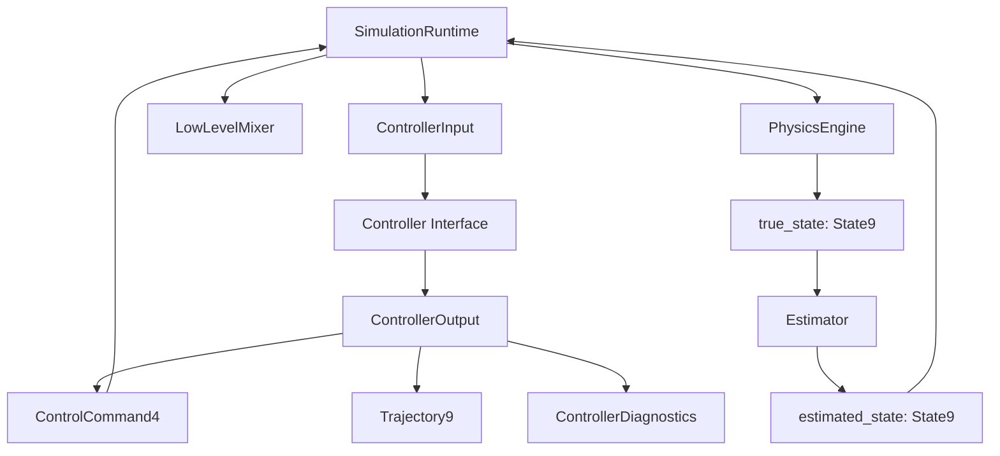

# 06_CONTROLLER_INTERFACE.md

> Status: Draft
> Scope: Ideal design after refactor
> Project: Quadrotor CC-MPC Simulation
> Related documents:
>
> * `04_DATA_MODEL.md`
> * `05_ENGINE_INTERFACE.md`
> * `ADR/ADR-003-state-vector-definition.md`
> * `ADR/ADR-004-control-command-definition.md`
> * `ADR/ADR-001-engine-abstraction.md`

---

## 1. Purpose

This document defines the standard interface for controllers in the refactored quadrotor CC-MPC simulation.

The goal is to make the controller layer independent from:

```text id="6du3wv"
physics engine internals
MuJoCo qpos/qvel
ODE implementation details
logger implementation
renderer implementation
scenario file format
runtime threading model
```

A controller shall receive canonical input data and return canonical command data.

The primary controller in this project is:

```text id="1dzyyp"
CCMPCController
```

However, the interface shall also support future controllers such as:

```text id="674ga7"
PIDController
LQRController
NominalMPCController
NMPCController
BaselineGoToGoalController
EmergencyStopController
```

---

## 2. Design Goal

The refactored simulation shall separate:

```text id="oo89we"
Controller
PhysicsEngine
LowLevelMixer
Runtime
Logger
Renderer
```

The controller shall be responsible for:

```text id="tth3vw"
receiving estimated state
receiving goal
receiving obstacle predictions
receiving uncertainty data
computing high-level control command
returning predicted trajectory
returning solver/controller diagnostics
```

The controller shall not be responsible for:

```text id="4dim1w"
stepping the physics engine
converting State9 to MuJoCo qpos/qvel
converting ControlCommand4 to rotor thrust
writing CSV logs
drawing plots
owning the runtime loop
parsing scenario YAML directly
```

Desired architecture:



---

## 3. Core Principle

The controller shall communicate only through canonical project data types.

Canonical input data types:

```text id="m6cp1i"
State9
Goal3
Gamma9x9
ObstaclePredictionHorizon
ControllerConfig
```

Canonical output data types:

```text id="s5l5v5"
ControlCommand4
Trajectory9
ControlTrajectory4
ControllerDiagnostics
```

The controller shall not expose or consume engine-internal data such as:

```text id="s3daye"
MuJoCo qpos
MuJoCo qvel
MuJoCo quaternion
MuJoCo MjData
MuJoCo actuator ctrl
rotor thrust command
```

Rotor thrust belongs to the low-level mixer or actuator interface, not the high-level controller interface.

---

## 4. Controller Types

The refactored system shall define controller types explicitly.

```python id="cuqxuy"
from enum import Enum

class ControllerType(str, Enum):
    CCMPC = "ccmpc"
    PID = "pid"
    LQR = "lqr"
    NOMINAL_MPC = "nominal_mpc"
    EMERGENCY_STOP = "emergency_stop"
```

Initial implementation target:

```text id="bo2xrr"
ControllerType.CCMPC
```

Optional fallback target:

```text id="d07agf"
ControllerType.PID
ControllerType.EMERGENCY_STOP
```

---

## 5. Base Controller Interface

The base controller interface shall define:

```python id="yvt85o"
class Controller:
    def reset(self) -> None:
        ...

    def compute_command(
        self,
        input_data: ControllerInput,
    ) -> ControllerOutput:
        ...

    def get_metadata(self) -> ControllerMetadata:
        ...

    def close(self) -> None:
        ...
```

The central method is:

```python id="9ch3cy"
compute_command(input_data: ControllerInput) -> ControllerOutput
```

---

## 6. Controller Metadata

Each controller shall expose metadata.

```python id="dqdtid"
from dataclasses import dataclass

@dataclass(frozen=True)
class ControllerMetadata:
    controller_type: ControllerType
    input_state_type: str
    output_command_type: str
    supports_obstacles: bool
    supports_uncertainty: bool
    supports_warm_start: bool
    supports_predicted_trajectory: bool
    notes: str = ""
```

Example for CC-MPC:

```python id="3hq7qo"
ControllerMetadata(
    controller_type=ControllerType.CCMPC,
    input_state_type="State9",
    output_command_type="ControlCommand4",
    supports_obstacles=True,
    supports_uncertainty=True,
    supports_warm_start=True,
    supports_predicted_trajectory=True,
)
```

Example for PID:

```python id="t77sze"
ControllerMetadata(
    controller_type=ControllerType.PID,
    input_state_type="State9",
    output_command_type="ControlCommand4",
    supports_obstacles=False,
    supports_uncertainty=False,
    supports_warm_start=False,
    supports_predicted_trajectory=False,
)
```

---

## 7. `ControllerInput`

### 7.1 Purpose

`ControllerInput` is the complete data package required by a controller at one control cycle.

The runtime shall construct `ControllerInput`.

The controller shall not read directly from physics engine, scenario loader, logger, or global variables.

---

### 7.2 Required fields

```python id="eo0q3y"
from dataclasses import dataclass
import numpy as np

@dataclass(frozen=True)
class ControllerInput:
    time: float
    estimated_state: State9
    goal: np.ndarray
    covariance: np.ndarray | None
    obstacles: object | None
    previous_solution: object | None
    reference_trajectory: object | None
    config: object
```

Recommended refined version:

```python id="orh3sw"
@dataclass(frozen=True)
class ControllerInput:
    time: float
    estimated_state: State9
    goal: Goal3
    covariance: Gamma9x9 | None
    obstacle_predictions: ObstaclePredictionHorizon | None
    previous_solution: ControllerOutput | None
    reference_trajectory: Trajectory9 | None
    config: ControllerConfig
```

---

### 7.3 Field definition

| Field                  | Type                       | Required | Meaning                                    |                                        |
| ---------------------- | -------------------------- | -------: | ------------------------------------------ | -------------------------------------- |
| `time`                 | `float`                    |      Yes | Current simulation/control time in seconds |                                        |
| `estimated_state`      | `State9`                   |      Yes | State estimate used by controller          |                                        |
| `goal`                 | `Goal3`                    |      Yes | Goal position in world frame               |                                        |
| `covariance`           | `Gamma9x9                  |    None` | For CC-MPC                                 | State uncertainty covariance           |
| `obstacle_predictions` | `ObstaclePredictionHorizon |    None` | For obstacle avoidance                     | Predicted obstacle states over horizon |
| `previous_solution`    | `ControllerOutput          |    None` | Optional                                   | Previous MPC result for warm-start     |
| `reference_trajectory` | `Trajectory9               |    None` | Optional                                   | External reference trajectory          |
| `config`               | `ControllerConfig`         |      Yes | Controller parameters                      |                                        |

---

### 7.4 Input ownership

`ControllerInput` is owned by:

```text id="q7b9b5"
SimulationRuntime
```

Read by:

```text id="fn5qlu"
Controller
```

Not owned by:

```text id="6s8jjo"
PhysicsEngine
Logger
Renderer
LowLevelMixer
```

---

### 7.5 `estimated_state`

The controller shall use `estimated_state`, not raw `true_state`, unless an explicit ideal estimator is used.

Allowed ideal simulation mode:

```text id="b6a1z5"
estimated_state = true_state
```

But even in ideal mode, the input field name shall remain:

```text id="1oa3ee"
estimated_state
```

This preserves the same interface for realistic estimator mode.

---

### 7.6 `goal`

The goal shall be a world-frame position.

```text id="pjjksq"
Goal3 = [x_goal, y_goal, z_goal]
```

Shape:

```text id="84tnm0"
(3,)
```

Unit:

```text id="ofkd3v"
meter
```

---

### 7.7 `covariance`

For CC-MPC, covariance is required.

Full state covariance:

```text id="pjwdzz"
Gamma9x9.shape == (9, 9)
```

Position covariance used by chance constraints:

```text id="n81uwv"
Sigma3x3 = Gamma9x9[0:3, 0:3]
```

If the controller does not use uncertainty, this field may be `None`.

CC-MPC shall reject `None` covariance unless explicitly configured for deterministic MPC mode.

---

### 7.8 `obstacle_predictions`

For obstacle avoidance, the controller should receive obstacle predictions over the planning horizon.

Recommended type:

```python id="55jmyg"
@dataclass(frozen=True)
class ObstaclePredictionHorizon:
    obstacles: list
    horizon_steps: int
    dt: float
```

Each obstacle prediction should contain:

```text id="dygj0t"
position sequence
velocity sequence
covariance sequence
ellipsoid axes
yaw/orientation
collision matrix or data needed to compute it
```

The controller shall not query sensors directly.

Obstacle sensing and prediction belong to perception or obstacle manager modules.

---

## 8. `ControllerOutput`

### 8.1 Purpose

`ControllerOutput` is the result of one controller call.

It shall contain:

```text id="hhp948"
first control command to apply now
predicted state trajectory
predicted control trajectory
solver/controller status
diagnostic metrics
```

---

### 8.2 Recommended type

```python id="io0g8v"
from dataclasses import dataclass

@dataclass(frozen=True)
class ControllerOutput:
    command: ControlCommand4
    predicted_trajectory: Trajectory9 | None
    control_trajectory: ControlTrajectory4 | None
    diagnostics: ControllerDiagnostics
```

---

### 8.3 Field definition

| Field                  | Type                    | Required | Meaning                  |                            |
| ---------------------- | ----------------------- | -------: | ------------------------ | -------------------------- |
| `command`              | `ControlCommand4`       |      Yes | First command to apply   |                            |
| `predicted_trajectory` | `Trajectory9            |    None` | For MPC                  | Predicted state trajectory |
| `control_trajectory`   | `ControlTrajectory4     |    None` | For MPC                  | Planned control sequence   |
| `diagnostics`          | `ControllerDiagnostics` |      Yes | Solver/controller status |                            |

---

### 8.4 First-command rule

MPC computes a sequence:

```text id="tuytwf"
[u_0, u_1, ..., u_{N-1}]
```

The controller output `command` shall be:

```text id="5s5vms"
u_0
```

Only the first control command shall be applied to the plant.

The remaining controls are used for:

```text id="hpmd1q"
warm-start
debugging
visualization
logging
analysis
```

---

## 9. `ControllerDiagnostics`

### 9.1 Purpose

`ControllerDiagnostics` records solver/controller execution information.

Recommended type:

```python id="roacgj"
@dataclass(frozen=True)
class ControllerDiagnostics:
    status: str
    success: bool
    solve_time_ms: float | None
    objective_value: float | None
    iterations: int | None
    fallback_used: bool
    fallback_reason: str | None
    max_constraint_violation: float | None
    min_obstacle_margin: float | None
    notes: dict
```

---

### 9.2 Status values

Recommended status enum:

```python id="sktw3h"
from enum import Enum

class ControllerStatus(str, Enum):
    SUCCESS = "success"
    INFEASIBLE = "infeasible"
    SOLVER_ERROR = "solver_error"
    NUMERICAL_ERROR = "numerical_error"
    FALLBACK = "fallback"
    EMERGENCY_STOP = "emergency_stop"
```

---

### 9.3 Required diagnostic fields

| Field                      | Meaning                                |
| -------------------------- | -------------------------------------- |
| `status`                   | Controller status                      |
| `success`                  | Whether the output command is nominal  |
| `solve_time_ms`            | Time spent solving controller          |
| `objective_value`          | Optimization objective if available    |
| `iterations`               | iMPC or solver iterations              |
| `fallback_used`            | Whether fallback was used              |
| `fallback_reason`          | Why fallback was triggered             |
| `max_constraint_violation` | Useful for safety debugging            |
| `min_obstacle_margin`      | Useful for obstacle avoidance analysis |
| `notes`                    | Extra implementation-specific data     |

---

## 10. CC-MPC Controller Specification

---

### 10.1 Responsibility

`CCMPCController` is responsible for solving the chance-constrained MPC problem.

It shall:

```text id="mz8b05"
receive ControllerInput
validate input data
build or update MPC parameters
propagate uncertainty
linearize dynamics
solve the QP
return first ControlCommand4
return predicted trajectory
return diagnostics
store warm-start data if needed
```

It shall not:

```text id="jmv45w"
step the physics engine
convert command to rotor thrust
write CSV files
draw plots
read MuJoCo qpos/qvel directly
parse scenario YAML directly
```

---

### 10.2 Expected input

`CCMPCController` requires:

```text id="7sqdnd"
estimated_state: State9
goal: Goal3
covariance: Gamma9x9
obstacle_predictions: ObstaclePredictionHorizon
config: ControllerConfig
```

Optional:

```text id="qz4x61"
previous_solution
reference_trajectory
```

---

### 10.3 Expected output

`CCMPCController` shall return:

```text id="m7qczv"
ControllerOutput
```

Where:

```text id="cfz8iz"
ControllerOutput.command -> ControlCommand4
ControllerOutput.predicted_trajectory -> Trajectory9
ControllerOutput.control_trajectory -> ControlTrajectory4
ControllerOutput.diagnostics -> ControllerDiagnostics
```

---

### 10.4 Internal algorithm

The CC-MPC controller may implement the following algorithm:

```text id="0ozlnr"
1. Validate ControllerInput.
2. Build or update warm-start trajectory.
3. Propagate covariance over prediction horizon.
4. Predict obstacle positions and uncertainties.
5. Linearize dynamics around current guess trajectory.
6. Compute chance-constraint parameters.
7. Compute cost parameters.
8. Solve QP.
9. Check solver status and convergence.
10. If successful, extract first ControlCommand4.
11. If unsuccessful, use fallback controller.
12. Return ControllerOutput.
```

---

### 10.5 Mathematical form

The controller solves a receding-horizon optimization problem:

$$
\min_{\hat{\mathbf{x}}^{1:N}, \mathbf{u}^{0:N-1}}
\quad
J^N(\hat{\mathbf{x}}^N)
+
\sum_{k=0}^{N-1}
J^k(\hat{\mathbf{x}}^k,\mathbf{u}^k)
$$

Subject to dynamics:

$$
\hat{\mathbf{x}}^{k+1}
=

\mathbf{A}_k
\hat{\mathbf{x}}^k
+
\mathbf{B}_k
\mathbf{u}^k
+
\mathbf{C}_k
$$

and constraints:

```text id="qdrlvj"
state bounds
control bounds
chance constraints
optional FOV constraints
slack constraints
```

The returned command shall be:

$$
\mathbf{u}_{apply}
=

\mathbf{u}^{0*}
$$

---

## 11. Fallback Controller

### 11.1 Purpose

The controller interface shall support fallback behavior.

Fallback may be used when:

```text id="qay6a2"
QP is infeasible
solver fails
solution contains NaN or Inf
solve time exceeds real-time budget
predicted trajectory violates safety limits
```

---

### 11.2 Fallback output

Fallback shall still return a valid `ControllerOutput`.

Example:

```python id="vrqdjn"
ControllerOutput(
    command=fallback_command,
    predicted_trajectory=None,
    control_trajectory=None,
    diagnostics=ControllerDiagnostics(
        status="fallback",
        success=False,
        fallback_used=True,
        fallback_reason="QP infeasible",
        ...
    ),
)
```

---

### 11.3 Fallback command type

Fallback command shall also be:

```text id="l2lwgh"
ControlCommand4
```

This keeps the runtime and engine dispatch unchanged.

---

### 11.4 Emergency stop

Emergency stop may be represented as:

```text id="7kxpg2"
ControlCommand4 = [0, 0, 0, 0]
```

or a configured safe descent command:

```text id="4zfs5d"
ControlCommand4 = [0, 0, vz_descent, 0]
```

The selected emergency behavior shall be documented in `RUNTIME_FLOW.md` or a safety document.

---

## 12. Warm-Start Policy

MPC controllers may use warm-start from the previous solution.

Warm-start data shall be stored inside the controller or passed through `previous_solution`.

Allowed design:

```text id="mz1313"
Controller owns previous solution internally.
```

Alternative allowed design:

```text id="a3fk4g"
Runtime passes previous_solution to ControllerInput.
```

Recommended initial design:

```text id="mkpzok"
Controller owns warm-start state internally.
```

Reason:

```text id="fz298g"
Warm-start is controller-specific and should not complicate runtime.
```

However, `ControllerInput.previous_solution` may still exist for testing or reproducibility.

---

## 13. Trajectory Layout

The public trajectory layout shall follow `DATA_MODEL.md`.

Recommended public layout:

```text id="lgqkyd"
Trajectory9.states.shape == (N + 1, 9)
ControlTrajectory4.controls.shape == (N, 4)
```

Reason:

```text id="klz1ci"
trajectory.states[k] returns the predicted State9 at horizon step k.
control_trajectory.controls[k] returns ControlCommand4 at horizon step k.
```

Internal solver layout may differ.

For example, CVXPY may store:

```text id="l8cp41"
states.shape == (9, N + 1)
controls.shape == (4, N)
```

But the controller output shall adapt this to the public layout.

---

## 14. Controller Configuration

### 14.1 `ControllerConfig`

Recommended type:

```python id="f9hul5"
@dataclass(frozen=True)
class ControllerConfig:
    controller_type: ControllerType
    horizon_steps: int
    timestep: float
    max_iterations: int
    solver_name: str
    tolerance: float
    limits: object
    weights: object
    uncertainty: object
    obstacle: object
    fallback: object
```

---

### 14.2 Required parameters

| Parameter        | Meaning                                   |
| ---------------- | ----------------------------------------- |
| `horizon_steps`  | MPC prediction horizon length             |
| `timestep`       | MPC timestep                              |
| `max_iterations` | Maximum iMPC iterations                   |
| `solver_name`    | Optimization solver name                  |
| `tolerance`      | Convergence tolerance                     |
| `limits`         | State/control limits                      |
| `weights`        | Cost weights                              |
| `uncertainty`    | Process and initial covariance parameters |
| `obstacle`       | Chance-constraint and obstacle parameters |
| `fallback`       | Fallback behavior config                  |

---

### 14.3 Configuration ownership

The runtime or config loader shall parse configuration.

The controller shall receive an already-validated `ControllerConfig`.

The controller shall not parse YAML files directly.

Invalid:

```python id="792zaj"
class CCMPCController:
    def __init__(self):
        self.config = yaml.safe_load(open("mpc.yaml"))
```

Valid:

```python id="833pt6"
config = load_controller_config(path)
controller = CCMPCController(config)
```

---

## 15. Validation Rules

---

### 15.1 Input validation

The controller shall validate:

```text id="zrwme9"
estimated_state is State9-compatible
goal shape == (3,)
time is finite
covariance shape == (9, 9) if required
covariance is symmetric positive semidefinite
obstacle predictions have correct horizon length
config values are valid
```

---

### 15.2 Output validation

The controller shall validate its output before returning:

```text id="87l98i"
command is ControlCommand4-compatible
command contains no NaN or Inf
command respects configured bounds
predicted trajectory has valid shape if present
control trajectory has valid shape if present
diagnostics status is set
```

---

### 15.3 Solver result validation

For optimization-based controllers, validate:

```text id="br29vf"
solver status is acceptable
solution values are finite
first command is finite
predicted trajectory is finite
constraint violation is within tolerance or handled via fallback
```

---

## 16. Controller and Engine Separation

The controller shall not know which physics engine is active.

Invalid:

```python id="9bqhrf"
if engine == "mujoco":
    return rotor_thrusts
else:
    return attitude_command
```

Valid:

```python id="d55pze"
return ControlCommand4(...)
```

Engine-specific command conversion belongs to:

```text id="d431w7"
LowLevelMixer
Runtime dispatch
PhysicsEngine adapter
```

---

## 17. Controller and Mixer Separation

The high-level controller shall not output rotor thrust.

Invalid:

```text id="5on5x9"
CCMPCController returns [T1, T2, T3, T4]
```

Valid:

```text id="tef9ux"
CCMPCController returns [phi_c, theta_c, vz_c, psi_dot_c]
LowLevelMixer returns [T1, T2, T3, T4]
```

The mixer may use controller output and current state:

```python id="7cvs7a"
actuator_command = mixer.compute(
    command=controller_output.command,
    state=true_state,
    previous_state=previous_true_state,
    dt=sim_dt,
)
```

---

## 18. Controller and Logger Separation

The controller shall not write logs directly.

Invalid:

```python id="7na4y2"
controller.compute_command(...):
    csv_writer.writerow(...)
```

Valid:

```python id="rw2ckl"
output = controller.compute_command(input_data)
logger.record(output)
```

Reason:

```text id="ggp8lf"
Controller should compute commands.
Logger should own experiment output format.
```

---

## 19. Controller and Obstacle Manager Separation

The controller shall not own obstacle detection.

Invalid:

```text id="ohv6wz"
Controller reads depth image directly.
Controller tracks obstacles directly.
```

Valid:

```text id="g1tnad"
ObstacleManager predicts obstacle horizon.
Controller receives ObstaclePredictionHorizon.
```

The controller may compute chance-constraint parameters from obstacle prediction data, but it shall not perform raw sensor processing.

---

## 20. Error Handling

Controller errors shall be classified.

| Error type         | Example              | Handling                   |
| ------------------ | -------------------- | -------------------------- |
| Input error        | invalid State9 shape | raise exception            |
| Config error       | negative horizon     | raise exception            |
| Solver error       | solver fails         | fallback or failed output  |
| Infeasible problem | QP infeasible        | fallback                   |
| Numerical error    | NaN solution         | fallback or emergency stop |
| Timeout            | solve time too long  | fallback                   |

Recommended exception types:

```python id="i4mue5"
class ControllerError(Exception):
    pass

class ControllerInputError(ControllerError):
    pass

class ControllerConfigError(ControllerError):
    pass

class ControllerSolverError(ControllerError):
    pass

class ControllerNumericalError(ControllerError):
    pass
```

Recommended policy:

```text id="acdvns"
Raise exceptions for programming/configuration errors.
Use fallback ControllerOutput for runtime solver failures.
```

---

## 21. Timing Requirements

The controller shall report solve time.

```text id="fgfzmo"
diagnostics.solve_time_ms
```

The runtime may enforce a control deadline.

Example:

```text id="4su1li"
mpc_dt = 0.06 s
deadline_ms = 60 ms
```

If solve time exceeds the deadline, runtime may:

```text id="ebajb4"
apply previous valid command
apply fallback command
trigger emergency stop
mark controller output as stale
```

The exact policy shall be defined in `03_RUNTIME_FLOW.md`.

---

## 22. Reproducibility Requirements

For reproducible experiments, the controller shall support:

```text id="dtqgth"
deterministic initialization
fixed solver options
explicit random seed if randomization is used
stable config serialization
diagnostic logging
```

The controller shall not use hidden global random state.

---

## 23. Recommended File Layout

```text id="w2vt1z"
simulation/
├── controllers/
│   ├── __init__.py
│   ├── base.py
│   ├── metadata.py
│   ├── ccmpc_controller.py
│   ├── fallback_controller.py
│   └── factory.py
```

Suggested responsibilities:

| File                     | Responsibility                                                        |
| ------------------------ | --------------------------------------------------------------------- |
| `base.py`                | Controller protocol/base class                                        |
| `metadata.py`            | ControllerType, ControllerMetadata, ControllerInput, ControllerOutput |
| `ccmpc_controller.py`    | CC-MPC adapter around solver implementation                           |
| `fallback_controller.py` | PID/emergency fallback                                                |
| `factory.py`             | Controller factory from config                                        |

Alternative location:

```text id="59srli"
ccmpc/controller/
```

This is acceptable if the project wants to keep controller implementation close to the CC-MPC package.

---

## 24. Example Usage

```python id="2jgh68"
controller = create_controller(config.controller)

for step in range(max_steps):
    true_state = engine.get_state()

    estimated_state, covariance = estimator.estimate(true_state)
    obstacle_predictions = obstacle_manager.predict_horizon(
        time=engine.get_time(),
        horizon_steps=config.controller.horizon_steps,
        dt=config.controller.timestep,
    )

    input_data = ControllerInput(
        time=engine.get_time(),
        estimated_state=estimated_state,
        goal=scenario.goal,
        covariance=covariance,
        obstacle_predictions=obstacle_predictions,
        previous_solution=None,
        reference_trajectory=None,
        config=config.controller,
    )

    output = controller.compute_command(input_data)

    control_command = output.command

    if engine.get_metadata().command_type == EngineCommandType.ACTUATOR_COMMAND_4:
        applied_command = mixer.compute(
            command=control_command,
            state=true_state,
            previous_state=previous_true_state,
            dt=config.simulation.sim_timestep,
        )
    else:
        applied_command = control_command

    step_result = engine.step(applied_command, config.simulation.sim_timestep)

    logger.record(
        time=step_result.time,
        true_state=step_result.true_state,
        estimated_state=estimated_state,
        controller_output=output,
        applied_command=applied_command,
    )
```

---

## 25. Required Tests

The controller layer shall include tests.

Required tests:

```text id="iflh3y"
test_controller_input_valid_state9
test_controller_input_rejects_invalid_state_shape
test_controller_input_rejects_invalid_goal_shape
test_controller_input_rejects_invalid_covariance

test_ccmpc_controller_returns_control_command4
test_ccmpc_controller_returns_trajectory9
test_ccmpc_controller_returns_control_trajectory4
test_ccmpc_controller_reports_solve_time
test_ccmpc_controller_reports_solver_status

test_controller_does_not_return_actuator_command4
test_controller_does_not_access_engine_internals
test_controller_uses_fallback_on_solver_failure
test_fallback_returns_control_command4

test_public_trajectory_layout
test_control_command_bounds_validation
```

---

## 26. Acceptance Criteria

This document is accepted when:

1. `ControllerInput` is defined.
2. `ControllerOutput` is defined.
3. `ControllerDiagnostics` is defined.
4. `ControllerMetadata` is defined.
5. `CCMPCController` receives `State9`, `Goal3`, covariance, and obstacle predictions.
6. `CCMPCController` returns `ControlCommand4`.
7. The controller does not return rotor thrust.
8. The controller does not depend on physics engine internals.
9. The controller does not write logs directly.
10. Runtime can call the controller without knowing the concrete solver implementation.
11. Tests validate controller input/output contracts.

---

## 27. Summary

The controller interface shall be engine-agnostic.

The controller shall receive:

```text id="mp3tut"
ControllerInput
```

The controller shall return:

```text id="ryrw32"
ControllerOutput
```

The command returned by any high-level controller shall be:

```text id="8dnvnj"
ControlCommand4 = [phi_c, theta_c, vz_c, psi_dot_c]
```

The controller shall not return:

```text id="1zbt7y"
rotor thrust
MuJoCo ctrl
torque command
PWM command
```

CC-MPC may internally solve a QP and produce trajectories, but the public interface remains stable.

This separation allows the simulation to replace physics engines, loggers, estimators, and renderers without changing controller code.

---

## 28. Related Documents

```text id="9pcyzm"
docs/design/03_RUNTIME_FLOW.md
docs/design/04_DATA_MODEL.md
docs/design/05_ENGINE_INTERFACE.md
docs/design/07_SCENARIO_CONFIG.md
docs/design/08_LOGGING_AND_METRICS.md
docs/design/ADR/ADR-001-engine-abstraction.md
docs/design/ADR/ADR-003-state-vector-definition.md
docs/design/ADR/ADR-004-control-command-definition.md
docs/theory/10_State_Space_Model.md
docs/theory/11_MPC.md
docs/theory/12_CCMPC.md
docs/theory/13_Chance_Constraints.md
docs/theory/14_Covariance_Propagation.md
docs/theory/16_Optimization.md
docs/theory/17_Solver.md
docs/theory/18_Implementation_Notes.md
```
