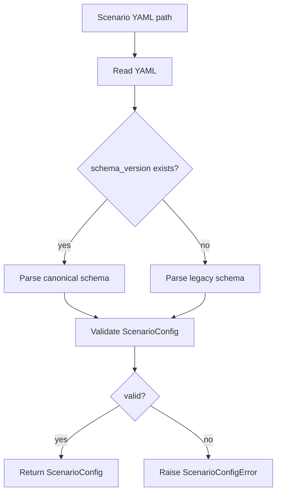

# 07_SCENARIO_CONFIG.md

> Status: Draft
> Scope: Ideal design after refactor
> Project: Quadrotor CC-MPC Simulation
> Related documents:
>
> * `02_ARCHITECTURE.md`
> * `03_RUNTIME_FLOW.md`
> * `04_DATA_MODEL.md`
> * `05_ENGINE_INTERFACE.md`
> * `06_CONTROLLER_INTERFACE.md`
> * `08_LOGGING_AND_METRICS.md`
> * `ADR/ADR-003-state-vector-definition.md`
> * `ADR/ADR-004-control-command-definition.md`

---

## 1. Purpose

This document defines the canonical scenario configuration format for the refactored quadrotor CC-MPC simulation.

The scenario config defines the experiment environment:

```text id="h4u9ah"
initial quadrotor state
goal position
obstacles
world bounds
success criteria
collision criteria
optional scenario-specific runtime overrides
```

The purpose is to make scenarios:

```text id="6b5wb1"
reproducible
validated before runtime
independent from demo scripts
independent from controller internals
independent from physics engine internals
easy to compare across ODE and MuJoCo
```

After refactor, scenario YAML files shall be treated as declarative experiment inputs, not as code.

---

## 2. Scope

This document defines:

1. Scenario YAML schema.
2. Required and optional fields.
3. Units and coordinate frames.
4. Obstacle schema.
5. Goal and termination schema.
6. Runtime override policy.
7. Validation rules.
8. Backward compatibility with current flat scenario files.
9. Recommended file layout.
10. Migration plan.

This document does not define:

```text id="5m05a1"
MPC cost weights
solver settings
physics engine implementation
MuJoCo XML model
logger output columns
controller algorithm details
```

Those belong to separate config files or design documents.

---

## 3. Design Principles

### 3.1 Scenario config is declarative

A scenario config shall describe *what* the experiment is, not *how* modules internally implement it.

Good:

```yaml id="hx5l44"
goal:
  position: [6.0, 4.0, 2.5]
```

Bad:

```yaml id="74kna3"
controller:
  internal_warm_start_array: [...]
```

---

### 3.2 Scenario config shall use canonical data contracts

Scenario config shall map directly to canonical data types:

| YAML field                 | Canonical type    |
| -------------------------- | ----------------- |
| `initial_state.state9`     | `State9`          |
| `goal.position`            | `Goal3`           |
| `obstacles[*]`             | `ObstacleSpec`    |
| `success.goal_threshold`   | success criterion |
| `runtime_overrides.sim_dt` | runtime override  |

---

### 3.3 Scenario config shall not own controller internals

Scenario config may specify environment-level data.

It shall not define:

```text id="c47agz"
MPC Q matrix
MPC R matrix
solver name
QP slack variable layout
CVXPY parameter names
warm-start arrays
```

Those belong to controller config, e.g.:

```text id="doxlvk"
config/mpc.yaml
config/controller.yaml
```

---

### 3.4 Scenario config shall be engine-independent

The same scenario should run on:

```text id="es1tvl"
ODEPhysicsEngine
MuJoCoPhysicsEngine
FuturePhysicsEngine
```

Therefore, scenario config shall not contain:

```text id="b9n9wr"
MuJoCo qpos
MuJoCo qvel
MuJoCo body id
MuJoCo actuator id
viewer camera position
```

Engine-specific config belongs to engine config.

---

### 3.5 Scenario config shall be validated before runtime

Invalid scenario files shall fail before simulation starts.

Runtime shall not discover malformed scenario data halfway through a run.

---

## 4. Configuration Layers

The refactored project shall distinguish multiple config layers.

```text id="6q5p0n"
AppConfig
├── ScenarioConfig
├── RuntimeConfig
├── ControllerConfig
├── EngineConfig
├── EstimatorConfig
├── MixerConfig
├── LoggingConfig
└── RenderingConfig
```

This document defines only:

```text id="ditqma"
ScenarioConfig
```

However, it may reference runtime overrides when they are scenario-specific.

---

## 5. Recommended File Layout

```text id="fx0jwr"
config/
├── app.yaml
├── controller/
│   └── ccmpc.yaml
├── runtime/
│   └── default.yaml
├── engines/
│   ├── ode.yaml
│   └── mujoco.yaml
├── scenarios/
│   ├── default.yaml
│   ├── static_obstacles.yaml
│   ├── corridor.yaml
│   ├── moving_obstacles.yaml
│   └── empty_world.yaml
└── logging/
    └── csv.yaml
```

Recommended scenario path:

```text id="rzzgdd"
config/scenarios/<scenario_id>.yaml
```

---

## 6. Canonical Scenario YAML

The canonical scenario schema shall use a structured format.

Example:

```yaml id="j1lgdh"
schema_version: "1.0"

scenario:
  id: "default"
  name: "Default moving obstacle scenario"
  description: "Quadrotor navigates to a 3D goal while avoiding moving ellipsoidal obstacles."
  tags: ["ccmpc", "moving-obstacles", "3d"]

world:
  frame: "W"
  convention: "Z_UP"
  gravity: [0.0, 0.0, -9.81]
  bounds:
    x: [-10.0, 10.0]
    y: [-10.0, 10.0]
    z: [0.0, 6.0]

initial_state:
  state9: [0.0, 0.0, 1.0, 0.0, 0.0, 0.0, 0.0, 0.0, 0.0]

goal:
  position: [6.0, 4.0, 2.5]
  threshold: 0.4

obstacles:
  - id: "obs_001"
    type: "box_ellipsoid"
    frame: "W"
    position: [2.5, 1.0, 1.5]
    size: [0.6, 0.6, 1.0]
    yaw: 0.3
    velocity: [0.2, 0.0, 0.0]
    covariance:
      position_std: [0.05, 0.05, 0.05]
      velocity_std: [0.02, 0.02, 0.02]

  - id: "obs_002"
    type: "box_ellipsoid"
    frame: "W"
    position: [4.0, 2.5, 1.8]
    size: [0.8, 0.5, 1.2]
    yaw: -0.5
    velocity: [-0.15, 0.1, 0.0]
    covariance:
      position_std: [0.05, 0.05, 0.05]
      velocity_std: [0.02, 0.02, 0.02]

success:
  goal_threshold: 0.4
  require_collision_free: true

termination:
  max_time: 30.0
  max_steps: 3000
  terminate_on_collision: true
  terminate_on_altitude_violation: true

runtime_overrides:
  sim_dt: 0.02
```

---

## 7. Top-Level Schema

Top-level fields:

| Field               | Type     | Required | Meaning                                  |
| ------------------- | -------- | -------: | ---------------------------------------- |
| `schema_version`    | `str`    |      Yes | Scenario schema version                  |
| `scenario`          | `object` |      Yes | Scenario metadata                        |
| `world`             | `object` |      Yes | World frame and bounds                   |
| `initial_state`     | `object` |      Yes | Initial quadrotor state                  |
| `goal`              | `object` |      Yes | Goal position and goal-specific settings |
| `obstacles`         | `list`   |      Yes | List of obstacle specifications          |
| `success`           | `object` |      Yes | Success criteria                         |
| `termination`       | `object` |      Yes | Stop conditions                          |
| `runtime_overrides` | `object` | Optional | Scenario-specific runtime overrides      |

---

## 8. `schema_version`

### 8.1 Purpose

`schema_version` identifies the version of the scenario schema.

Example:

```yaml id="clzm8c"
schema_version: "1.0"
```

### 8.2 Rules

```text id="vvwcdh"
schema_version must be present
schema_version must be a string
loader must reject unsupported major versions
loader may warn on newer minor versions
```

Recommended compatibility policy:

| Version difference      | Behavior              |
| ----------------------- | --------------------- |
| Same major and minor    | accept                |
| Same major, newer minor | warn and attempt load |
| Different major         | reject                |

---

## 9. `scenario`

### 9.1 Purpose

The `scenario` section stores human-readable metadata.

Example:

```yaml id="q47v5j"
scenario:
  id: "corridor_static"
  name: "Static corridor scenario"
  description: "Quadrotor flies through a corridor with static wall-like obstacles."
  tags: ["corridor", "static-obstacles"]
```

### 9.2 Fields

| Field         | Type        | Required | Meaning                     |
| ------------- | ----------- | -------: | --------------------------- |
| `id`          | `str`       |      Yes | Stable scenario identifier  |
| `name`        | `str`       |      Yes | Human-readable name         |
| `description` | `str`       | Optional | Longer scenario description |
| `tags`        | `list[str]` | Optional | Scenario categories         |

### 9.3 Validation

```text id="f782wn"
scenario.id must be non-empty
scenario.id should be filesystem-safe
scenario.name must be non-empty
tags must be strings
```

Recommended ID format:

```text id="12s2j8"
lowercase letters, numbers, underscores, hyphens
```

---

## 10. `world`

### 10.1 Purpose

The `world` section defines the global coordinate convention and optional world bounds.

Example:

```yaml id="mvb05v"
world:
  frame: "W"
  convention: "Z_UP"
  gravity: [0.0, 0.0, -9.81]
  bounds:
    x: [-10.0, 10.0]
    y: [-10.0, 10.0]
    z: [0.0, 6.0]
```

### 10.2 Fields

| Field        | Type          | Required | Meaning                 |
| ------------ | ------------- | -------: | ----------------------- |
| `frame`      | `str`         |      Yes | World frame name        |
| `convention` | `str`         |      Yes | Axis convention         |
| `gravity`    | `list[float]` | Optional | Gravity vector          |
| `bounds`     | `object`      | Optional | Simulation/world bounds |

### 10.3 Required convention

The canonical convention shall be:

```yaml id="hxwpck"
convention: "Z_UP"
```

Meaning:

```text id="ui3f4w"
z = 0 means ground level
z > 0 means above ground
gravity points in negative z direction
```

### 10.4 Bounds

World bounds are optional but recommended.

```yaml id="84w8de"
bounds:
  x: [-10.0, 10.0]
  y: [-10.0, 10.0]
  z: [0.0, 6.0]
```

Bounds may be used for:

```text id="09h7sk"
validation
termination
plot limits
sanity checks
```

They shall not replace controller state constraints.

---

## 11. `initial_state`

### 11.1 Purpose

The `initial_state` section defines the initial quadrotor canonical state.

Example:

```yaml id="m4ubt5"
initial_state:
  state9: [0.0, 0.0, 1.0, 0.0, 0.0, 0.0, 0.0, 0.0, 0.0]
```

### 11.2 Required ordering

The ordering shall be:

```text id="93kvba"
[x, y, z, vx, vy, vz, roll, pitch, yaw]
```

Mathematical form:

$$
\mathbf{x}_0
============

\begin{bmatrix}
x_0 \
y_0 \
z_0 \
v_{x,0} \
v_{y,0} \
v_{z,0} \
\phi_0 \
\theta_0 \
\psi_0
\end{bmatrix}
\in
\mathbb{R}^9
$$

### 11.3 Units

| Field              | Unit | Frame     |
| ------------------ | ---- | --------- |
| `x, y, z`          | m    | World     |
| `vx, vy, vz`       | m/s  | World     |
| `roll, pitch, yaw` | rad  | Euler ZYX |

### 11.4 Validation

```text id="m81drk"
state9 must have length 9
all values must be finite
z must be within world bounds if bounds are defined
roll, pitch, yaw must be in radians
```

Degrees are not allowed in canonical `state9`.

If degrees are desired for human input, use an explicit alternative field:

```yaml id="y2s3j7"
initial_state:
  position: [0.0, 0.0, 1.0]
  velocity: [0.0, 0.0, 0.0]
  attitude_deg: [0.0, 0.0, 0.0]
```

The loader may convert this to `State9`, but the internal config object shall store radians.

Recommended initial implementation:

```text id="wjf2pp"
support only state9
reject attitude_deg until needed
```

---

## 12. `goal`

### 12.1 Purpose

The `goal` section defines the target position.

Example:

```yaml id="twmfz0"
goal:
  position: [6.0, 4.0, 2.5]
  threshold: 0.4
```

### 12.2 Fields

| Field       | Type          | Unit | Required | Meaning                      |
| ----------- | ------------- | ---- | -------: | ---------------------------- |
| `position`  | `list[float]` | m    |      Yes | Goal position in world frame |
| `threshold` | `float`       | m    | Optional | Goal reached threshold       |

### 12.3 `Goal3`

The goal position maps to:

```text id="t9h727"
Goal3 = [x_goal, y_goal, z_goal]
```

Shape:

```text id="n6jj22"
(3,)
```

### 12.4 Validation

```text id="czqsjj"
goal.position must have length 3
all values must be finite
goal.threshold must be positive
goal z must be within world z bounds if defined
```

---

## 13. `success`

### 13.1 Purpose

The `success` section defines experiment success criteria.

Example:

```yaml id="a3exzz"
success:
  goal_threshold: 0.4
  require_collision_free: true
```

### 13.2 Fields

| Field                    | Type    | Required | Meaning                                        |
| ------------------------ | ------- | -------: | ---------------------------------------------- |
| `goal_threshold`         | `float` |      Yes | Maximum distance to goal for success           |
| `require_collision_free` | `bool`  |      Yes | Whether collisions invalidate success          |
| `require_altitude_valid` | `bool`  | Optional | Whether altitude violations invalidate success |
| `max_final_speed`        | `float` | Optional | Optional final-speed success criterion         |

### 13.3 Goal distance

Goal distance shall be computed in world frame:

$$
d_g
===

\lVert
\mathbf{p}
----------

\mathbf{p}_g
\rVert_2
$$

where:

| Symbol         | Meaning                             |
| -------------- | ----------------------------------- |
| $\mathbf{p}$   | current position from `State9[0:3]` |
| $\mathbf{p}_g$ | goal position                       |

Goal reached condition:

$$
d_g
\leq
d_{\text{threshold}}
$$

---

## 14. `termination`

### 14.1 Purpose

The `termination` section defines when the run stops.

Example:

```yaml id="4lu6ds"
termination:
  max_time: 30.0
  max_steps: 3000
  terminate_on_collision: true
  terminate_on_altitude_violation: true
```

### 14.2 Fields

| Field                             | Type    | Unit     |                   Required | Meaning                |
| --------------------------------- | ------- | -------- | -------------------------: | ---------------------- |
| `max_time`                        | `float` | s        |                        Yes | Maximum simulated time |
| `max_steps`                       | `int`   | steps    |                   Optional | Maximum physics steps  |
| `terminate_on_collision`          | `bool`  | Yes      | Stop when collision occurs |                        |
| `terminate_on_altitude_violation` | `bool`  | Yes      |   Stop on invalid altitude |                        |
| `terminate_on_goal_reached`       | `bool`  | Optional |  Stop once goal is reached |                        |
| `terminate_on_solver_failure`     | `bool`  | Optional |     Stop on solver failure |                        |

### 14.3 Validation

```text id="0fvzij"
max_time > 0
max_steps > 0 if present
boolean fields must be booleans
```

If both `max_time` and `max_steps` are present, runtime shall stop at whichever is reached first.

---

## 15. `obstacles`

### 15.1 Purpose

The `obstacles` section defines static or moving obstacles.

Example:

```yaml id="68s29h"
obstacles:
  - id: "obs_001"
    type: "box_ellipsoid"
    frame: "W"
    position: [2.5, 1.0, 1.5]
    size: [0.6, 0.6, 1.0]
    yaw: 0.3
    velocity: [0.2, 0.0, 0.0]
```

### 15.2 Required fields

| Field      | Type          | Unit | Required | Meaning                          |
| ---------- | ------------- | ---- | -------: | -------------------------------- |
| `id`       | `str`         | -    |      Yes | Obstacle identifier              |
| `type`     | `str`         | -    |      Yes | Obstacle geometry type           |
| `frame`    | `str`         | -    |      Yes | Coordinate frame                 |
| `position` | `list[float]` | m    |      Yes | Initial obstacle center          |
| `size`     | `list[float]` | m    |      Yes | Box dimensions                   |
| `yaw`      | `float`       | rad  |      Yes | Obstacle yaw angle               |
| `velocity` | `list[float]` | m/s  |      Yes | Obstacle velocity in world frame |

### 15.3 Optional fields

| Field                | Type     | Meaning                           |
| -------------------- | -------- | --------------------------------- |
| `covariance`         | `object` | Obstacle uncertainty              |
| `active`             | `bool`   | Whether obstacle is enabled       |
| `appearance_time`    | `float`  | Time when obstacle becomes active |
| `disappearance_time` | `float`  | Time when obstacle is removed     |
| `metadata`           | `object` | Extra non-runtime metadata        |

---

## 16. Obstacle Types

### 16.1 `box_ellipsoid`

Initial canonical type:

```yaml id="m886h9"
type: "box_ellipsoid"
```

Meaning:

```text id="st2ti2"
Scenario defines a box size.
ObstacleManager converts box size to an ellipsoid for smooth collision constraints.
```

Box size:

```text id="xjlw95"
size = [length, width, height]
```

Ellipsoid semi-axes:

$$
\begin{bmatrix}
a_o \
b_o \
c_o
\end{bmatrix}
=============

\frac{\sqrt{3}}{2}
\begin{bmatrix}
l_o \
w_o \
h_o
\end{bmatrix}
$$

### 16.2 Future types

Future supported obstacle types may include:

```text id="42i7cw"
sphere
ellipsoid
box
cylinder
mesh
dynamic_agent
```

Only `box_ellipsoid` is required for the initial refactor.

---

## 17. Obstacle Coordinate Frame

For scenario config, obstacle `position` and `velocity` shall be in world frame.

Required:

```yaml id="iawkok"
frame: "W"
```

The loader shall reject unsupported frames until explicit adapters are implemented.

Allowed initial value:

```text id="5sgie6"
W
```

Future allowed values may include:

```text id="9b36bl"
B
C
```

but only if the config loader implements conversion to world frame.

---

## 18. Obstacle Motion Model

Initial obstacle motion model shall be constant velocity.

```yaml id="xn36v6"
motion_model: "constant_velocity"
```

If `motion_model` is omitted, default shall be:

```text id="h8t24n"
constant_velocity
```

Prediction:

$$
\hat{\mathbf{p}}_o^{k+1}
========================

\hat{\mathbf{p}}_o^k
+
\hat{\mathbf{v}}_o^k
\Delta t
$$

$$
\hat{\mathbf{v}}_o^{k+1}
========================

\hat{\mathbf{v}}_o^k
$$

---

## 19. Obstacle Covariance

### 19.1 Purpose

Obstacle covariance is needed for chance-constrained obstacle avoidance.

Example:

```yaml id="orc1yv"
covariance:
  position_std: [0.05, 0.05, 0.05]
  velocity_std: [0.02, 0.02, 0.02]
```

### 19.2 Supported covariance formats

Recommended initial format:

```yaml id="dm4jxm"
covariance:
  position_std: [0.05, 0.05, 0.05]
  velocity_std: [0.02, 0.02, 0.02]
```

This maps to:

$$
\boldsymbol{\Sigma}_o
=====================

\operatorname{diag}
(
\sigma_x^2,
\sigma_y^2,
\sigma_z^2
)
$$

and:

$$
\boldsymbol{\Sigma}_{o,v}
=========================

\operatorname{diag}
(
\sigma_{v_x}^2,
\sigma_{v_y}^2,
\sigma_{v_z}^2
)
$$

Future format:

```yaml id="32f1pc"
covariance:
  position:
    matrix:
      - [0.0025, 0.0, 0.0]
      - [0.0, 0.0025, 0.0]
      - [0.0, 0.0, 0.0025]
```

Recommended initial implementation:

```text id="am4dfv"
support position_std and velocity_std only
```

---

## 20. `runtime_overrides`

### 20.1 Purpose

Some scenario properties affect runtime timing.

Example:

```yaml id="gt1s28"
runtime_overrides:
  sim_dt: 0.02
```

This allows a scenario to specify a preferred physics timestep.

### 20.2 Allowed fields

Initial allowed overrides:

| Field       | Type    | Unit  | Meaning                                     |
| ----------- | ------- | ----- | ------------------------------------------- |
| `sim_dt`    | `float` | s     | Physics timestep                            |
| `max_time`  | `float` | s     | Optional override for termination max time  |
| `max_steps` | `int`   | steps | Optional override for termination max steps |

### 20.3 Disallowed fields

Scenario config shall not override:

```text id="wtr5os"
MPC cost weights
solver choice
engine type
logger output path
renderer backend
```

unless the project explicitly moves those into an app-level experiment config.

Reason:

```text id="4uy9so"
Scenario should describe environment, not implementation details.
```

---

## 21. Legacy Scenario Format

The current demo scenario format is flat.

Example:

```yaml id="s520ph"
start: [0.0, 0.0, 1.0, 0.0, 0.0, 0.0, 0.0, 0.0, 0.0]
goal: [6.0, 4.0, 2.5]
target_altitude: 2.0
obstacles:
  - position: [2.5, 1.0, 1.5]
    size: [0.6, 0.6, 1.0]
    yaw: 0.3
    velocity: [0.2, 0.0, 0.0]
goal_threshold: 0.4
sim_timestep: 0.02
```

This format shall be supported only through a legacy adapter during migration.

---

## 22. Legacy-to-Canonical Mapping

| Legacy field            | Canonical field                               |
| ----------------------- | --------------------------------------------- |
| `start`                 | `initial_state.state9`                        |
| `goal`                  | `goal.position`                               |
| `goal_threshold`        | `goal.threshold` and `success.goal_threshold` |
| `sim_timestep`          | `runtime_overrides.sim_dt`                    |
| `obstacles[*].position` | `obstacles[*].position`                       |
| `obstacles[*].size`     | `obstacles[*].size`                           |
| `obstacles[*].yaw`      | `obstacles[*].yaw`                            |
| `obstacles[*].velocity` | `obstacles[*].velocity`                       |
| `target_altitude`       | optional metadata or removed if unused        |

Example adapter behavior:

```python id="nzd4yf"
def load_legacy_scenario(data: dict) -> ScenarioConfig:
    return ScenarioConfig(
        schema_version="legacy",
        initial_state=State9(data["start"]),
        goal=GoalConfig(
            position=data["goal"],
            threshold=data.get("goal_threshold", 0.4),
        ),
        obstacles=convert_legacy_obstacles(data.get("obstacles", [])),
        runtime_overrides=RuntimeOverrides(
            sim_dt=data.get("sim_timestep", None),
        ),
    )
```

The loader shall warn when loading legacy schema.

---

## 23. `target_altitude` Policy

Current flat scenarios may include:

```yaml id="t3n3ql"
target_altitude: 2.0
```

In the refactored architecture, this field shall not be required.

Reason:

```text id="a0jk5f"
Goal altitude is already specified by goal.position[2].
The controller tracks goal position.
Target altitude is ambiguous unless a runtime module explicitly uses it.
```

Allowed policies:

| Policy            | Meaning                                   |
| ----------------- | ----------------------------------------- |
| remove            | Delete field from canonical scenario      |
| metadata          | Keep only as non-runtime metadata         |
| explicit behavior | Define a module that uses target altitude |

Recommended initial policy:

```text id="cb1x87"
remove from canonical schema
support as legacy metadata only
```

If future scenarios require altitude segments, use an explicit route or reference trajectory schema.

---

## 24. ScenarioConfig Data Type

Recommended Python data classes:

```python id="mfmat5"
from dataclasses import dataclass
from typing import Any

@dataclass(frozen=True)
class ScenarioMetadata:
    id: str
    name: str
    description: str | None
    tags: list[str]

@dataclass(frozen=True)
class WorldBounds:
    x: tuple[float, float]
    y: tuple[float, float]
    z: tuple[float, float]

@dataclass(frozen=True)
class WorldConfig:
    frame: str
    convention: str
    gravity: tuple[float, float, float]
    bounds: WorldBounds | None

@dataclass(frozen=True)
class GoalConfig:
    position: Goal3
    threshold: float

@dataclass(frozen=True)
class ObstacleCovarianceConfig:
    position_std: tuple[float, float, float]
    velocity_std: tuple[float, float, float]

@dataclass(frozen=True)
class ObstacleSpec:
    id: str
    type: str
    frame: str
    position: tuple[float, float, float]
    size: tuple[float, float, float]
    yaw: float
    velocity: tuple[float, float, float]
    covariance: ObstacleCovarianceConfig | None
    motion_model: str = "constant_velocity"
    active: bool = True

@dataclass(frozen=True)
class SuccessConfig:
    goal_threshold: float
    require_collision_free: bool = True
    require_altitude_valid: bool = True

@dataclass(frozen=True)
class TerminationConfig:
    max_time: float
    max_steps: int | None
    terminate_on_collision: bool
    terminate_on_altitude_violation: bool
    terminate_on_goal_reached: bool = True
    terminate_on_solver_failure: bool = False

@dataclass(frozen=True)
class RuntimeOverrides:
    sim_dt: float | None = None
    max_time: float | None = None
    max_steps: int | None = None

@dataclass(frozen=True)
class ScenarioConfig:
    schema_version: str
    scenario: ScenarioMetadata
    world: WorldConfig
    initial_state: State9
    goal: GoalConfig
    obstacles: list[ObstacleSpec]
    success: SuccessConfig
    termination: TerminationConfig
    runtime_overrides: RuntimeOverrides | None = None
    raw_metadata: dict[str, Any] | None = None
```

---

## 25. Config Loader Architecture

Recommended files:

```text id="wlfpf6"
simulation/config/
├── schema.py
├── loader.py
├── legacy.py
└── validation.py
```

Responsibilities:

| File            | Responsibility                |
| --------------- | ----------------------------- |
| `schema.py`     | dataclass definitions         |
| `loader.py`     | load YAML and dispatch parser |
| `legacy.py`     | convert flat legacy scenario  |
| `validation.py` | validate parsed config        |

---

## 26. Loading Flow



---

## 27. Validation Rules

### 27.1 General validation

```text id="ne8nr4"
YAML must parse to dict
required top-level fields must exist
all numeric fields must be finite
all list fields must have correct length
units must follow schema
```

---

### 27.2 Initial state validation

```text id="2wwyw3"
initial_state.state9 length == 9
all values finite
position inside world bounds if bounds are defined
z >= world.bounds.z[0] if bounds are defined
Euler angles are radians
```

---

### 27.3 Goal validation

```text id="gzxwew"
goal.position length == 3
goal.position values finite
goal.threshold > 0
goal inside world bounds if bounds are defined
```

---

### 27.4 Obstacle validation

For each obstacle:

```text id="s987xt"
id is unique
type is supported
frame == W for initial refactor
position length == 3
size length == 3
size entries > 0
yaw is finite
velocity length == 3
velocity values finite
covariance std values >= 0 if present
appearance_time < disappearance_time if both present
```

---

### 27.5 Runtime override validation

```text id="b55g13"
sim_dt > 0 if present
max_time > 0 if present
max_steps > 0 if present
```

---

### 27.6 Cross-field validation

```text id="1hsv2v"
initial state should not start inside an obstacle
goal should not be inside an obstacle
goal should not be outside world bounds
sim_dt should be compatible with controller_dt if both known
max_steps should be consistent with max_time and sim_dt if all are present
```

Cross-field validation may require controller/runtime config in addition to scenario config.

Therefore, some checks shall be performed at `AppConfig` validation level.

---

## 28. Collision Sanity Checks

The scenario validator should optionally check whether initial state or goal is inside an obstacle.

For spherical MAV radius `r_i` and ellipsoidal obstacle:

$$
\lVert
\mathbf{p}_i
------------

\mathbf{p}*o
\rVert*{\boldsymbol{\Omega}_{io}}
\leq
1
$$

means collision.

The validator may warn or reject if:

```text id="ux95eb"
initial state is in collision
goal position is in collision
```

Recommended initial behavior:

```text id="69rlto"
reject initial collision
warn on goal near obstacle
reject goal inside obstacle
```

---

## 29. Example Scenarios

### 29.1 Empty world

```yaml id="wz4ahy"
schema_version: "1.0"

scenario:
  id: "empty_world"
  name: "Empty world"
  description: "Quadrotor flies to a goal without obstacles."
  tags: ["baseline", "no-obstacles"]

world:
  frame: "W"
  convention: "Z_UP"
  gravity: [0.0, 0.0, -9.81]
  bounds:
    x: [-10.0, 10.0]
    y: [-10.0, 10.0]
    z: [0.0, 6.0]

initial_state:
  state9: [0.0, 0.0, 1.0, 0.0, 0.0, 0.0, 0.0, 0.0, 0.0]

goal:
  position: [5.0, 0.0, 2.0]
  threshold: 0.4

obstacles: []

success:
  goal_threshold: 0.4
  require_collision_free: true

termination:
  max_time: 20.0
  max_steps: 2000
  terminate_on_collision: true
  terminate_on_altitude_violation: true
  terminate_on_goal_reached: true

runtime_overrides:
  sim_dt: 0.02
```

---

### 29.2 Static obstacle scenario

```yaml id="6pz2hi"
schema_version: "1.0"

scenario:
  id: "static_obstacles"
  name: "Static obstacle scenario"
  description: "Quadrotor avoids static obstacles while flying to a 3D goal."
  tags: ["static-obstacles", "ccmpc"]

world:
  frame: "W"
  convention: "Z_UP"
  gravity: [0.0, 0.0, -9.81]
  bounds:
    x: [-2.0, 10.0]
    y: [-5.0, 5.0]
    z: [0.0, 6.0]

initial_state:
  state9: [0.0, 0.0, 1.0, 0.0, 0.0, 0.0, 0.0, 0.0, 0.0]

goal:
  position: [8.0, 0.0, 1.5]
  threshold: 0.4

obstacles:
  - id: "wall_left_001"
    type: "box_ellipsoid"
    frame: "W"
    position: [2.0, -1.5, 1.0]
    size: [0.5, 4.0, 2.0]
    yaw: 0.0
    velocity: [0.0, 0.0, 0.0]
    covariance:
      position_std: [0.02, 0.02, 0.02]
      velocity_std: [0.0, 0.0, 0.0]

success:
  goal_threshold: 0.4
  require_collision_free: true

termination:
  max_time: 30.0
  max_steps: 3000
  terminate_on_collision: true
  terminate_on_altitude_violation: true
  terminate_on_goal_reached: true

runtime_overrides:
  sim_dt: 0.02
```

---

### 29.3 Moving obstacle scenario

```yaml id="8zssxb"
schema_version: "1.0"

scenario:
  id: "moving_obstacles"
  name: "Moving obstacle scenario"
  description: "Quadrotor avoids moving obstacles with constant-velocity prediction."
  tags: ["moving-obstacles", "ccmpc", "dynamic"]

world:
  frame: "W"
  convention: "Z_UP"
  gravity: [0.0, 0.0, -9.81]
  bounds:
    x: [-2.0, 10.0]
    y: [-5.0, 5.0]
    z: [0.0, 6.0]

initial_state:
  state9: [0.0, 0.0, 1.0, 0.0, 0.0, 0.0, 0.0, 0.0, 0.0]

goal:
  position: [6.0, 4.0, 2.5]
  threshold: 0.4

obstacles:
  - id: "moving_obs_001"
    type: "box_ellipsoid"
    frame: "W"
    position: [2.5, 1.0, 1.5]
    size: [0.6, 0.6, 1.0]
    yaw: 0.3
    velocity: [0.2, 0.0, 0.0]
    motion_model: "constant_velocity"
    covariance:
      position_std: [0.05, 0.05, 0.05]
      velocity_std: [0.02, 0.02, 0.02]

success:
  goal_threshold: 0.4
  require_collision_free: true

termination:
  max_time: 30.0
  max_steps: 3000
  terminate_on_collision: true
  terminate_on_altitude_violation: true
  terminate_on_goal_reached: true

runtime_overrides:
  sim_dt: 0.02
```

---

## 30. Backward Compatibility Policy

During migration, the loader may support both:

```text id="pbtf12"
canonical schema
legacy flat schema
```

But new scenarios shall use canonical schema.

Recommended loader behavior:

| Input type                             | Behavior                             |
| -------------------------------------- | ------------------------------------ |
| canonical schema with `schema_version` | load normally                        |
| legacy schema without `schema_version` | load through legacy adapter and warn |
| malformed schema                       | reject                               |
| unknown schema major version           | reject                               |

Example warning:

```text id="83l5fr"
[warn] Loading legacy scenario format. Please migrate to schema_version: "1.0".
```

---

## 31. Scenario Naming Policy

Scenario file names should be stable and descriptive.

Recommended:

```text id="hrb7cy"
empty_world.yaml
static_obstacles.yaml
moving_obstacles.yaml
corridor_static.yaml
corridor_dynamic.yaml
```

Not recommended:

```text id="uwnnuy"
test.yaml
new.yaml
final.yaml
demo2.yaml
```

Scenario IDs should match file names unless there is a reason not to.

---

## 32. Reproducibility Metadata

Scenario config may include optional reproducibility metadata.

Example:

```yaml id="qgglli"
reproducibility:
  random_seed: 42
  expected_engine: "ode"
  expected_controller: "ccmpc"
  notes: "Baseline scenario for regression tests."
```

This metadata shall not force engine/controller selection.
It only documents expected usage.

Actual engine/controller selection belongs to `AppConfig`.

---

## 33. AppConfig Integration

A full app config may reference a scenario.

Example:

```yaml id="657wq8"
scenario_file: "config/scenarios/moving_obstacles.yaml"
controller_file: "config/controller/ccmpc.yaml"
engine_file: "config/engines/ode.yaml"
runtime_file: "config/runtime/default.yaml"
logging_file: "config/logging/csv.yaml"
```

The app config loader shall:

```text id="z2n8ax"
load all referenced configs
validate each config independently
apply scenario runtime overrides
validate cross-config consistency
build AppConfig
```

---

## 34. Cross-Config Consistency

Some validation requires multiple config files.

Examples:

```text id="ba10l6"
runtime.sim_dt <= controller.timestep
controller horizon compatible with obstacle prediction horizon
world bounds compatible with controller altitude limits
engine timestep compatible with runtime sim_dt
logging path compatible with scenario id
```

These checks belong to `AppConfig` validation, not pure `ScenarioConfig` validation.

---

## 35. Migration Plan

### Phase 1: Define canonical schema

Create:

```text id="2je6uk"
docs/design/07_SCENARIO_CONFIG.md
```

and implement dataclasses in:

```text id="gdsy3p"
simulation/config/schema.py
```

---

### Phase 2: Implement loader

Create:

```text id="d3ag21"
simulation/config/loader.py
```

Functions:

```python id="4hohvo"
def load_scenario_config(path: str) -> ScenarioConfig:
    ...
```

---

### Phase 3: Implement legacy adapter

Create:

```text id="mnafx3"
simulation/config/legacy.py
```

Function:

```python id="5cobak"
def convert_legacy_scenario(data: dict) -> ScenarioConfig:
    ...
```

---

### Phase 4: Migrate current scenario files

Migrate:

```text id="pfpf6b"
simulation.yaml
simulation_static.yaml
simulation_corridor.yaml
```

to:

```text id="aaj1hs"
config/scenarios/default.yaml
config/scenarios/static_obstacles.yaml
config/scenarios/corridor_static.yaml
```

---

### Phase 5: Add validation tests

Add tests:

```text id="3e1fsc"
test_load_canonical_scenario
test_load_legacy_scenario
test_reject_missing_initial_state
test_reject_invalid_state_length
test_reject_invalid_goal_length
test_reject_negative_obstacle_size
test_reject_duplicate_obstacle_id
test_reject_unsupported_obstacle_frame
test_reject_goal_inside_obstacle
test_runtime_override_validation
```

---

## 36. Required Tests

### 36.1 Schema tests

```text id="g0topq"
test_schema_version_required
test_scenario_metadata_required
test_world_config_required
test_initial_state_required
test_goal_required
test_success_required
test_termination_required
```

---

### 36.2 Validation tests

```text id="oa2sq2"
test_state9_length_must_be_9
test_goal3_length_must_be_3
test_obstacle_position_length_must_be_3
test_obstacle_size_length_must_be_3
test_obstacle_size_positive
test_obstacle_velocity_length_must_be_3
test_unique_obstacle_ids
test_sim_dt_positive
```

---

### 36.3 Legacy tests

```text id="xfx95z"
test_legacy_start_maps_to_initial_state
test_legacy_goal_maps_to_goal_position
test_legacy_goal_threshold_maps_to_success
test_legacy_sim_timestep_maps_to_runtime_override
test_legacy_target_altitude_warns_or_metadata
```

---

### 36.4 Integration tests

```text id="rxc8s2"
test_runtime_accepts_loaded_scenario
test_obstacle_manager_accepts_scenario_obstacles
test_controller_receives_goal_from_scenario
test_engine_reset_uses_initial_state
test_logger_records_scenario_id
```

---

## 37. Acceptance Criteria

This document is accepted when:

1. Canonical scenario YAML schema is defined.
2. Scenario config maps to `State9`, `Goal3`, and `ObstacleSpec`.
3. Required fields are documented.
4. Units and frames are documented.
5. Obstacle schema is documented.
6. Runtime override policy is documented.
7. Legacy flat config mapping is documented.
8. `target_altitude` policy is documented.
9. Validation rules are documented.
10. Migration plan and tests are defined.

---

## 38. Summary

The refactored simulation shall use a structured scenario config.

Canonical scenario files shall define:

```text id="lh54cu"
scenario metadata
world frame
initial State9
Goal3
obstacles
success criteria
termination criteria
runtime overrides
```

Scenario config shall not define:

```text id="ao1jk4"
MPC solver internals
controller cost weights
MuJoCo qpos/qvel
logger implementation
renderer backend
```

The current flat format may be supported temporarily through a legacy adapter, but all new scenarios shall use the canonical schema.

---

## 39. Related Documents

```text id="8xc5fs"
docs/design/02_ARCHITECTURE.md
docs/design/03_RUNTIME_FLOW.md
docs/design/04_DATA_MODEL.md
docs/design/05_ENGINE_INTERFACE.md
docs/design/06_CONTROLLER_INTERFACE.md
docs/design/08_LOGGING_AND_METRICS.md
docs/design/09_VALIDATION_PLAN.md
docs/design/10_KNOWN_LIMITATIONS.md

docs/design/ADR/ADR-001-engine-abstraction.md
docs/design/ADR/ADR-002-single-thread-vs-mpc-thread.md
docs/design/ADR/ADR-003-state-vector-definition.md
docs/design/ADR/ADR-004-control-command-definition.md

docs/theory/03_Coordinate_Frames.md
docs/theory/15_Obstacle_Avoidance.md
docs/theory/19_Glossary.md
```
