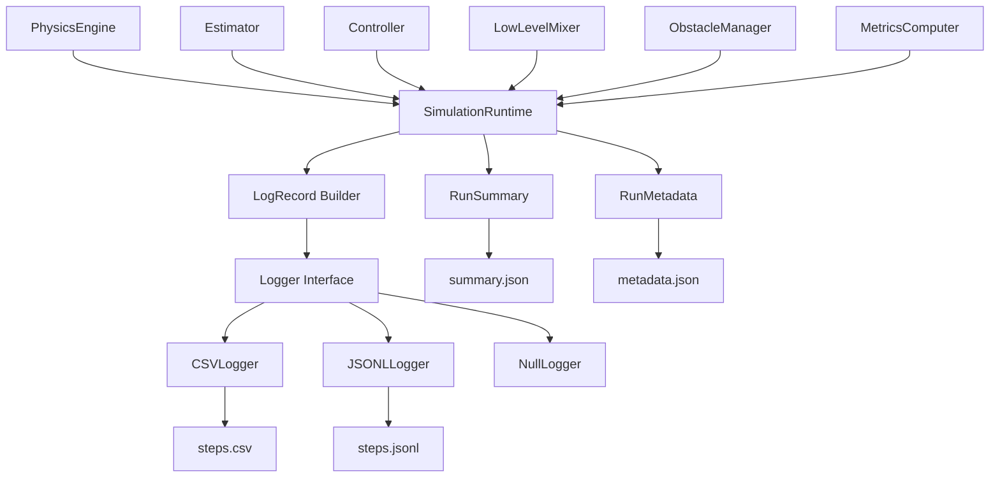

# 08_LOGGING_AND_METRICS.md

> Status: Draft
> Scope: Ideal design after refactor
> Project: Quadrotor CC-MPC Simulation
> Related documents:
>
> * `02_ARCHITECTURE.md`
> * `03_RUNTIME_FLOW.md`
> * `04_DATA_MODEL.md`
> * `05_ENGINE_INTERFACE.md`
> * `06_CONTROLLER_INTERFACE.md`
> * `07_SCENARIO_CONFIG.md`
> * `09_VALIDATION_PLAN.md`
> * `ADR/ADR-001-engine-abstraction.md`
> * `ADR/ADR-002-single-thread-vs-mpc-thread.md`
> * `ADR/ADR-003-state-vector-definition.md`
> * `ADR/ADR-004-control-command-definition.md`

---

## 1. Purpose

This document defines the logging and metrics architecture for the refactored quadrotor CC-MPC simulation.

The goals are:

1. Make every simulation run reproducible.
2. Make controller, engine, mixer, estimator, obstacle, and runtime behavior traceable.
3. Standardize log fields across ODE and MuJoCo engines.
4. Separate logging from simulation behavior.
5. Define metrics for goal reaching, obstacle avoidance, solver performance, and runtime health.
6. Provide enough data to debug failures after a run.

The logger shall record what happened.
The logger shall not affect what happens.

---

## 2. Scope

This document defines:

```text id="9b7w95"
LogRecord structure
required log fields
optional debug log fields
CSV schema
run metadata schema
run summary schema
metrics definitions
failure classification
logger responsibilities
logger validation rules
logging tests
```

This document does not define:

```text id="ww4gxi"
controller optimization internals
physics engine implementation
scenario YAML schema
visualization layout
post-processing notebooks
```

---

## 3. Design Principles

### 3.1 Logging is passive

The logger shall not call:

```text id="eqbab4"
controller.compute_command()
engine.step()
mixer.compute()
estimator.estimate()
obstacle_manager.predict_horizon()
```

The runtime builds a `LogRecord` and passes it to the logger.

Correct:

```python id="zpoo4s"
logger.record(log_record)
```

Incorrect:

```python id="k391cd"
logger.record_from_engine(engine)
logger.record_from_controller(controller)
```

---

### 3.2 Logging uses snapshots

A log record shall be an immutable snapshot of one runtime step.

The logger shall not store mutable references to live simulation arrays.

Correct:

```text id="kp0r42"
copy true_state
copy estimated_state
copy control_command
copy actuator_command
copy diagnostics
```

Incorrect:

```text id="2p7aye"
store reference to engine.data.qpos
store reference to controller internal CVXPY variables
```

---

### 3.3 Logging is engine-independent

The same high-level log schema shall work for:

```text id="m6pqmh"
ODEPhysicsEngine
MuJoCoPhysicsEngine
FuturePhysicsEngine
```

Engine-specific information is allowed only under:

```text id="gtrumu"
engine_info
```

Canonical state fields shall remain the same.

---

### 3.4 Logging separates command levels

The logger shall distinguish:

```text id="6z0b03"
ControlCommand4
ActuatorCommand4
```

High-level command fields:

```text id="vozbf3"
control_phi_c
control_theta_c
control_vz_c
control_psi_dot_c
```

Actuator command fields:

```text id="cgyc75"
actuator_T1
actuator_T2
actuator_T3
actuator_T4
```

The logger shall not use ambiguous column names such as:

```text id="w3i9e7"
u0
u1
u2
u3
ctrl0
ctrl1
ctrl2
ctrl3
```

unless a metadata file maps them explicitly.

---

### 3.5 Logs must support failure attribution

A log shall contain enough data to determine whether a failure came from:

```text id="dxin67"
controller
solver
mixer
physics engine
estimator
obstacle prediction
runtime dispatch
configuration
numerical instability
```

---

## 4. Logging Architecture



---

## 5. Logger Responsibilities

The logger shall be responsible for:

```text id="zra28z"
opening output files
writing run metadata
writing step records
writing final run summary
flushing data safely
closing files
validating log schema
```

The logger shall not be responsible for:

```text id="o3g7d7"
computing control commands
stepping physics
computing actuator commands
checking collisions directly
mutating runtime state
deciding termination
```

---

## 6. Log Outputs

Each run should generate the following outputs.

```text id="k80g42"
run_directory/
├── metadata.json
├── steps.csv
├── summary.json
├── controller_debug.jsonl      optional
├── trajectories.npz            optional
├── obstacle_debug.jsonl        optional
└── events.jsonl                optional
```

---

### 6.1 `metadata.json`

Stores run-level metadata.

Purpose:

```text id="71zi3t"
make the run reproducible
record config and versions
record scenario identity
record engine/controller choices
```

---

### 6.2 `steps.csv`

Stores one row per logged simulation step.

Purpose:

```text id="65we69"
plot trajectory
analyze control behavior
compute metrics
debug step-level failures
compare runs
```

---

### 6.3 `summary.json`

Stores final run-level metrics.

Purpose:

```text id="igig6m"
quickly compare experiments
report success/failure
record final goal distance
record collision status
record solver statistics
```

---

### 6.4 Optional debug files

Optional files may be enabled for heavy debugging.

| File                     | Purpose                                      |
| ------------------------ | -------------------------------------------- |
| `controller_debug.jsonl` | Full controller diagnostics per solve        |
| `trajectories.npz`       | Predicted trajectories and control sequences |
| `obstacle_debug.jsonl`   | Obstacle predictions and covariance          |
| `events.jsonl`           | Discrete runtime events, warnings, failures  |

---

## 7. `LogRecord`

### 7.1 Purpose

`LogRecord` represents one runtime-step snapshot.

The runtime shall build `LogRecord` after physics step and before termination finalization.

---

### 7.2 Recommended data type

```python id="3xmwe5"
from dataclasses import dataclass
from typing import Any

@dataclass(frozen=True)
class LogRecord:
    step: int
    time: float
    runtime_mode: str

    true_state: State9
    estimated_state: State9 | None

    goal: Goal3

    control_command: ControlCommand4 | None
    actuator_command: ActuatorCommand4 | None

    controller_output: ControllerOutput | None
    controller_diagnostics: ControllerDiagnostics | None

    step_result: StepResult | None
    engine_info: dict[str, Any]

    obstacle_metrics: dict[str, Any]
    tracking_metrics: dict[str, Any]
    safety_metrics: dict[str, Any]
    runtime_metrics: dict[str, Any]

    termination_status: TerminationStatus | None
```

---

### 7.3 Required fields

Every `LogRecord` shall include:

| Field                            |         Required | Meaning                       |
| -------------------------------- | ---------------: | ----------------------------- |
| `step`                           |              Yes | Runtime step index            |
| `time`                           |              Yes | Simulation time in seconds    |
| `runtime_mode`                   |              Yes | Runtime mode                  |
| `true_state`                     |              Yes | State from physics engine     |
| `goal`                           |              Yes | Goal position                 |
| `control_command`                | Yes if available | High-level controller command |
| `step_result`                    |              Yes | Result of physics step        |
| `tracking_metrics.goal_distance` |              Yes | Distance to goal              |
| `safety_metrics.collision_flag`  |              Yes | Whether collision occurred    |
| `runtime_metrics.engine_success` |              Yes | Whether engine step succeeded |

---

### 7.4 Optional fields

Optional fields:

| Field                    | Meaning                           |
| ------------------------ | --------------------------------- |
| `estimated_state`        | State estimate used by controller |
| `actuator_command`       | Rotor thrust or actuator command  |
| `controller_output`      | Full controller output            |
| `controller_diagnostics` | Solver/controller details         |
| `obstacle_metrics`       | Obstacle distances/margins        |
| `engine_info`            | Engine-specific diagnostics       |
| `termination_status`     | Run termination status            |

---

## 8. Required CSV Columns

The default `steps.csv` shall contain a stable set of columns.

### 8.1 Runtime columns

```text id="79e6bt"
step
time
runtime_mode
engine_type
controller_type
```

---

### 8.2 True state columns

Canonical true state columns:

```text id="6z8ewi"
true_pos_x
true_pos_y
true_pos_z
true_vel_x
true_vel_y
true_vel_z
true_roll
true_pitch
true_yaw
```

These map to:

```text id="7y8rrd"
State9 = [x, y, z, vx, vy, vz, roll, pitch, yaw]
```

---

### 8.3 Estimated state columns

Estimated state columns:

```text id="nrict5"
est_pos_x
est_pos_y
est_pos_z
est_vel_x
est_vel_y
est_vel_z
est_roll
est_pitch
est_yaw
```

If no estimator is used, these may equal true state in ideal mode.

---

### 8.4 State error columns

If both `true_state` and `estimated_state` exist:

```text id="dhc4lf"
est_error_pos_norm
est_error_vel_norm
est_error_att_norm
```

Definitions:

$$
e_p
=

\lVert
\mathbf{p}^{true}
-

\mathbf{p}^{est}
\rVert_2
$$

$$
e_v
=

\lVert
\mathbf{v}^{true}
-

\mathbf{v}^{est}
\rVert_2
$$

$$
e_\eta
=

\lVert
\boldsymbol{\eta}^{true}
-
\boldsymbol{\eta}^{est}
\rVert_2
$$

---

### 8.5 Goal columns

```text id="q5yrj3"
goal_x
goal_y
goal_z
goal_distance
goal_reached
```

Goal distance:

$$
d_g
=

\lVert
\mathbf{p}
-

\mathbf{p}_g
\rVert_2
$$

where:

```text id="6nqmoo"
p = true_state.position
p_g = goal.position
```

---

### 8.6 Control command columns

High-level controller command:

```text id="ohvqe2"
control_phi_c
control_theta_c
control_vz_c
control_psi_dot_c
```

These map to:

```text id="81omyi"
ControlCommand4 = [phi_c, theta_c, vz_c, psi_dot_c]
```

---

### 8.7 Actuator command columns

Actuator-level command:

```text id="ii9faz"
actuator_T1
actuator_T2
actuator_T3
actuator_T4
```

For ODE engine, these may be empty because ODE may consume `ControlCommand4` directly.

For MuJoCo rotor-force engine, these should be populated.

---

### 8.8 Controller diagnostic columns

```text id="03kthp"
controller_status
controller_success
controller_solve_time_ms
controller_objective_value
controller_iterations
controller_fallback_used
controller_fallback_reason
controller_max_constraint_violation
controller_min_obstacle_margin
```

---

### 8.9 Predicted trajectory summary columns

The full predicted trajectory may be large.
The default CSV shall store summary values.

```text id="sd48vq"
pred_final_x
pred_final_y
pred_final_z
pred_final_goal_distance
pred_min_obstacle_margin
pred_max_speed
pred_max_control_norm
```

Full predicted trajectories shall be stored in optional debug files.

---

### 8.10 Engine columns

```text id="35yhvr"
engine_success
engine_status
engine_step_dt
engine_internal_substeps
engine_warning
```

Engine-specific details shall be serialized in:

```text id="kqaswi"
engine_info
```

or in optional JSONL debug logs.

---

### 8.11 Safety columns

```text id="zqkkim"
collision_flag
min_obstacle_distance
min_obstacle_margin
min_chance_constraint_margin
altitude_violation
speed_violation
control_violation
nan_detected
```

---

### 8.12 Runtime timing columns

```text id="exy70l"
sim_dt
controller_dt
log_dt
render_dt
wall_time_ms
step_wall_time_ms
```

For threaded mode, also include:

```text id="c0j0go"
state_time
command_time
command_age_ms
state_sequence_id
command_sequence_id
controller_input_state_sequence_id
stale_command_flag
```

---

## 9. Recommended `steps.csv` Schema

Recommended minimal CSV header:

```text id="zkx62u"
step,time,runtime_mode,engine_type,controller_type,
true_pos_x,true_pos_y,true_pos_z,
true_vel_x,true_vel_y,true_vel_z,
true_roll,true_pitch,true_yaw,
est_pos_x,est_pos_y,est_pos_z,
est_vel_x,est_vel_y,est_vel_z,
est_roll,est_pitch,est_yaw,
goal_x,goal_y,goal_z,goal_distance,goal_reached,
control_phi_c,control_theta_c,control_vz_c,control_psi_dot_c,
actuator_T1,actuator_T2,actuator_T3,actuator_T4,
controller_status,controller_success,controller_solve_time_ms,
controller_objective_value,controller_iterations,
controller_fallback_used,controller_fallback_reason,
pred_final_x,pred_final_y,pred_final_z,pred_final_goal_distance,
collision_flag,min_obstacle_distance,min_obstacle_margin,
min_chance_constraint_margin,
altitude_violation,speed_violation,control_violation,nan_detected,
engine_success,engine_status,engine_step_dt,engine_internal_substeps,
step_wall_time_ms
```

The actual CSV file shall use one physical header line.

---

## 10. Run Metadata

### 10.1 Purpose

`metadata.json` stores information needed to reproduce the run.

---

### 10.2 Recommended fields

```json id="npkiou"
{
  "run_id": "2026-06-28T12-00-00_default_ode_ccmpc",
  "created_at": "2026-06-28T12:00:00+07:00",
  "project": "quadrotor_ccmpc",
  "schema_version": "1.0",
  "scenario_id": "moving_obstacles",
  "runtime_mode": "deterministic_single_thread",
  "engine_type": "ode",
  "controller_type": "ccmpc",
  "estimator_type": "ideal",
  "mixer_type": "none",
  "random_seed": 42,
  "config_files": {
    "scenario": "config/scenarios/moving_obstacles.yaml",
    "controller": "config/controller/ccmpc.yaml",
    "runtime": "config/runtime/default.yaml",
    "engine": "config/engines/ode.yaml"
  },
  "git": {
    "commit": null,
    "branch": null,
    "dirty": null
  },
  "software": {
    "python": null,
    "numpy": null,
    "scipy": null,
    "cvxpy": null,
    "mujoco": null
  }
}
```

---

### 10.3 Required metadata

Required metadata:

```text id="0jhu33"
run_id
created_at
scenario_id
runtime_mode
engine_type
controller_type
config_files
random_seed
```

Git and software versions are strongly recommended.

---

## 11. Run Summary

### 11.1 Purpose

`summary.json` stores final run-level metrics.

---

### 11.2 Recommended fields

```json id="5qrn6p"
{
  "run_id": "2026-06-28T12-00-00_default_ode_ccmpc",
  "success": true,
  "termination_reason": "goal_reached",
  "total_steps": 913,
  "total_time": 18.26,
  "final_goal_distance": 0.37,
  "min_goal_distance": 0.34,
  "collision": false,
  "min_obstacle_distance": 0.82,
  "min_obstacle_margin": 0.21,
  "min_chance_constraint_margin": 0.05,
  "max_speed": 2.31,
  "mean_speed": 1.12,
  "max_control_norm": 0.91,
  "mean_control_norm": 0.34,
  "solver_success_rate": 0.98,
  "fallback_count": 3,
  "mean_solve_time_ms": 18.7,
  "max_solve_time_ms": 44.1,
  "late_solve_count": 0,
  "nan_detected": false
}
```

---

## 12. Metrics Definitions

---

## 12.1 Goal distance

Definition:

$$
d_g(t)
=
\lVert
\mathbf{p}(t)
-

\mathbf{p}_g
\rVert_2
$$

Where:

| Symbol          | Meaning               |
| --------------- | --------------------- |
| $\mathbf{p}(t)$ | current true position |
| $\mathbf{p}_g$  | goal position         |

Metric columns:

```text id="i93vtr"
goal_distance
final_goal_distance
min_goal_distance
goal_reached
```

---

## 12.2 Success

A run is successful if:

```text id="620hwc"
goal_reached == true
collision_flag was never true
no fatal numerical failure occurred
termination_reason == goal_reached
```

Formal condition:

```text id="a1uvms"
success =
    goal_reached
    and not collision
    and not nan_detected
    and not fatal_solver_failure
```

Scenario config may add stricter criteria.

---

## 12.3 Speed

Velocity norm:

$$
v_{\text{norm}}
=

\lVert
\mathbf{v}
\rVert_2
$$

Metric columns:

```text id="x1gbo0"
speed_norm
max_speed
mean_speed
speed_violation
```

Speed violation:

```text id="ik8ner"
speed_norm > max_speed_limit
```

---

## 12.4 Control norm

For `ControlCommand4`:

$$
u_{\text{norm}}
=
\lVert
\mathbf{u}
\rVert_2
$$

where:

```text id="96tzgi"
u = [phi_c, theta_c, vz_c, psi_dot_c]
```

Metric columns:

```text id="h83lod"
control_norm
max_control_norm
mean_control_norm
control_violation
```

---

## 12.5 Actuator norm

For `ActuatorCommand4`:

$$
T_{\text{sum}}
=

T_1 + T_2 + T_3 + T_4
$$

Metric columns:

```text id="ifaysz"
actuator_total_thrust
actuator_max_thrust
actuator_min_thrust
actuator_saturation_flag
```

These are mainly relevant for MuJoCo rotor-force simulation.

---

## 12.6 Obstacle distance

For simple Euclidean distance:

$$
d_o
=

\lVert
\mathbf{p}
-

\mathbf{p}_o
\rVert_2
$$

Metric columns:

```text id="80d6u9"
min_obstacle_distance
closest_obstacle_id
```

This is useful for visualization and quick debugging, but it is not the full ellipsoidal collision metric.

---

## 12.7 Ellipsoidal collision value

For robot-obstacle collision:

$$
c_o
=

\lVert
\mathbf{p}
-

\mathbf{p}*o
\rVert*{\boldsymbol{\Omega}_{io}}
$$

Collision condition:

$$
c_o
\leq
1
$$

Metric columns:

```text id="8jzlpm"
ellipsoid_collision_value
min_ellipsoid_collision_value
collision_flag
```

---

## 12.8 Obstacle margin

Define obstacle margin:

$$ \begin{aligned} m_o &= c_o \\ &= 1 \end{aligned} $$

Interpretation:

|     Value | Meaning               |
| --------: | --------------------- |
| `m_o > 0` | outside obstacle      |
| `m_o = 0` | on collision boundary |
| `m_o < 0` | collision             |

Metric columns:

```text id="gfak56"
min_obstacle_margin
collision_flag
```

---

## 12.9 Chance-constraint margin

For chance constraints, define:

$$
\begin{aligned}
m_{\text{cc}}
&= \text{LHS} \\
&= \text{RHS}
\end{aligned}
$$

where:

```text id="3h00tg"
LHS = nominal transformed clearance
RHS = uncertainty margin
```

Interpretation:

|      Value | Meaning                     |
| ---------: | --------------------------- |
| `m_cc > 0` | chance constraint satisfied |
| `m_cc = 0` | active constraint           |
| `m_cc < 0` | chance constraint violated  |

Metric columns:

```text id="nt3kzm"
min_chance_constraint_margin
chance_constraint_violation_count
```

---

## 12.10 Solver metrics

Required solver metrics:

```text id="p7cij9"
controller_status
controller_success
controller_solve_time_ms
controller_objective_value
controller_iterations
controller_fallback_used
controller_fallback_reason
```

Run-level metrics:

```text id="mxxwa9"
solver_success_rate
fallback_count
mean_solve_time_ms
median_solve_time_ms
max_solve_time_ms
late_solve_count
```

---

## 12.11 Runtime timing metrics

Step wall time:

$$
t_{\text{wall,step}}
=

## t_{\text{wall,end}}

t_{\text{wall,start}}
$$

Metric columns:

```text id="2y33b0"
step_wall_time_ms
controller_solve_time_ms
engine_step_time_ms
logger_write_time_ms
renderer_time_ms
```

---

## 12.12 Cross-track error

If a reference path exists, cross-track error may be computed.

For point-to-line segment reference, define:

```text id="gudg4l"
cte = distance from current position to reference path
```

Metric column:

```text id="ohqsk9"
cross_track_error
```

If no reference path exists, this field may be empty.

---

## 12.13 Heading error

If heading target is defined:

```text id="609v1z"
heading_error = wrapped_angle(yaw - yaw_ref)
```

Metric column:

```text id="1qhi5j"
heading_error_rad
```

For human-readable output, the logger may additionally write:

```text id="3j6cyi"
heading_error_deg
```

but radians remain canonical.

---

## 13. Controller Debug Logging

The default CSV shall not store large arrays by default.

For detailed MPC debugging, use:

```text id="7eu1q7"
controller_debug.jsonl
```

Each line may include:

```json id="61g33l"
{
  "step": 120,
  "time": 2.40,
  "status": "success",
  "solve_time_ms": 18.4,
  "objective_value": 123.45,
  "iterations": 3,
  "fallback_used": false,
  "max_constraint_violation": 0.0,
  "min_obstacle_margin": 0.18,
  "min_chance_constraint_margin": 0.04,
  "notes": {}
}
```

---

## 14. Trajectory Debug Logging

Full predicted trajectories may be stored in:

```text id="6unkri"
trajectories.npz
```

Recommended arrays:

```text id="u4h89w"
predicted_states
predicted_controls
predicted_times
step_indices
```

Recommended shapes:

```text id="t1dhap"
predicted_states.shape == (num_controller_calls, N + 1, 9)
predicted_controls.shape == (num_controller_calls, N, 4)
```

This avoids forcing large trajectory arrays into CSV strings.

---

## 15. Obstacle Debug Logging

Obstacle debug file:

```text id="u6gk8r"
obstacle_debug.jsonl
```

Each record may include:

```json id="s54rth"
{
  "step": 120,
  "time": 2.40,
  "closest_obstacle_id": "obs_001",
  "min_obstacle_distance": 0.82,
  "min_obstacle_margin": 0.21,
  "min_chance_constraint_margin": 0.05,
  "obstacle_count": 2
}
```

Full obstacle predictions may be stored only in debug mode because they can be large.

---

## 16. Event Logging

Discrete events should be written to:

```text id="jfgk00"
events.jsonl
```

Examples:

```json id="kyf0gs"
{"time": 1.20, "step": 60, "level": "warning", "event": "solver_late", "message": "solve_time_ms exceeded controller_dt"}
```

```json id="3tex4i"
{"time": 4.80, "step": 240, "level": "error", "event": "nan_detected", "message": "NaN detected in true_state"}
```

Event levels:

```text id="mld69s"
debug
info
warning
error
critical
```

---

## 17. Logger Interface

Recommended interface:

```python id="7fvied"
class Logger:
    def start_run(self, metadata: RunMetadata) -> None:
        ...

    def record(self, record: LogRecord) -> None:
        ...

    def record_event(self, event: LogEvent) -> None:
        ...

    def finish_run(self, summary: RunSummary) -> None:
        ...

    def close(self) -> None:
        ...
```

---

## 18. Logger Implementations

Initial implementations:

```text id="gtja5o"
CSVLogger
NullLogger
```

Recommended future implementations:

```text id="xbfo9z"
JSONLLogger
ParquetLogger
SQLiteLogger
MemoryLogger
```

---

### 18.1 `CSVLogger`

Responsibilities:

```text id="r2m12n"
write metadata.json
write steps.csv
write summary.json
optionally write events.jsonl
optionally write controller_debug.jsonl
```

---

### 18.2 `NullLogger`

Responsibilities:

```text id="s36s7r"
accept LogRecord
discard data
useful for fast unit tests
```

---

### 18.3 `MemoryLogger`

Responsibilities:

```text id="bpki0f"
store records in memory
useful for tests
```

---

## 19. Logging Frequency

The runtime may log every physics step or downsample logs.

Config:

```yaml id="vytmmz"
logging:
  enabled: true
  log_dt: 0.02
  debug_trajectories: false
  debug_obstacles: false
  debug_controller: true
```

Rules:

```text id="08v3hv"
log_dt > 0
log_dt should be an integer multiple of sim_dt in deterministic mode
controller debug records should be written on controller update steps
```

Recommended default:

```text id="pytdlr"
log every physics step for initial debugging
```

---

## 20. Logging and Runtime Modes

### 20.1 Deterministic single-thread mode

Required:

```text id="4flhpa"
step
time
true_state
estimated_state
control_command
applied_command
controller diagnostics
engine status
metrics
```

This is the reference mode for regression logs.

---

### 20.2 Threaded MPC mode

Threaded mode requires additional timing fields:

```text id="bebhuy"
state_time
controller_input_time
command_publish_time
command_apply_time
state_sequence_id
command_sequence_id
command_age_ms
stale_command_flag
controller_solve_time_ms
```

Without these fields, asynchronous behavior cannot be analyzed.

---

### 20.3 Real-time viewer mode

Real-time mode should log:

```text id="xmxt8r"
simulation time
wall-clock time
realtime_factor
frame_skip_count
render_time_ms
```

---

## 21. Metrics Computer

Metrics shall be computed outside the logger.

Recommended module:

```text id="v4a2pm"
simulation/runtime/metrics.py
```

Responsibilities:

```text id="7bz2ad"
compute goal distance
compute speed norm
compute control norm
compute actuator statistics
compute obstacle distance
compute collision flag
compute chance-constraint margins if available
compute run summary
```

Logger records metrics.
MetricsComputer computes metrics.

---

## 22. Metrics Data Type

Recommended type:

```python id="7unrpk"
@dataclass(frozen=True)
class StepMetrics:
    goal_distance: float
    goal_reached: bool

    speed_norm: float
    max_speed_violation: bool

    control_norm: float | None
    control_violation: bool | None

    actuator_total_thrust: float | None
    actuator_saturation_flag: bool | None

    collision_flag: bool
    min_obstacle_distance: float | None
    min_obstacle_margin: float | None
    min_chance_constraint_margin: float | None

    altitude_violation: bool
    nan_detected: bool
```

---

## 23. Run Summary Data Type

Recommended type:

```python id="kuygvw"
@dataclass(frozen=True)
class RunSummary:
    run_id: str
    success: bool
    termination_reason: str
    total_steps: int
    total_time: float

    final_goal_distance: float
    min_goal_distance: float

    collision: bool
    min_obstacle_distance: float | None
    min_obstacle_margin: float | None
    min_chance_constraint_margin: float | None

    max_speed: float
    mean_speed: float

    max_control_norm: float | None
    mean_control_norm: float | None

    solver_success_rate: float | None
    fallback_count: int
    mean_solve_time_ms: float | None
    max_solve_time_ms: float | None
    late_solve_count: int

    nan_detected: bool
```

---

## 24. Failure Classification

Failures shall be classified consistently.

Recommended failure categories:

```text id="5wj0t6"
goal_timeout
collision
altitude_violation
solver_failure
engine_failure
mixer_failure
numerical_failure
config_error
runtime_error
user_interrupt
```

Termination reason shall use one of these categories.

---

## 25. Success Criteria

A run shall be marked successful if:

```text id="xlesdm"
goal_reached == true
collision == false
altitude_violation == false
nan_detected == false
fatal_solver_failure == false
fatal_engine_failure == false
```

Scenario-specific success criteria may add:

```text id="9ko7qy"
max_final_speed
max_path_length
max_solve_time
minimum_obstacle_margin
```

---

## 26. Data Validation Rules

### 26.1 LogRecord validation

Each `LogRecord` shall validate:

```text id="ie88cx"
step >= 0
time >= 0
true_state is valid State9
estimated_state is valid State9 if present
control_command is valid ControlCommand4 if present
actuator_command is valid ActuatorCommand4 if present
goal is valid Goal3
metrics are finite if present
```

---

### 26.2 CSV validation

CSV logger shall validate:

```text id="qlcenv"
header is stable
number of columns is constant
no unescaped commas in string fields
numeric fields are finite or empty
boolean fields are true/false
```

---

### 26.3 Summary validation

Run summary shall validate:

```text id="qihwep"
total_steps >= 0
total_time >= 0
success is boolean
termination_reason is not empty
final_goal_distance is finite
```

---

## 27. Handling NaN and Inf

If NaN or Inf is detected in critical data:

```text id="hpj8br"
true_state
estimated_state
control_command
actuator_command
predicted_trajectory
```

Runtime shall:

```text id="3pradw"
record event
mark nan_detected = true
terminate run or trigger fallback depending on policy
write final summary
```

Recommended default:

```text id="v2qvzg"
terminate on NaN in true_state or control_command
```

---

## 28. Log Schema Versioning

Every log output shall include a schema version.

Example:

```json id="09q4x6"
{
  "log_schema_version": "1.0"
}
```

CSV files should include schema version in `metadata.json`, not as a CSV row.

Rules:

```text id="hsex64"
major version changes when columns are removed or semantics change
minor version changes when columns are added
patch version changes when formatting changes without semantic change
```

---

## 29. Backward Compatibility With Current Logs

Current demo logs include fields similar to:

```text id="9nir34"
step
t
pos_x
pos_y
pos_z
vel_x
vel_y
vel_z
roll
pitch
yaw
u_phi_c
u_theta_c
u_vz_c
u_psi_dot_c
T1
T2
T3
T4
mpc_solve_ms
cte
hdg_err_deg
goal_dist
mpc_traj_x
mpc_traj_y
mpc_traj_z
```

The refactored schema shall map these to canonical names.

| Current field    | Canonical field                                |
| ---------------- | ---------------------------------------------- |
| `t`              | `time`                                         |
| `pos_x`          | `true_pos_x`                                   |
| `pos_y`          | `true_pos_y`                                   |
| `pos_z`          | `true_pos_z`                                   |
| `vel_x`          | `true_vel_x`                                   |
| `vel_y`          | `true_vel_y`                                   |
| `vel_z`          | `true_vel_z`                                   |
| `u_phi_c`        | `control_phi_c`                                |
| `u_theta_c`      | `control_theta_c`                              |
| `u_vz_c`         | `control_vz_c`                                 |
| `u_psi_dot_c`    | `control_psi_dot_c`                            |
| `T1`             | `actuator_T1`                                  |
| `T2`             | `actuator_T2`                                  |
| `T3`             | `actuator_T3`                                  |
| `T4`             | `actuator_T4`                                  |
| `mpc_solve_ms`   | `controller_solve_time_ms`                     |
| `goal_dist`      | `goal_distance`                                |
| `cte`            | `cross_track_error`                            |
| `hdg_err_deg`    | `heading_error_deg`                            |
| `mpc_traj_x/y/z` | `trajectories.npz` or trajectory debug columns |

Legacy logs may be supported by a post-processing adapter, but new logs shall use canonical names.

---

## 30. Recommended Logging Config

```yaml id="y4xjg7"
logging:
  enabled: true
  output_root: "logs"
  log_schema_version: "1.0"

  step_log:
    format: "csv"
    filename: "steps.csv"
    log_dt: null

  metadata:
    filename: "metadata.json"
    include_git_info: true
    include_software_versions: true
    include_config_snapshot: true

  summary:
    filename: "summary.json"

  debug:
    controller: true
    trajectories: false
    obstacles: false
    events: true

  validation:
    fail_on_nan: true
    fail_on_schema_mismatch: true
```

If `log_dt` is `null`, logger records every runtime step.

---

## 31. Recommended File Layout

```text id="8jg2gl"
simulation/
├── logging/
│   ├── __init__.py
│   ├── base.py
│   ├── records.py
│   ├── metrics.py
│   ├── csv_logger.py
│   ├── jsonl_logger.py
│   ├── memory_logger.py
│   ├── null_logger.py
│   ├── summary.py
│   └── schema.py
```

Suggested responsibilities:

| File               | Responsibility                                       |
| ------------------ | ---------------------------------------------------- |
| `base.py`          | Logger interface                                     |
| `records.py`       | `LogRecord`, `RunMetadata`, `RunSummary`, `LogEvent` |
| `metrics.py`       | metric computation helpers                           |
| `csv_logger.py`    | write `steps.csv`                                    |
| `jsonl_logger.py`  | write debug/event logs                               |
| `memory_logger.py` | in-memory test logger                                |
| `null_logger.py`   | no-op logger                                         |
| `summary.py`       | aggregate run metrics                                |
| `schema.py`        | CSV column definitions                               |

---

## 32. Migration Plan

### Phase 1: Define log data types

Create:

```text id="i4fc9c"
LogRecord
RunMetadata
RunSummary
LogEvent
StepMetrics
```

---

### Phase 2: Define CSV schema

Create:

```text id="88nysj"
simulation/logging/schema.py
```

with stable column list.

---

### Phase 3: Implement CSVLogger

Create:

```text id="oe8qbe"
simulation/logging/csv_logger.py
```

Responsibilities:

```text id="k42uap"
write metadata.json
write steps.csv
write summary.json
write events.jsonl if enabled
```

---

### Phase 4: Update runtime

Runtime shall build `LogRecord` and call:

```python id="2tylkn"
logger.record(log_record)
```

---

### Phase 5: Add metrics computer

Create:

```text id="zqdpqu"
simulation/runtime/metrics.py
```

or:

```text id="7mk3zk"
simulation/logging/metrics.py
```

Initial recommendation:

```text id="93i6um"
simulation/runtime/metrics.py
```

because metrics are part of runtime evaluation, not file writing.

---

### Phase 6: Add legacy log adapter

Optional post-processing tool:

```text id="elj4ru"
scripts/convert_legacy_log.py
```

Maps old columns to canonical columns.

---

## 33. Required Tests

### 33.1 LogRecord tests

```text id="0j8yg2"
test_log_record_requires_step_and_time
test_log_record_accepts_state9
test_log_record_rejects_nan_true_state
test_log_record_accepts_control_command4
test_log_record_accepts_actuator_command4
```

---

### 33.2 CSV schema tests

```text id="dm4e5m"
test_csv_header_matches_schema
test_csv_rows_have_constant_column_count
test_csv_numeric_fields_are_serialized
test_csv_empty_optional_fields_are_allowed
test_csv_boolean_fields_are_serialized_consistently
```

---

### 33.3 Logger tests

```text id="uef7g3"
test_csv_logger_writes_metadata
test_csv_logger_writes_steps
test_csv_logger_writes_summary
test_csv_logger_closes_file
test_null_logger_accepts_records
test_memory_logger_stores_records
```

---

### 33.4 Metrics tests

```text id="6nbsfl"
test_goal_distance_metric
test_goal_reached_metric
test_speed_norm_metric
test_control_norm_metric
test_collision_margin_metric
test_chance_constraint_margin_metric
test_run_summary_aggregation
```

---

### 33.5 Runtime integration tests

```text id="dxgb24"
test_runtime_logs_true_state
test_runtime_logs_estimated_state
test_runtime_logs_control_command
test_runtime_logs_actuator_command_for_mujoco
test_runtime_logs_controller_status
test_runtime_logs_goal_distance
test_runtime_writes_summary_on_success
test_runtime_writes_summary_on_failure
```

---

## 34. Acceptance Criteria

This document is accepted when:

1. `LogRecord` is defined.
2. Required CSV columns are defined.
3. `metadata.json` schema is defined.
4. `summary.json` schema is defined.
5. Metrics definitions are documented.
6. Controller, engine, obstacle, and runtime metrics are separated.
7. Legacy log field mapping is documented.
8. Logging config is documented.
9. Logger responsibilities are clearly separated from runtime and controller.
10. Required tests are listed.

---

## 35. Summary

The refactored simulation shall use snapshot-based logging.

Each step shall log:

```text id="1hjw3s"
runtime state
true State9
estimated State9
goal distance
ControlCommand4
ActuatorCommand4 if available
controller diagnostics
engine diagnostics
safety metrics
runtime timing metrics
```

Each run shall produce:

```text id="34bzb9"
metadata.json
steps.csv
summary.json
optional debug files
```

The logger shall be passive.

Metrics shall be computed by a metrics module, not by the logger.

The log schema shall be stable, versioned, and shared across ODE and MuJoCo runs.

---

## 36. Related Documents

```text id="4b5uwm"
docs/design/02_ARCHITECTURE.md
docs/design/03_RUNTIME_FLOW.md
docs/design/04_DATA_MODEL.md
docs/design/05_ENGINE_INTERFACE.md
docs/design/06_CONTROLLER_INTERFACE.md
docs/design/07_SCENARIO_CONFIG.md
docs/design/09_VALIDATION_PLAN.md
docs/design/10_KNOWN_LIMITATIONS.md

docs/design/ADR/ADR-001-engine-abstraction.md
docs/design/ADR/ADR-002-single-thread-vs-mpc-thread.md
docs/design/ADR/ADR-003-state-vector-definition.md
docs/design/ADR/ADR-004-control-command-definition.md

docs/theory/10_State_Space_Model.md
docs/theory/11_MPC.md
docs/theory/12_CCMPC.md
docs/theory/13_Chance_Constraints.md
docs/theory/15_Obstacle_Avoidance.md
docs/theory/16_Optimization.md
docs/theory/18_Implementation_Notes.md
```
