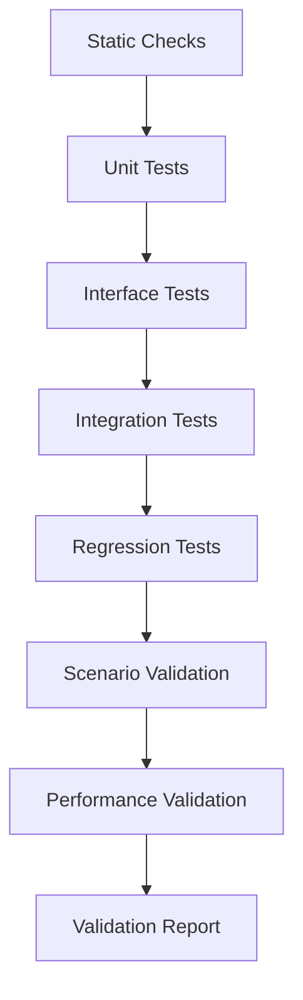

# 09_VALIDATION_PLAN.md

> Status: Draft
> Scope: Ideal design after refactor
> Project: Quadrotor CC-MPC Simulation
> Related documents:
>
> * `02_ARCHITECTURE.md`
> * `03_RUNTIME_FLOW.md`
> * `04_DATA_MODEL.md`
> * `05_ENGINE_INTERFACE.md`
> * `06_CONTROLLER_INTERFACE.md`
> * `07_SCENARIO_CONFIG.md`
> * `08_LOGGING_AND_METRICS.md`
> * `10_KNOWN_LIMITATIONS.md`
> * `ADR/ADR-001-engine-abstraction.md`
> * `ADR/ADR-002-single-thread-vs-mpc-thread.md`
> * `ADR/ADR-003-state-vector-definition.md`
> * `ADR/ADR-004-control-command-definition.md`

---

## 1. Purpose

This document defines the validation plan for the refactored quadrotor CC-MPC simulation.

The purpose is to ensure that the refactored system is:

```text id="8l0gda"
correct
reproducible
traceable
numerically stable
safe under expected simulation conditions
consistent with the theory baseline
consistent across ODE and MuJoCo backends
```

Validation is not limited to checking whether the code runs.
The goal is to verify that every major contract defined by the design documents is implemented correctly.

---

## 2. Scope

This validation plan covers:

```text id="ixdsge"
data model validation
state/control contract validation
physics engine validation
controller interface validation
runtime flow validation
scenario config validation
logging schema validation
uncertainty propagation validation
obstacle avoidance validation
solver behavior validation
ODE/MuJoCo adapter validation
regression experiments
end-to-end simulation validation
```

This document does not define:

```text id="4y2adp"
new controller algorithms
new dynamics equations
MuJoCo XML tuning
paper-level statistical evaluation
real hardware flight validation
```

Those may be added in future validation documents.

---

## 3. Validation Philosophy

The refactor shall be validated from the bottom up.

Validation layers:

```text id="1d05by"
1. Static checks
2. Unit tests
3. Interface contract tests
4. Integration tests
5. Regression tests
6. Scenario validation experiments
7. Performance validation
8. Reproducibility validation
```

The system is considered research-ready only when:

```text id="26tq7e"
core data contracts are tested
ODE runtime works deterministically
MuJoCo adapter round-trip is tested
controller output is valid
logs are complete and stable
known baseline scenarios pass
failures are diagnosable from logs
```

---

## 4. Validation Principles

### 4.1 Validate contracts before behavior

Before checking whether the quadrotor reaches the goal, the project must verify:

```text id="5wdeqy"
State9 ordering
ControlCommand4 ordering
ActuatorCommand4 ordering
coordinate frame conventions
unit conventions
trajectory shape conventions
covariance matrix properties
```

If these are wrong, behavioral tests are not meaningful.

---

### 4.2 Validate modules before full simulations

The system shall test individual modules first:

```text id="oobqxf"
types
dynamics
linearization
uncertainty
obstacles
mixer
engine adapters
controller wrapper
logger
scenario loader
```

Only after module tests pass should full simulation tests be trusted.

---

### 4.3 Validate deterministic mode first

The reference runtime is:

```text id="44uk6s"
deterministic_single_thread
```

All validation shall target this mode first.

Threaded runtime validation is optional and shall be added only after deterministic runtime is stable.

---

### 4.4 Logs are part of validation

A simulation run is not considered valid unless it produces logs that allow post-run debugging.

Required outputs:

```text id="pjqt9s"
metadata.json
steps.csv
summary.json
events.jsonl if failures occur
```

---

### 4.5 Do not hide numerical failure

The validation system shall fail loudly on:

```text id="bn1kxe"
NaN
Inf
invalid state shape
invalid command shape
non-PSD covariance
solver failure without fallback
engine instability
schema mismatch
```

---

## 5. Validation Levels



---

## 6. Validation Artifacts

Each validation run should produce:

```text id="8god3z"
validation_report.md
validation_summary.json
pytest_report.xml
coverage_report/
logs/
plots/
failure_cases/
```

Recommended layout:

```text id="255csg"
validation/
├── reports/
│   ├── validation_report.md
│   └── validation_summary.json
├── logs/
├── plots/
├── failure_cases/
└── baselines/
```

---

## 7. Test Directory Layout

Recommended test layout:

```text id="w66efi"
tests/
├── unit/
│   ├── test_types.py
│   ├── test_dynamics.py
│   ├── test_linearization.py
│   ├── test_uncertainty.py
│   ├── test_obstacle.py
│   ├── test_mixer.py
│   ├── test_utils.py
│   └── test_quaternion_adapter.py
│
├── interface/
│   ├── test_engine_interface.py
│   ├── test_controller_interface.py
│   ├── test_logger_interface.py
│   └── test_scenario_loader_interface.py
│
├── integration/
│   ├── test_runtime_ode.py
│   ├── test_runtime_mujoco.py
│   ├── test_controller_engine_loop.py
│   ├── test_logging_pipeline.py
│   └── test_scenario_to_runtime.py
│
├── regression/
│   ├── test_empty_world_regression.py
│   ├── test_static_obstacle_regression.py
│   ├── test_moving_obstacle_regression.py
│   └── test_log_schema_regression.py
│
└── validation/
    ├── test_ode_validation_scenarios.py
    ├── test_mujoco_validation_scenarios.py
    ├── test_solver_performance.py
    └── test_reproducibility.py
```

---

## 8. Static Checks

Static checks shall run before tests.

Recommended tools:

```text id="b1wlzg"
ruff
mypy or pyright
pytest collection
markdown lint
YAML validation
import cycle check
```

---

### 8.1 Python formatting and linting

Required checks:

```text id="y0n7lf"
no syntax errors
no unused critical imports
no obvious type misuse
no circular imports across architecture layers
```

Recommended command:

```bash id="q5p2tk"
ruff check .
```

---

### 8.2 Type checking

Recommended command:

```bash id="wyq6oi"
mypy quadrotor_ccmpc simulation ccmpc
```

or:

```bash id="yoz0te"
pyright
```

Type checking is especially important for:

```text id="0lah2o"
State9
ControlCommand4
ActuatorCommand4
ControllerInput
ControllerOutput
StepResult
LogRecord
ScenarioConfig
```

---

### 8.3 YAML validation

All config files shall be parsed and validated before runtime tests.

Required checks:

```text id="8c5sim"
scenario YAML parses successfully
required fields exist
state9 has length 9
goal has length 3
obstacle fields are valid
runtime overrides are positive
```

---

### 8.4 Markdown validation

Design docs should be checked for basic formatting.

Required checks:

```text id="5qcvyu"
code fences are balanced
display math blocks are balanced
tables are valid Markdown
links to related documents are valid
```

---

## 9. Unit Tests

Unit tests verify small, isolated pieces of functionality.

---

## 9.1 Data type tests

Target:

```text id="z18nsa"
State9
Goal3
ControlCommand4
ActuatorCommand4
Trajectory9
ControlTrajectory4
Gamma9x9
Sigma3x3
```

Required tests:

```text id="47l39e"
test_state9_accepts_valid_vector
test_state9_rejects_wrong_shape
test_state9_rejects_nan
test_state9_field_order

test_control_command4_accepts_valid_vector
test_control_command4_rejects_wrong_shape
test_control_command4_rejects_nan
test_control_command4_field_order

test_actuator_command4_rejects_negative_thrust
test_actuator_command4_rejects_wrong_shape

test_trajectory9_shape
test_control_trajectory4_shape

test_covariance_symmetric_psd
test_covariance_rejects_non_symmetric
test_covariance_rejects_negative_eigenvalue
```

Acceptance criteria:

```text id="rzspms"
all canonical data types validate shape
all canonical data types reject NaN and Inf
field order matches DATA_MODEL.md
```

---

## 9.2 Quaternion and attitude adapter tests

Target:

```text id="itub65"
euler_to_quat()
quat_to_euler()
State9 <-> MuJoCo qpos/qvel adapter
```

Required tests:

```text id="1dctdi"
test_euler_zero_to_identity_quaternion
test_quaternion_norm_is_one
test_euler_quaternion_roundtrip_small_angles
test_euler_quaternion_roundtrip_random_safe_angles
test_quaternion_rejects_zero_norm
test_yaw_wraparound_handled
test_mujoco_state9_roundtrip_position
test_mujoco_state9_roundtrip_attitude
```

Recommended tolerance:

```text id="5xx3pe"
position error <= 1e-9 m
angle error <= 1e-9 rad for simple cases
angle error <= 1e-6 rad for general safe-angle cases
```

Safe-angle test range:

```text id="q5qj09"
roll  in [-0.5, 0.5] rad
pitch in [-0.5, 0.5] rad
yaw   in [-pi, pi] rad
```

Avoid testing near pitch = ±90° as a normal round-trip acceptance case because Euler angles are singular there.

---

## 9.3 Dynamics tests

Target:

```text id="5shis5"
QuadrotorDynamics
continuous dynamics
discrete integration
linearization
```

Required tests:

```text id="g0pd74"
test_continuous_dynamics_shape
test_continuous_dynamics_finite
test_hover_zero_command_no_horizontal_acceleration
test_yaw_rate_command_changes_yaw
test_roll_pitch_command_affects_attitude
test_vertical_velocity_command_affects_vz
test_discrete_step_shape
test_discrete_step_finite
test_rk4_small_dt_consistency
test_linearization_shapes
test_linearization_affine_offset_consistency
test_linearization_prediction_matches_rollout_near_guess
```

Acceptance criteria:

```text id="7073wu"
continuous dynamics returns shape (9,)
discrete step returns valid State9-compatible vector
linearization matrices have shapes A=(9,9), B=(9,4), C=(9,)
linearized prediction approximates nonlinear rollout for small perturbations
```

Recommended linearization tolerance:

```text id="uk0k46"
norm(error) <= 1e-3 for small perturbations
```

---

## 9.4 Uncertainty propagation tests

Target:

```text id="dqn7yc"
UncertaintyPropagator
Gamma9x9
Sigma3x3 extraction
```

Required tests:

```text id="j1me6m"
test_gamma_shape_preserved
test_gamma_symmetric_after_propagation
test_gamma_psd_after_propagation
test_sigma_extraction_shape
test_sigma_psd
test_covariance_trace_nonnegative
test_zero_process_noise_no_artificial_growth_for_identity_F
test_obstacle_covariance_growth_constant_velocity
```

Acceptance criteria:

```text id="mj41hl"
Gamma_k has shape (9,9)
Gamma_k is symmetric within tolerance
Gamma_k is PSD within tolerance
Sigma_k = Gamma_k[0:3, 0:3]
obstacle covariance grows according to constant-velocity model
```

Recommended tolerance:

```text id="8qdcy4"
symmetry tolerance: 1e-9
minimum eigenvalue >= -1e-9
```

---

## 9.5 Obstacle model tests

Target:

```text id="4zlbzv"
EllipsoidalObstacle
ObstacleManager
box_to_ellipsoid conversion
collision matrix
constant-velocity prediction
chance constraint helper values
```

Required tests:

```text id="djw3e0"
test_box_to_ellipsoid_axes_positive
test_box_to_ellipsoid_corners_on_surface
test_obstacle_prediction_constant_velocity
test_obstacle_covariance_growth
test_collision_matrix_shape
test_collision_matrix_symmetric_psd
test_collision_value_inside_obstacle
test_collision_value_outside_obstacle
test_closest_obstacle_selection
test_obstacle_manager_handles_empty_list
```

Acceptance criteria:

```text id="5b2lho"
ellipsoid axes are positive
Omega has shape (3,3)
Omega is symmetric PSD
constant-velocity prediction matches formula
collision flag is correct for simple known points
```

---

## 9.6 Chance constraint tests

Target:

```text id="8m4u4z"
chance constraint RHS
Omega Cholesky convention
uncertainty margin
slack handling
```

Required tests:

```text id="xzk5a9"
test_chance_rhs_nonnegative
test_chance_rhs_increases_with_covariance
test_chance_rhs_increases_when_delta_decreases
test_chance_rhs_zero_when_covariance_zero
test_omega_cholesky_reconstructs_omega
test_rotated_obstacle_rhs_consistency
```

Acceptance criteria:

```text id="d9elpr"
RHS is finite
RHS is nonnegative
larger covariance produces larger or equal RHS
smaller risk threshold produces larger or equal RHS
Cholesky convention satisfies L @ L.T = Omega
```

---

## 9.7 Mixer tests

Target:

```text id="x5gk5u"
LowLevelMixer
ControlCommand4 -> ActuatorCommand4
```

Required tests:

```text id="10mt6v"
test_mixer_returns_actuator_command4
test_mixer_output_shape
test_mixer_output_finite
test_mixer_output_nonnegative
test_mixer_hover_command_balanced_thrust
test_mixer_roll_command_creates_expected_differential_pattern
test_mixer_pitch_command_creates_expected_differential_pattern
test_mixer_saturation_flag
test_mixer_rejects_invalid_control_command
```

Acceptance criteria:

```text id="ib0acv"
mixer output has shape (4,)
all thrust values are finite
all thrust values are nonnegative
thrust values respect configured max_rotor_thrust
```

The exact rotor differential pattern shall be validated against the final rotor ordering documented in the MuJoCo XML and mixer design.

---

## 9.8 Solver helper tests

Target:

```text id="159dpu"
QP parameter construction
DPP-compliant parameter update
warm-start shift
fallback behavior
```

Required tests:

```text id="6wqhel"
test_warm_start_shift_preserves_shape
test_warm_start_first_state_overwritten_by_measurement
test_qp_problem_built_once
test_parameter_shapes_match_horizon
test_solver_status_interpreted_correctly
test_fallback_triggered_on_infeasible_status
test_control_bounds_enforced
test_slack_nonnegative
```

Acceptance criteria:

```text id="4j7yjh"
QP problem structure remains fixed after initialization
parameter shapes match horizon N
first command is finite when solver succeeds
fallback returns valid ControlCommand4
```

---

## 10. Interface Contract Tests

Interface tests verify that modules obey the architecture-level contracts.

---

## 10.1 Physics engine interface tests

Target:

```text id="3zo0zr"
PhysicsEngine
ODEPhysicsEngine
MuJoCoPhysicsEngine
```

Required tests:

```text id="a14axf"
test_engine_reset_accepts_state9
test_engine_get_state_returns_state9
test_engine_get_time_monotonic
test_engine_metadata_declares_command_type
test_ode_engine_accepts_control_command4
test_ode_engine_rejects_actuator_command4
test_mujoco_engine_accepts_actuator_command4
test_mujoco_engine_rejects_control_command4_without_mixer
test_engine_step_returns_step_result
test_engine_step_result_contains_true_state
```

Acceptance criteria:

```text id="jmaklc"
every engine exposes State9
every engine declares command type
wrong command type is rejected
StepResult is complete and finite
```

---

## 10.2 Controller interface tests

Target:

```text id="sixmls"
Controller
CCMPCController
FallbackController
```

Required tests:

```text id="0ol1nu"
test_controller_accepts_controller_input
test_controller_rejects_invalid_state
test_controller_rejects_invalid_goal
test_controller_returns_controller_output
test_controller_output_command_is_control_command4
test_controller_output_not_actuator_command4
test_controller_reports_diagnostics
test_controller_handles_no_obstacles
test_controller_handles_solver_failure_with_fallback
```

Acceptance criteria:

```text id="6ywgq5"
controller input uses estimated_state
controller output command is ControlCommand4
controller does not expose rotor thrust
controller diagnostics are populated
```

---

## 10.3 Runtime dispatch interface tests

Target:

```text id="wglql4"
runtime dispatch
engine metadata
mixer integration
```

Required tests:

```text id="2a999l"
test_dispatch_sends_control_command_to_ode
test_dispatch_uses_mixer_for_mujoco
test_dispatch_rejects_missing_mixer_for_actuator_engine
test_dispatch_rejects_unknown_engine_command_type
test_dispatch_does_not_modify_control_command
```

Acceptance criteria:

```text id="ygym9u"
ODE receives ControlCommand4
MuJoCo receives ActuatorCommand4
runtime never passes ControlCommand4 directly to MuJoCo rotor-force engine
```

---

## 10.4 Logger interface tests

Target:

```text id="ohd4r2"
Logger
CSVLogger
MemoryLogger
NullLogger
```

Required tests:

```text id="b57d46"
test_logger_start_run_writes_metadata
test_logger_record_accepts_log_record
test_logger_record_does_not_mutate_record
test_logger_finish_run_writes_summary
test_csv_header_stable
test_csv_rows_have_consistent_column_count
test_memory_logger_stores_records
test_null_logger_accepts_records
```

Acceptance criteria:

```text id="seol5v"
logger is passive
CSV schema is stable
metadata and summary are written
```

---

## 11. Integration Tests

Integration tests verify multiple modules working together.

---

## 11.1 Scenario loader to runtime integration

Required tests:

```text id="k5t49q"
test_load_empty_world_scenario_and_reset_engine
test_load_static_obstacle_scenario_and_create_obstacle_manager
test_load_moving_obstacle_scenario_and_predict_obstacles
test_legacy_scenario_adapter_maps_start_to_state9
test_scenario_goal_passed_to_controller_input
```

Acceptance criteria:

```text id="enxtl4"
ScenarioConfig loads successfully
initial_state resets engine
goal reaches controller input
obstacles reach obstacle manager
runtime overrides are applied correctly
```

---

## 11.2 ODE runtime integration

Required tests:

```text id="6kyzmt"
test_ode_runtime_one_step
test_ode_runtime_multiple_steps_no_nan
test_ode_runtime_controller_due_logic
test_ode_runtime_zero_order_hold
test_ode_runtime_logs_steps
test_ode_runtime_goal_reached_termination
```

Acceptance criteria:

```text id="jwn48v"
ODE runtime completes without NaN
controller is called at expected frequency
logs contain required fields
termination works
```

---

## 11.3 MuJoCo runtime integration

Required tests:

```text id="9q1k7q"
test_mujoco_reset_state9_roundtrip
test_mujoco_runtime_one_step
test_mujoco_runtime_uses_mixer
test_mujoco_runtime_logs_actuator_command
test_mujoco_runtime_no_direct_qpos_to_controller
```

Acceptance criteria:

```text id="b79vlz"
MuJoCo public state is State9
controller never receives qpos/qvel
mixer is used before MuJoCo step
actuator command is logged
```

If MuJoCo is not available in CI, these tests may be marked:

```text id="mg9ylp"
@pytest.mark.mujoco
```

and run in an environment with MuJoCo installed.

---

## 11.4 Controller-runtime integration

Required tests:

```text id="p5pr19"
test_controller_output_applied_to_engine
test_controller_fallback_used_on_solver_failure
test_controller_diagnostics_logged
test_predicted_trajectory_logged_in_debug_mode
```

Acceptance criteria:

```text id="vvuslv"
valid controller output is applied
fallback output remains ControlCommand4
diagnostics appear in logs
```

---

## 11.5 Logging integration

Required tests:

```text id="kr7qeb"
test_run_writes_metadata_steps_summary
test_steps_csv_contains_true_state
test_steps_csv_contains_estimated_state
test_steps_csv_contains_control_command
test_steps_csv_contains_actuator_command_for_mujoco
test_summary_matches_step_log
```

Acceptance criteria:

```text id="8zamxn"
metadata.json exists
steps.csv exists
summary.json exists
summary metrics match recorded steps
```

---

## 12. Regression Tests

Regression tests protect known-good behavior.

---

## 12.1 Regression scenario set

Initial regression scenarios:

```text id="9tbdv0"
empty_world_ode
static_obstacle_ode
moving_obstacle_ode
empty_world_mujoco_headless
static_obstacle_mujoco_headless
```

Optional later scenarios:

```text id="6q46fn"
corridor_static
corridor_dynamic
high_uncertainty_obstacles
solver_failure_fallback
threaded_runtime_smoke
```

---

## 12.2 Empty world regression

Purpose:

```text id="b9kc1s"
Verify basic goal navigation without obstacles.
```

Expected result:

```text id="2h90uh"
goal reached
no collision
no NaN
solver success rate high
final goal distance <= goal_threshold
```

Required metrics:

```text id="wts67w"
success == true
termination_reason == goal_reached
collision == false
nan_detected == false
final_goal_distance <= scenario.goal.threshold
```

---

## 12.3 Static obstacle regression

Purpose:

```text id="72wopv"
Verify obstacle avoidance for stationary obstacles.
```

Expected result:

```text id="x4l43f"
goal reached or safe termination depending scenario
no collision
minimum obstacle margin >= configured tolerance
chance constraint violation count acceptable
```

Required metrics:

```text id="uf8f4w"
collision == false
min_obstacle_margin >= -tolerance
nan_detected == false
controller_fallback_count within expected bound
```

---

## 12.4 Moving obstacle regression

Purpose:

```text id="vlnu28"
Verify constant-velocity obstacle prediction and replanning.
```

Expected result:

```text id="g5awiv"
obstacle prediction updates over time
controller replans
no collision
logs contain obstacle metrics
```

Required metrics:

```text id="t4vwhk"
collision == false
min_obstacle_distance finite
min_obstacle_margin finite
solver_success_rate above threshold
```

---

## 12.5 Log schema regression

Purpose:

```text id="kfwymw"
Prevent accidental log column changes.
```

Required tests:

```text id="d8j3cb"
test_steps_csv_header_matches_schema_file
test_metadata_json_contains_required_fields
test_summary_json_contains_required_fields
```

Acceptance criteria:

```text id="2lvodi"
schema changes require explicit log schema version update
```

---

## 13. Validation Experiments

Validation experiments are longer than normal tests and may be run manually or in scheduled CI.

---

## 13.1 Dynamics validation experiment

Purpose:

```text id="ltrwme"
Verify reduced ODE dynamics behavior in simple cases.
```

Cases:

```text id="akex3p"
hover with zero command
vertical velocity command
roll command
pitch command
yaw-rate command
```

Expected behavior:

```text id="li9n7q"
zero command does not produce horizontal drift in ideal hover
positive vertical velocity command increases altitude
roll/pitch commands influence horizontal motion
yaw-rate command changes yaw
no NaN or Inf
```

Outputs:

```text id="qqmkuo"
trajectory plots
state time series
control time series
summary metrics
```

---

## 13.2 Adapter validation experiment

Purpose:

```text id="ds8b1n"
Verify State9 <-> MuJoCo qpos/qvel conversion.
```

Cases:

```text id="tfw9k6"
zero attitude
nonzero yaw
nonzero roll/pitch within safe range
random safe attitude samples
```

Expected behavior:

```text id="t97tqw"
position round-trip error small
velocity round-trip error small
attitude round-trip error small
quaternion norm close to one
```

Acceptance criteria:

```text id="x19bis"
max_position_error <= 1e-8 m
max_velocity_error <= 1e-8 m/s
max_attitude_error <= 1e-6 rad
```

---

## 13.3 Controller validation experiment

Purpose:

```text id="id8i13"
Verify CC-MPC controller output under representative inputs.
```

Cases:

```text id="u902t6"
no obstacles
one static obstacle
two static obstacles
one moving obstacle
large initial covariance
near-infeasible obstacle layout
```

Expected behavior:

```text id="v41gkd"
returns ControlCommand4
returns predicted trajectory
respects control bounds
reports solver status
uses fallback when needed
does not return NaN
```

Metrics:

```text id="9zo28r"
solve_time_ms
solver_status
fallback_used
max_constraint_violation
min_obstacle_margin
command_norm
```

---

## 13.4 End-to-end ODE validation

Purpose:

```text id="w4fwke"
Validate full deterministic runtime with ODE engine.
```

Scenarios:

```text id="oahm23"
empty_world
static_obstacles
moving_obstacles
```

Acceptance criteria:

```text id="8e7iu2"
runs complete without NaN
logs generated
summary generated
goal distance decreases in empty_world
no collision in obstacle scenarios
```

---

## 13.5 End-to-end MuJoCo validation

Purpose:

```text id="ytfahj"
Validate full deterministic runtime with MuJoCo engine and mixer.
```

Scenarios:

```text id="c41v30"
empty_world_mujoco
static_obstacle_mujoco
```

Acceptance criteria:

```text id="a0fvdb"
MuJoCo engine returns State9
mixer returns ActuatorCommand4
logs contain actuator_T1..T4
no MuJoCo qpos/qvel appears in controller input
no NaN or huge values in true_state
```

MuJoCo validation may initially be smoke-level until mixer and model are fully tuned.

---

## 13.6 Obstacle avoidance validation

Purpose:

```text id="6p36xw"
Validate collision checking and obstacle margin metrics.
```

Cases:

```text id="n94kbe"
point outside ellipsoid
point on ellipsoid boundary
point inside ellipsoid
moving obstacle prediction
rotated obstacle
```

Acceptance criteria:

```text id="9wv9fl"
collision flag correct for known points
min_obstacle_margin sign is correct
rotated obstacle collision matrix behaves consistently
```

---

## 13.7 Chance constraint validation

Purpose:

```text id="8cznk1"
Validate deterministic reformulation behavior.
```

Cases:

```text id="xovbpk"
zero covariance
small covariance
large covariance
different delta values
rotated obstacle
```

Expected behavior:

```text id="5prdsl"
larger covariance increases safety margin
smaller delta increases safety margin
zero covariance reduces uncertainty margin
RHS remains finite
```

---

## 13.8 Reproducibility validation

Purpose:

```text id="kpbffa"
Verify deterministic runtime reproducibility.
```

Procedure:

```text id="zt9lfr"
run same scenario twice
same config
same random seed
same engine
same controller
compare summaries and step logs
```

Acceptance criteria:

```text id="poq5ji"
same termination reason
same total steps
final goal distance difference <= tolerance
state trajectory difference <= tolerance
control sequence difference <= tolerance
```

Recommended tolerance:

```text id="69ly83"
ODE deterministic mode: <= 1e-9 for pure deterministic components
full controller run: <= 1e-6 to 1e-4 depending solver numeric behavior
```

---

## 14. Performance Validation

Performance validation ensures the simulation is practical for research use.

---

## 14.1 Solver timing validation

Metrics:

```text id="29l7tf"
mean_solve_time_ms
median_solve_time_ms
p95_solve_time_ms
max_solve_time_ms
late_solve_count
```

Initial target:

```text id="ibnvub"
p95_solve_time_ms <= controller_dt_ms
```

For `controller_dt = 0.06 s`:

```text id="9ay1wk"
p95_solve_time_ms <= 60 ms
```

This is a target, not a hard proof of real-time safety.

---

## 14.2 Runtime timing validation

Metrics:

```text id="2gv32t"
step_wall_time_ms
engine_step_time_ms
controller_solve_time_ms
logger_write_time_ms
renderer_time_ms
```

Acceptance criteria for deterministic testing:

```text id="03k6iq"
simulation completes within reasonable wall-clock time
no unbounded memory growth
logging does not dominate runtime
```

---

## 14.3 Scaling validation

Optional scaling cases:

```text id="hgk3pl"
number of obstacles = 0, 1, 2, 5, 10
max_obstacles passed to MPC = 1, 2, 3
horizon N = 10, 20, 30
```

Metrics:

```text id="voxcqa"
solve_time_ms
success rate
fallback count
minimum obstacle margin
```

Purpose:

```text id="vol5lx"
understand practical limits of current Python/CVXPY implementation
```

---

## 15. Numerical Validation

Numerical validation checks that computations are stable and physically meaningful.

---

## 15.1 NaN/Inf validation

The runtime shall fail validation if NaN or Inf occurs in:

```text id="did2q2"
true_state
estimated_state
control_command
actuator_command
predicted_trajectory
covariance
obstacle prediction
solver output
```

Required test:

```text id="m9z9q7"
test_no_nan_inf_in_reference_scenarios
```

---

## 15.2 Bounds validation

Check:

```text id="l86mpe"
control command bounds
state bounds
altitude bounds
speed bounds
actuator bounds
```

Acceptance criteria:

```text id="i6rda4"
hard bounds are never violated unless explicitly represented by slack
soft constraint violations are logged
```

---

## 15.3 Covariance validation

Check every propagated covariance:

```text id="3ctqan"
symmetric
PSD
finite
correct shape
position covariance extractable
```

Acceptance criteria:

```text id="j33p3i"
min eigenvalue >= -1e-9
all diagonal elements >= -1e-12
no NaN or Inf
```

---

## 16. Safety Validation

Safety validation focuses on obstacle avoidance and termination behavior.

---

## 16.1 Collision validation

Required metrics:

```text id="6fr0gd"
collision_flag
min_obstacle_distance
min_obstacle_margin
collision_step
collision_obstacle_id
```

Acceptance criteria for safe scenarios:

```text id="xlr1u3"
collision_flag is false for all steps
min_obstacle_margin >= -tolerance
```

Recommended tolerance:

```text id="rw7vun"
tolerance = 1e-6 for deterministic geometry tests
tolerance = 1e-3 for full simulation runs
```

---

## 16.2 Altitude validation

Check:

```text id="24rl0e"
z >= z_min
z <= z_max if configured
```

Acceptance criteria:

```text id="rt5u09"
no altitude violation in reference scenarios
altitude violation terminates run if configured
```

---

## 16.3 Fallback validation

Required tests:

```text id="goaazx"
force solver failure
force infeasible obstacle layout
verify fallback command is valid
verify fallback is logged
verify runtime continues or terminates according to policy
```

Acceptance criteria:

```text id="ea0dv8"
fallback command is ControlCommand4
fallback reason is logged
no NaN after fallback
```

---

## 17. Log Validation

Logs are validation artifacts.

---

## 17.1 Required log files

For every full run:

```text id="jxfcps"
metadata.json
steps.csv
summary.json
```

Optional:

```text id="p36bei"
events.jsonl
controller_debug.jsonl
trajectories.npz
obstacle_debug.jsonl
```

---

## 17.2 Log schema validation

Required tests:

```text id="t3afab"
test_metadata_schema
test_steps_csv_schema
test_summary_schema
test_required_columns_present
test_no_unexpected_column_removal
```

Acceptance criteria:

```text id="f1a3nx"
CSV header matches schema
metadata contains config references
summary can be parsed as JSON
summary metrics match step log
```

---

## 17.3 Metric consistency validation

Required checks:

```text id="r5yw5f"
summary.final_goal_distance == last step goal_distance
summary.min_goal_distance == min steps.goal_distance
summary.collision == any steps.collision_flag
summary.nan_detected == any steps.nan_detected
summary.fallback_count == count steps.controller_fallback_used
```

---

## 18. Traceability Matrix

Each design contract shall map to validation tests.

| Contract                               | Source Document           | Validation                                           |
| -------------------------------------- | ------------------------- | ---------------------------------------------------- |
| `State9` ordering                      | `ADR-003`, `DATA_MODEL`   | `test_state9_field_order`                            |
| `ControlCommand4` ordering             | `ADR-004`, `DATA_MODEL`   | `test_control_command4_field_order`                  |
| `ActuatorCommand4` separation          | `ADR-004`                 | `test_controller_does_not_return_actuator_command4`  |
| Engine exposes `State9`                | `05_ENGINE_INTERFACE`     | `test_engine_get_state_returns_state9`               |
| MuJoCo uses adapter                    | `05_ENGINE_INTERFACE`     | `test_mujoco_state9_roundtrip`                       |
| Controller returns `ControlCommand4`   | `06_CONTROLLER_INTERFACE` | `test_controller_output_command_is_control_command4` |
| Runtime dispatch uses mixer for MuJoCo | `03_RUNTIME_FLOW`         | `test_dispatch_uses_mixer_for_mujoco`                |
| Scenario maps to `State9`              | `07_SCENARIO_CONFIG`      | `test_load_canonical_scenario`                       |
| Logger is passive                      | `08_LOGGING_AND_METRICS`  | `test_logger_does_not_mutate_record`                 |
| Deterministic runtime reference        | `ADR-002`                 | `test_reproducibility_same_seed`                     |
| Covariance PSD                         | `DATA_MODEL`, theory      | `test_gamma_psd_after_propagation`                   |
| Chance constraint margin finite        | CC-MPC theory             | `test_chance_rhs_nonnegative`                        |

---

## 19. Validation Commands

Recommended local commands:

```bash id="87yu6y"
# Static checks
ruff check .
mypy quadrotor_ccmpc simulation ccmpc

# Unit tests
pytest tests/unit -v

# Interface tests
pytest tests/interface -v

# Integration tests
pytest tests/integration -v

# Regression tests
pytest tests/regression -v

# Validation experiments
pytest tests/validation -v
```

Recommended full command:

```bash id="lv4fwv"
pytest tests -v --tb=short
```

Optional coverage:

```bash id="p7t1v2"
pytest tests --cov=ccmpc --cov=simulation --cov-report=html
```

---

## 20. CI Validation Stages

Recommended CI pipeline:

```text id="ls8dyy"
stage 1: lint
stage 2: type check
stage 3: unit tests
stage 4: interface tests
stage 5: integration tests without MuJoCo
stage 6: regression tests without MuJoCo
stage 7: optional MuJoCo tests
stage 8: optional long validation experiments
```

MuJoCo tests may be optional if the CI environment lacks display/native dependencies.

Recommended markers:

```text id="zqbcl7"
@pytest.mark.mujoco
@pytest.mark.slow
@pytest.mark.regression
@pytest.mark.validation
```

---

## 21. Acceptance Criteria for Refactor Milestones

---

### 21.1 Milestone A: Data contracts valid

Accepted when:

```text id="vmjw44"
State9 tests pass
ControlCommand4 tests pass
ActuatorCommand4 tests pass
Trajectory tests pass
covariance validation tests pass
```

---

### 21.2 Milestone B: ODE runtime valid

Accepted when:

```text id="vne4ft"
ODE engine interface tests pass
ODE runtime integration tests pass
empty_world_ode regression passes
logs are generated
no NaN or Inf
```

---

### 21.3 Milestone C: Controller valid

Accepted when:

```text id="3s7jkd"
CCMPCController returns ControlCommand4
controller diagnostics are logged
fallback works
solver status is handled
predicted trajectory layout is correct
```

---

### 21.4 Milestone D: MuJoCo adapter valid

Accepted when:

```text id="2b13y2"
State9 <-> MuJoCo round-trip tests pass
MuJoCo engine exposes State9
MuJoCo receives ActuatorCommand4
controller never receives qpos/qvel
```

---

### 21.5 Milestone E: End-to-end validation

Accepted when:

```text id="5t4rux"
empty_world_ode passes
static_obstacle_ode passes
moving_obstacle_ode passes
logging schema regression passes
summary metrics are consistent
```

---

## 22. Failure Triage

When validation fails, classify the failure.

| Failure Symptom                | Likely Layer                                            |
| ------------------------------ | ------------------------------------------------------- |
| wrong state values             | data model or adapter                                   |
| control command invalid        | controller                                              |
| actuator thrust invalid        | mixer                                                   |
| NaN after physics step         | engine or command dispatch                              |
| solver infeasible              | controller, scenario, uncertainty, obstacle constraints |
| collision despite valid solver | obstacle model, chance constraints, runtime delay       |
| log missing fields             | logger/schema                                           |
| nondeterministic run           | runtime, random seed, solver, threading                 |
| MuJoCo-only failure            | MuJoCo adapter, mixer, XML model                        |

Every failure case should produce:

```text id="2v3sat"
failing config
steps.csv
summary.json
events.jsonl
minimal reproduction command
```

---

## 23. Validation Report Template

Each validation report should include:

```text id="wghm6z"
run date
git commit
environment
test summary
scenario summary
pass/fail table
key metrics
known failures
next actions
```

Recommended Markdown structure:

```text id="oh830e"
# Validation Report

## 1. Metadata
## 2. Test Summary
## 3. Scenario Results
## 4. Solver Performance
## 5. Safety Metrics
## 6. Reproducibility Results
## 7. Failures
## 8. Conclusions
```

---

## 24. Minimum Validation Before Refactor Merge

A refactor PR shall not be merged unless the following pass:

```text id="ifjjls"
ruff check
unit tests
interface tests
ODE runtime integration test
scenario loader tests
logging schema tests
empty_world_ode regression
```

MuJoCo tests may be optional for early refactor PRs, but must pass before claiming MuJoCo support is complete.

---

## 25. Known Validation Gaps

The following are not covered by the initial validation plan:

```text id="av17wo"
real hardware flight
real camera perception
full VIO pipeline
real-time OS scheduling
wind disturbances
motor dynamics identification
battery voltage effects
aerodynamic ground effect
formal stability proof
formal recursive feasibility proof
```

These gaps shall be documented in:

```text id="bg1ywd"
10_KNOWN_LIMITATIONS.md
```

---

## 26. Recommended Implementation Order

Validation should be implemented in this order:

```text id="hryq9k"
1. Data type tests
2. Dynamics tests
3. Uncertainty tests
4. Obstacle tests
5. Mixer tests
6. Adapter tests
7. Engine interface tests
8. Controller interface tests
9. Scenario loader tests
10. Logger tests
11. Runtime integration tests
12. Regression scenarios
13. Performance validation
14. MuJoCo validation
```

Reason:

```text id="qotlbc"
later tests depend on earlier contracts being correct
```

---

## 27. Summary

The refactored quadrotor CC-MPC simulation shall be validated through layered testing.

The validation plan prioritizes:

```text id="mxy41z"
canonical data contracts
deterministic runtime behavior
ODE engine correctness
controller interface correctness
logging completeness
obstacle and chance-constraint correctness
MuJoCo adapter correctness
reproducibility
```

A simulation run is valid only if:

```text id="7adr8r"
it uses canonical State9 and ControlCommand4
it produces finite states and commands
it follows the runtime flow
it logs required fields
it satisfies scenario-specific success and safety criteria
it can be reproduced or diagnosed from generated artifacts
```

---

## 28. Related Documents

```text id="m7kdbw"
docs/design/02_ARCHITECTURE.md
docs/design/03_RUNTIME_FLOW.md
docs/design/04_DATA_MODEL.md
docs/design/05_ENGINE_INTERFACE.md
docs/design/06_CONTROLLER_INTERFACE.md
docs/design/07_SCENARIO_CONFIG.md
docs/design/08_LOGGING_AND_METRICS.md
docs/design/10_KNOWN_LIMITATIONS.md
docs/design/11_REFACTOR_PLAN.md

docs/design/ADR/ADR-001-engine-abstraction.md
docs/design/ADR/ADR-002-single-thread-vs-mpc-thread.md
docs/design/ADR/ADR-003-state-vector-definition.md
docs/design/ADR/ADR-004-control-command-definition.md

docs/theory/10_State_Space_Model.md
docs/theory/11_MPC.md
docs/theory/12_CCMPC.md
docs/theory/14_Covariance_Propagation.md
docs/theory/15_Obstacle_Avoidance.md
docs/theory/16_Optimization.md
docs/theory/17_Solver.md
docs/theory/18_Implementation_Notes.md
```
