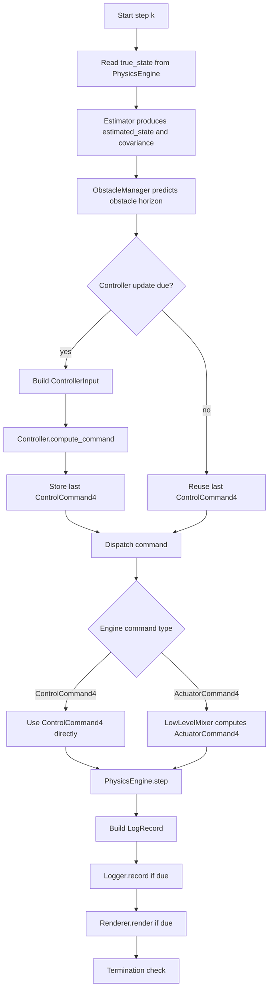
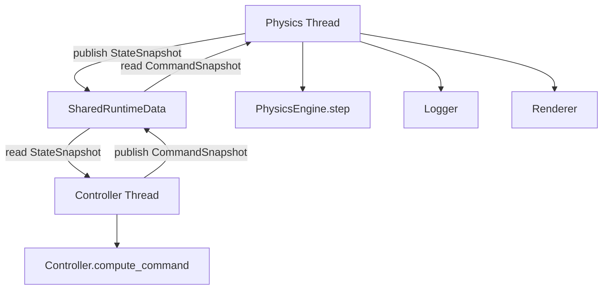

# ADR-002: Single-Thread Runtime vs MPC Thread

> Status: Proposed
> Date: 2026-06-28
> Project: Quadrotor CC-MPC Simulation
> Related documents:
>
> * `docs/design/03_RUNTIME_FLOW.md`
> * `docs/design/04_DATA_MODEL.md`
> * `docs/design/05_ENGINE_INTERFACE.md`
> * `docs/design/06_CONTROLLER_INTERFACE.md`
> * `docs/design/ADR/ADR-001-engine-abstraction.md`
> * `docs/design/ADR/ADR-003-state-vector-definition.md`
> * `docs/design/ADR/ADR-004-control-command-definition.md`

---

## 1. Context

The quadrotor CC-MPC simulation must coordinate two time-sensitive processes:

```text id="6na3wd"
physics stepping
MPC solving
```

The physics engine may need to step at a relatively high rate.

Examples:

```text id="hzp71b"
ODE simulation timestep: 0.01 s to 0.06 s
MuJoCo internal timestep: often smaller than simulation timestep
MPC/controller timestep: typically around 0.06 s
```

The MPC controller solves an optimization problem over a finite horizon. It may take non-negligible time compared with the controller period.

There are two possible runtime architectures:

```text id="hfrpoj"
Option A: deterministic single-thread runtime
Option B: threaded runtime with separate MPC thread
```

The current MuJoCo-style demo uses a threaded pattern:

```text id="wt92ff"
main thread: MuJoCo physics step + render
MPC thread: CC-MPC solve loop
shared data: state, command, trajectory, timing
```

This can improve visual responsiveness and better resemble real robotic systems, but it introduces concurrency risks:

```text id="wouo4g"
stale state
stale command
race condition
partially updated state vector
harder debugging
non-deterministic replay
timestamp mismatch
delayed control application
```

For an academic refactor, the project needs a formal decision on which runtime mode is the reference architecture.

---

## 2. Decision

The refactored simulation shall use **deterministic single-thread runtime** as the reference mode.

Threaded MPC runtime may be supported later as an optional advanced mode, but it shall not be the default runtime for:

```text id="88gc1n"
debugging
regression testing
paper-style experiments
CSV generation
validation
reproducibility
```

The default runtime mode shall be:

```yaml id="ybdl79"
runtime:
  mode: deterministic_single_thread
```

Threaded runtime shall be explicitly configured:

```yaml id="b1cxdf"
runtime:
  mode: threaded_mpc
```

The single-thread runtime is the normative architecture.

The threaded runtime is an optional extension.

---

## 3. Rationale

The project is currently in a refactor and validation phase.

The top priority is:

```text id="zpt5ef"
correctness
traceability
debuggability
reproducibility
clear data flow
```

not maximum wall-clock real-time performance.

A deterministic single-thread runtime makes it easier to answer:

```text id="8h3i1a"
Which state did the controller receive?
Which command did it return?
Which command was applied to physics?
Which state resulted from that command?
Which row in the log corresponds to this step?
Did the failure come from controller, mixer, engine, or logger?
```

A threaded MPC runtime is useful later, especially for real-time visualization and realistic deployment experiments, but it should be introduced only after the deterministic runtime is correct and tested.

---

## 4. Options Considered

---

## 4.1 Option A: Deterministic single-thread runtime

In this option, physics stepping and controller solving occur in one ordered loop.

Reference order:

```text id="8v7z10"
1. read true_state
2. estimate state
3. predict obstacles
4. run controller if due
5. dispatch command
6. step physics
7. log
8. render if due
9. check termination
```

Example:

```text id="120y1k"
true_state
-> estimated_state
-> controller
-> ControlCommand4
-> mixer if needed
-> applied_command
-> PhysicsEngine.step()
-> next true_state
-> log
```

### Advantages

```text id="bmncjb"
deterministic execution order
easy to debug
easy to reproduce
easy to test
no race condition
no stale state unless deliberately modeled
logs are easier to interpret
controller and physics timestamps are aligned
simpler failure attribution
```

### Disadvantages

```text id="sd8u13"
controller solve blocks physics stepping
viewer may pause while MPC solves
less realistic than asynchronous robotic systems
not ideal for wall-clock real-time visualization
cannot exploit parallel CPU cores
```

---

## 4.2 Option B: Threaded runtime with MPC thread

In this option, physics/rendering and MPC solving run in separate threads.

Typical structure:

```text id="knvftj"
main thread:
    physics step
    render
    publish true_state
    read latest command

MPC thread:
    read latest state snapshot
    solve MPC
    publish latest command
```

### Advantages

```text id="o7z88i"
physics/render loop can keep running while MPC solves
closer to real robotic systems
better for real-time viewer mode
can use latest available command asynchronously
can hide solver latency
```

### Disadvantages

```text id="93kx8t"
requires shared data synchronization
state read by MPC may be stale
command applied by physics may be stale
logs must include separate state and command timestamps
race conditions are possible
debugging is harder
results may be less reproducible
controller delay compensation becomes necessary
```

---

## 4.3 Option C: Hybrid runtime

In this option, the project supports both:

```text id="jmha43"
deterministic_single_thread
threaded_mpc
```

The single-thread version is the reference implementation.

The threaded version is optional and must preserve the same public interfaces.

Decision: Accepted as long-term direction.

---

## 5. Final Decision

The project shall adopt Option C with the following priority:

```text id="n04dab"
1. deterministic_single_thread is the reference runtime
2. threaded_mpc is optional
3. all validation and regression tests target deterministic_single_thread first
4. threaded_mpc must be implemented using the same data contracts
5. threaded_mpc must include timestamping and stale-data diagnostics
```

The default runtime shall be:

```text id="x1uvmh"
deterministic_single_thread
```

The optional threaded runtime shall not change:

```text id="gwpqjy"
ControllerInput
ControllerOutput
PhysicsEngine
State9
ControlCommand4
ActuatorCommand4
LogRecord
```

---

## 6. Normative Single-Thread Flow

The deterministic single-thread runtime shall follow this order.



---

## 7. Single-Thread Timing Policy

The runtime shall support different update rates.

Recommended config:

```yaml id="f4zm56"
runtime:
  sim_dt: 0.01
  controller_dt: 0.06
  render_dt: 0.03
  log_dt: 0.01
```

The controller shall run when:

```text id="4faumw"
step_index % controller_period_steps == 0
```

where:

```text id="b1ywsi"
controller_period_steps = round(controller_dt / sim_dt)
```

Between controller updates, the runtime shall use zero-order hold:

```text id="cz5cmb"
last_control_command is reused until the next controller solve
```

For MuJoCo actuator-level simulation, the mixer may be called every physics step using the held `ControlCommand4`.

---

## 8. Single-Thread Pseudocode

```python id="a9al6z"
def run_single_thread(config: AppConfig) -> RunSummary:
    engine = create_physics_engine(config.engine)
    controller = create_controller(config.controller)
    estimator = create_estimator(config.estimator)
    obstacle_manager = create_obstacle_manager(config.scenario.obstacles)
    mixer = create_mixer(config.mixer) if engine_requires_mixer(engine) else None
    logger = create_logger(config.logging)
    renderer = create_renderer(config.rendering)

    engine.reset(config.scenario.initial_state)
    controller.reset()
    logger.start_run(config)

    previous_true_state = engine.get_state()
    last_control_command = ControlCommand4.zeros()
    last_controller_output = None

    for step_index in range(config.runtime.max_steps):
        current_time = engine.get_time()

        true_state = engine.get_state()

        estimated_state, covariance = estimator.estimate(
            true_state=true_state,
            time=current_time,
        )

        obstacle_predictions = obstacle_manager.predict_horizon(
            time=current_time,
            horizon_steps=config.controller.horizon_steps,
            dt=config.controller.timestep,
        )

        if controller_due(step_index, config.runtime):
            controller_input = ControllerInput(
                time=current_time,
                estimated_state=estimated_state,
                goal=config.scenario.goal,
                covariance=covariance,
                obstacle_predictions=obstacle_predictions,
                previous_solution=last_controller_output,
                reference_trajectory=None,
                config=config.controller,
            )

            last_controller_output = controller.compute_command(controller_input)
            last_control_command = last_controller_output.command

        applied_command = dispatch_command(
            control_command=last_control_command,
            engine=engine,
            mixer=mixer,
            true_state=true_state,
            previous_true_state=previous_true_state,
            dt=config.runtime.sim_dt,
        )

        step_result = engine.step(
            command=applied_command,
            dt=config.runtime.sim_dt,
        )

        log_record = build_log_record(
            step_index=step_index,
            time=step_result.time,
            true_state=step_result.true_state,
            estimated_state=estimated_state,
            control_command=last_control_command,
            applied_command=applied_command,
            controller_output=last_controller_output,
            step_result=step_result,
        )

        if logging_due(step_index, config.runtime):
            logger.record(log_record)

        if renderer.enabled and render_due(step_index, config.runtime):
            renderer.render(log_record)

        termination_status = check_termination(
            step_result=step_result,
            controller_output=last_controller_output,
            scenario=config.scenario,
        )

        if termination_status.done:
            break

        previous_true_state = step_result.true_state

    logger.finish_run()
    engine.close()
    renderer.close()

    return build_run_summary()
```

---

## 9. Optional Threaded Runtime Flow

The optional threaded runtime may use two primary threads:

```text id="0z7c65"
physics thread
controller thread
```

Optional third thread:

```text id="biv1yt"
render thread
```

Reference structure:



Threaded runtime shall not change controller or engine public interfaces.

---

## 10. Shared Runtime Data

Threaded runtime shall use explicit shared data structures.

Recommended data type:

```python id="yy3xf3"
@dataclass
class StateSnapshot:
    state: State9
    covariance: Gamma9x9 | None
    time: float
    step_index: int
    sequence_id: int
```

```python id="0aoq86"
@dataclass
class CommandSnapshot:
    command: ControlCommand4
    controller_output: ControllerOutput | None
    computed_at_time: float
    state_sequence_id: int
    solve_time_ms: float | None
    sequence_id: int
```

```python id="frhrqd"
@dataclass
class SharedRuntimeData:
    lock: threading.Lock
    latest_state: StateSnapshot
    latest_command: CommandSnapshot
    is_active: bool
    termination_requested: bool
```

---

## 11. Shared Data Rules

Threaded runtime shall follow these rules:

```text id="dbk3fa"
all shared writes must be atomic
all shared reads must return a self-consistent snapshot
no thread may mutate a snapshot after publishing it
state and command snapshots must carry timestamps
state and command snapshots must carry sequence ids
command must record which state sequence it was computed from
```

A controller thread shall never read a partially updated `State9`.

A physics thread shall never read a partially updated `ControlCommand4`.

---

## 12. Threaded Physics Thread

Physics thread responsibilities:

```text id="iss5bq"
read latest command snapshot
dispatch/mix command if needed
step physics engine
publish latest state snapshot
build log record
render if needed
check termination
```

Pseudocode:

```python id="nfowz9"
def physics_thread_loop(shared: SharedRuntimeData, config: AppConfig):
    while shared.is_active:
        with shared.lock:
            command_snapshot = copy_snapshot(shared.latest_command)

        applied_command = dispatch_command(
            control_command=command_snapshot.command,
            engine=engine,
            mixer=mixer,
            true_state=engine.get_state(),
            previous_true_state=previous_true_state,
            dt=config.runtime.sim_dt,
        )

        step_result = engine.step(applied_command, config.runtime.sim_dt)

        state_snapshot = StateSnapshot(
            state=step_result.true_state,
            covariance=None,
            time=step_result.time,
            step_index=step_index,
            sequence_id=next_state_sequence_id(),
        )

        with shared.lock:
            shared.latest_state = state_snapshot

        log_threaded_step(
            state_snapshot=state_snapshot,
            command_snapshot=command_snapshot,
            step_result=step_result,
        )
```

---

## 13. Threaded Controller Thread

Controller thread responsibilities:

```text id="z1k6uu"
read latest state snapshot
build ControllerInput
solve controller
publish latest command snapshot
report solve time
sleep or wait until next controller period
```

Pseudocode:

```python id="w9ondl"
def controller_thread_loop(shared: SharedRuntimeData, config: AppConfig):
    while shared.is_active:
        with shared.lock:
            state_snapshot = copy_snapshot(shared.latest_state)

        controller_input = build_controller_input_from_snapshot(
            state_snapshot=state_snapshot,
            config=config,
        )

        t_start = perf_counter()
        controller_output = controller.compute_command(controller_input)
        solve_time_ms = (perf_counter() - t_start) * 1000.0

        command_snapshot = CommandSnapshot(
            command=controller_output.command,
            controller_output=controller_output,
            computed_at_time=state_snapshot.time,
            state_sequence_id=state_snapshot.sequence_id,
            solve_time_ms=solve_time_ms,
            sequence_id=next_command_sequence_id(),
        )

        with shared.lock:
            shared.latest_command = command_snapshot

        sleep_until_next_controller_period()
```

---

## 14. Stale Data Policy

Threaded runtime must explicitly track stale data.

A command is stale if:

```text id="xp4d6l"
current_physics_time - command_snapshot.computed_at_time > max_command_age
```

Recommended fields in log:

```text id="ykgw5d"
state_time
command_time
command_age_ms
state_sequence_id
command_sequence_id
command_computed_from_state_sequence_id
controller_solve_time_ms
```

Recommended policy:

| Condition                | Action                   |
| ------------------------ | ------------------------ |
| command age within limit | apply command            |
| command slightly stale   | apply but warn           |
| command too stale        | use fallback command     |
| no command available     | use safe initial command |
| controller thread dead   | terminate or fallback    |

Initial recommended config:

```yaml id="ir15za"
runtime:
  threaded:
    max_command_age_ms: 120
    stale_command_policy: fallback
```

---

## 15. Delay Compensation Policy

Threaded runtime may use delay compensation.

Reason:

```text id="9em801"
The controller computes a command from a state snapshot that may be older than the time when the command is applied.
```

Possible policy:

```text id="yfnm20"
predict state forward by measured solve time
```

Example:

```text id="hyb6ge"
predicted_state = f_forward(state_snapshot, last_command, solve_time)
```

Delay compensation shall be explicit and logged.

Required diagnostics:

```text id="h5qi98"
delay_compensation_enabled
estimated_delay_ms
state_time
apply_time
prediction_model
```

No hidden delay compensation shall be applied without logging.

---

## 16. Logging Requirements for Threaded Runtime

Threaded runtime logs must include enough information to reconstruct timing.

Required extra fields:

```text id="shqk39"
runtime_mode
state_time
controller_input_time
command_publish_time
command_apply_time
state_sequence_id
command_sequence_id
command_age_ms
controller_solve_time_ms
stale_command_flag
delay_compensation_flag
```

Reason:

```text id="yp4mkk"
Without these fields, it is impossible to determine whether a bad trajectory was caused by the controller, engine, or asynchronous timing.
```

---

## 17. Determinism Requirements

### 17.1 Single-thread mode

Single-thread mode shall guarantee deterministic execution when:

```text id="61c8ev"
same config
same initial state
same scenario
same random seed
same solver settings
same Python/library versions
```

Expected output:

```text id="db5rf3"
same state trajectory
same command sequence
same log order
same termination reason
```

within numerical tolerance.

---

### 17.2 Threaded mode

Threaded mode does not guarantee bitwise identical execution because scheduling may vary.

Threaded mode shall instead guarantee:

```text id="9keq02"
snapshot consistency
no partial state reads
no partial command reads
explicit timestamps
explicit command age logging
safe termination
```

Threaded mode may be reproducible only under stricter scheduling constraints.

---

## 18. Runtime Mode Selection

Configuration:

```yaml id="gfb9sc"
runtime:
  mode: deterministic_single_thread
```

or:

```yaml id="xwdx45"
runtime:
  mode: threaded_mpc
```

Allowed values:

```python id="mxr1cw"
class RuntimeMode(str, Enum):
    DETERMINISTIC_SINGLE_THREAD = "deterministic_single_thread"
    THREADED_MPC = "threaded_mpc"
    REALTIME_VIEWER = "realtime_viewer"
```

Policy:

| Mode                          | Default? | Purpose                            |
| ----------------------------- | -------: | ---------------------------------- |
| `deterministic_single_thread` |      Yes | Testing, research, reproducibility |
| `realtime_viewer`             | Optional | Visual inspection                  |
| `threaded_mpc`                | Optional | Real-time/asynchronous experiments |

---

## 19. Error Handling

### 19.1 Single-thread errors

Single-thread runtime errors are handled synchronously.

Examples:

```text id="icvvz3"
controller failure
engine failure
mixer failure
logger failure
```

The runtime can attribute failures to a specific step and module.

---

### 19.2 Threaded runtime errors

Threaded runtime shall handle errors per thread.

Recommended shared error state:

```python id="n6zpyc"
@dataclass
class RuntimeThreadError:
    thread_name: str
    error_type: str
    message: str
    time: float
    recoverable: bool
```

If any critical thread fails:

```text id="19kfxf"
set shared.termination_requested = True
record thread error
stop all threads safely
finalize logs
```

---

## 20. Safety Policy

For both runtime modes, if no valid control command is available, the runtime shall use a safe fallback command.

Recommended default:

```text id="o6fm9q"
ControlCommand4 = [0, 0, 0, 0]
```

Alternative safe descent command may be configured:

```text id="496uqj"
ControlCommand4 = [0, 0, vz_descent, 0]
```

For threaded runtime, if command is too stale:

```text id="aohib2"
use fallback command
mark stale_command_flag = true
```

---

## 21. Consequences

### 21.1 Positive consequences

This decision provides:

```text id="x6vbud"
deterministic reference implementation
easier debugging
easier regression testing
clearer logs
lower risk during refactor
clean separation between reference mode and real-time mode
ability to add threaded runtime later
```

---

### 21.2 Negative consequences

This decision also means:

```text id="1fqfuk"
single-thread mode may pause physics while MPC solves
viewer may be less smooth
not fully representative of asynchronous robotics deployment
real-time performance evaluation requires optional threaded mode
```

These limitations are acceptable for the refactor phase.

---

## 22. Risks and Mitigations

### Risk 1: Single-thread mode hides real-time latency problems

Mitigation:

```text id="y3h9ey"
always log controller solve_time_ms
define controller deadline
run separate real-time tests after deterministic validation
```

---

### Risk 2: Threaded mode introduces race conditions

Mitigation:

```text id="aq2wg1"
use immutable snapshots
use locks for shared state
include sequence ids
include timestamps
test stale command behavior
```

---

### Risk 3: Results differ between runtime modes

Mitigation:

```text id="i1o2rd"
treat deterministic_single_thread as reference
compare threaded output against reference statistically
do not require exact equality for threaded mode
```

---

### Risk 4: Delay compensation becomes hidden logic

Mitigation:

```text id="3ctpx6"
delay compensation must be explicit
delay compensation must be configurable
delay compensation must be logged
```

---

## 23. Implementation Rules

### Rule 1: Reference mode first

All new controller, engine, mixer, logger, and scenario features shall work in deterministic single-thread mode first.

---

### Rule 2: Threaded mode uses same interfaces

Threaded runtime shall not introduce a different controller or engine API.

---

### Rule 3: Threaded mode uses snapshots

Threaded runtime shall exchange immutable snapshots, not raw mutable arrays.

---

### Rule 4: Threaded mode logs timing

Threaded logs shall include state time, command time, command age, and solve time.

---

### Rule 5: No hidden shared mutable state

All shared state shall be explicitly defined in `SharedRuntimeData`.

---

## 24. Migration Plan

### Phase 1: Implement deterministic runtime

Create:

```text id="b5p5l9"
simulation/runtime/loop.py
simulation/runtime/timing.py
simulation/runtime/dispatch.py
```

Implement:

```text id="rl0353"
run_single_thread()
dispatch_command()
controller_due()
logging_due()
render_due()
```

---

### Phase 2: Port ODE simulation to deterministic runtime

Replace script-specific ODE loop with:

```text id="b7h1ip"
SimulationRuntime + ODEPhysicsEngine
```

---

### Phase 3: Port MuJoCo headless simulation to deterministic runtime

Use:

```text id="y40qaw"
SimulationRuntime + MuJoCoPhysicsEngine + LowLevelMixer
```

No MPC thread yet.

---

### Phase 4: Add runtime tests

Add tests for:

```text id="tiiq02"
single-step ODE
single-step MuJoCo
controller due timing
zero-order hold
dispatch to mixer
log order
termination
```

---

### Phase 5: Add optional threaded runtime

Only after deterministic runtime passes tests, add:

```text id="r7hlo4"
run_threaded_mpc()
SharedRuntimeData
StateSnapshot
CommandSnapshot
threaded log fields
stale command policy
```

---

## 25. Required Tests

### 25.1 Single-thread tests

```text id="9j2cxy"
test_single_thread_step_order
test_single_thread_controller_due
test_single_thread_zero_order_hold
test_single_thread_ode_dispatch
test_single_thread_mujoco_dispatch_uses_mixer
test_single_thread_reproducibility_fixed_seed
test_single_thread_log_order
test_single_thread_termination_goal
```

---

### 25.2 Threaded tests

```text id="psba8u"
test_threaded_snapshot_atomicity
test_threaded_state_sequence_id_increments
test_threaded_command_sequence_id_increments
test_threaded_command_records_source_state_id
test_threaded_stale_command_detection
test_threaded_fallback_on_stale_command
test_threaded_shutdown_on_controller_error
test_threaded_shutdown_on_engine_error
```

---

### 25.3 Regression comparison tests

```text id="fozpeh"
test_threaded_final_goal_distance_close_to_single_thread
test_threaded_no_collision_if_single_thread_no_collision
test_threaded_command_age_logged
test_threaded_solve_time_logged
```

---

## 26. Acceptance Criteria

This ADR is accepted when:

1. `deterministic_single_thread` is defined as the reference runtime mode.
2. `threaded_mpc` is defined as optional.
3. Single-thread step order is documented.
4. Threaded shared data policy is documented.
5. Stale command policy is documented.
6. Delay compensation policy is explicit.
7. Threaded logging requirements are documented.
8. Runtime mode selection is config-driven.
9. Required tests are listed.
10. No controller or engine API changes are required between runtime modes.

---

## 27. Decision Summary

The project shall use:

```text id="1jjzc5"
deterministic_single_thread
```

as the reference runtime architecture.

The project may later support:

```text id="60nd0s"
threaded_mpc
```

as an optional runtime mode.

The single-thread mode is optimized for:

```text id="evhby6"
correctness
debugging
testing
reproducibility
academic validation
```

The threaded mode is optimized for:

```text id="gm51vq"
real-time visualization
asynchronous control experiments
deployment-like behavior
```

Both modes shall use the same canonical interfaces:

```text id="7esw07"
State9
ControlCommand4
ActuatorCommand4
ControllerInput
ControllerOutput
PhysicsEngine
StepResult
LogRecord
```

Threaded runtime shall not be introduced until the deterministic runtime is correct, tested, and reproducible.

---

## 28. Related Documents

```text id="dsbwn2"
docs/design/03_RUNTIME_FLOW.md
docs/design/04_DATA_MODEL.md
docs/design/05_ENGINE_INTERFACE.md
docs/design/06_CONTROLLER_INTERFACE.md
docs/design/08_LOGGING_AND_METRICS.md
docs/design/09_VALIDATION_PLAN.md
docs/design/ADR/ADR-001-engine-abstraction.md
docs/design/ADR/ADR-003-state-vector-definition.md
docs/design/ADR/ADR-004-control-command-definition.md
docs/theory/11_MPC.md
docs/theory/12_CCMPC.md
docs/theory/16_Optimization.md
docs/theory/17_Solver.md
docs/theory/18_Implementation_Notes.md
```
