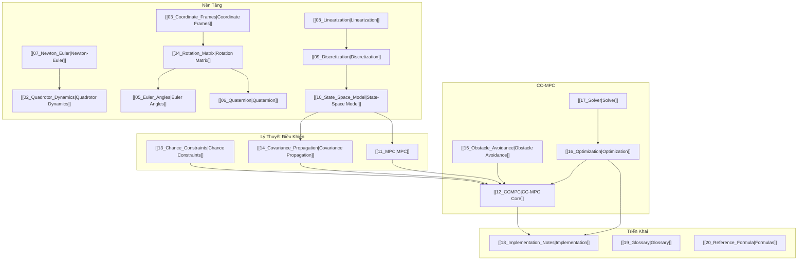

# Quadrotor Chance-Constrained MPC — Map of Content

> [!abstract] Nguồn chính
> - Zhu, H. & Alonso-Mora, J. (2019). *Chance-Constrained Collision Avoidance for MAVs in Dynamic Environments.* IEEE RA-L.
> - Lin, J., Zhu, H. & Alonso-Mora, J. (2020). *Robust Vision-based Obstacle Avoidance for MAVs.* IEEE ICRA.
> - Implementation: `quadrotor_ccmpc` (CVXPY + CLARABEL + MuJoCo)

---

## 📊 Dashboard

```dataview
TABLE chapter, phase, file.mtime as "Modified"
FROM "Theory"
WHERE chapter AND chapter != 0
SORT chapter ASC
```

---

## 🧭 Lộ Trình Đọc (Reading Roadmap)

### Giai Đoạn 1: Nền Tảng (Foundations)

```dataview
LIST WITHOUT ID "**Ch." + chapter + ":** [[" + file.name + "|" + title + "]]"
FROM "Theory"
WHERE phase = "foundations"
SORT chapter ASC
```

### Giai Đoạn 2: Lý Thuyết Điều Khiển (Control Theory)

```dataview
LIST WITHOUT ID "**Ch." + chapter + ":** [[" + file.name + "|" + title + "]]"
FROM "Theory"
WHERE phase = "control-theory"
SORT chapter ASC
```

### Giai Đoạn 3: Triển Khai (Implementation)

```dataview
LIST WITHOUT ID "**Ch." + chapter + ":** [[" + file.name + "|" + title + "]]"
FROM "Theory"
WHERE phase = "implementation"
SORT chapter ASC
```

### Giai Đoạn 4: Tham Khảo (Reference)

```dataview
LIST WITHOUT ID "**Ch." + chapter + ":** [[" + file.name + "|" + title + "]]"
FROM "Theory"
WHERE phase = "reference"
SORT chapter ASC
```

---

## 🔗 Sơ Đồ Kiến Thức (Knowledge Graph)



---

## 🏷️ Tags

```dataview
TABLE WITHOUT ID
    file.link AS "Chapter",
    join(tags, ", ") AS "Tags"
FROM "Theory"
WHERE chapter
SORT chapter ASC
```

---

## 📐 Công Thức Quan Trọng

| # | Công Thức | Chương |
|---|-----------|--------|
| F1 | $\mathbf{x}_{k+1} = \mathbf{f}(\mathbf{x}_k, \mathbf{u}_k) + \boldsymbol{\omega}_k$ | [[02_Quadrotor_Dynamics\|Ch.2]] |
| F2 | $\boldsymbol{\Gamma}_{k+1} = \mathbf{F}_k \boldsymbol{\Gamma}_k \mathbf{F}_k^T + \mathbf{Q}_k$ | [[14_Covariance_Propagation\|Ch.14]] |
| F3 | $\mathbb{P}(\mathbf{a}^T\mathbf{x} \leq b) \leq \delta \iff \mathbf{a}^T\hat{\mathbf{x}} - b \geq \text{erf}^{-1}(1-2\delta)\sqrt{2\mathbf{a}^T\boldsymbol{\Sigma}\mathbf{a}}$ | [[13_Chance_Constraints\|Ch.13]] |
| F4 | $\mathbf{n}_o^T\boldsymbol{\Omega}^{1/2}(\hat{\mathbf{p}} - \hat{\mathbf{p}}_o) - 1 \geq \text{erf}^{-1}(1-2\delta)\sqrt{...}$ | [[12_CCMPC\|Ch.12]] |
| F5 | $\dot{\mathbf{v}} = \mathbf{R}_Z(\psi)\begin{bmatrix} \tan\theta \\ -\tan\phi \end{bmatrix} g - k_D \mathbf{v}$ | [[02_Quadrotor_Dynamics\|Ch.2]] |
| F6 | $(a,b,c) = \frac{\sqrt{3}}{2}(l,w,h)$ | [[15_Obstacle_Avoidance\|Ch.15]] |
| F7 | $\boldsymbol{\Omega}_{io} = \mathbf{R}_o^T \text{diag}(\frac{1}{(a+r)^2}, \frac{1}{(b+r)^2}, \frac{1}{(c+r)^2})\mathbf{R}_o$ | [[15_Obstacle_Avoidance\|Ch.15]] |

---

## 📝 Ký Hiệu Chính

| Ký hiệu | Ý nghĩa | Chương |
|----------|---------|--------|
| $\mathbf{x}$ | State vector (9D) | [[02_Quadrotor_Dynamics\|Ch.2]] |
| $\mathbf{u}$ | Control input (4D) | [[02_Quadrotor_Dynamics\|Ch.2]] |
| $\phi, \theta, \psi$ | Roll, pitch, yaw | [[05_Euler_Angles\|Ch.5]] |
| $\hat{\mathbf{x}}$ | State mean (estimate) | [[10_State_Space_Model\|Ch.10]] |
| $\boldsymbol{\Gamma}$ | State covariance (9×9) | [[14_Covariance_Propagation\|Ch.14]] |
| $\boldsymbol{\Sigma}$ | Position covariance (3×3) | [[14_Covariance_Propagation\|Ch.14]] |
| $\delta$ | Collision probability threshold | [[13_Chance_Constraints\|Ch.13]] |
| $\boldsymbol{\Omega}$ | Collision matrix | [[15_Obstacle_Avoidance\|Ch.15]] |
| $\text{erf}^{-1}$ | Inverse error function | [[13_Chance_Constraints\|Ch.13]] |

---

## 📚 Tài Liệu Tham Khảo

1. Zhu, H. & Alonso-Mora, J. (2019). "Chance-Constrained Collision Avoidance for MAVs in Dynamic Environments." *IEEE RA-L*, 4(2), 776–783.

2. Lin, J., Zhu, H. & Alonso-Mora, J. (2020). "Robust Vision-based Obstacle Avoidance for MAVs in Dynamic Environments." *IEEE ICRA*, 2682–2688.

---

## 🔧 Verification Status

Tất cả 13/13 công thức đã được kiểm chứng bằng Python (`verify_formulas.py`):

- [x] Gaussian chance constraints (Lemmas 1 & 2)
- [x] Collision matrix computation
- [x] Covariance propagation
- [x] Full pipeline: detection → ellipsoid → CC constraint
- [x] Logistic collision cost
- [x] FOV constraints
- [x] Box-to-ellipsoid bounding
