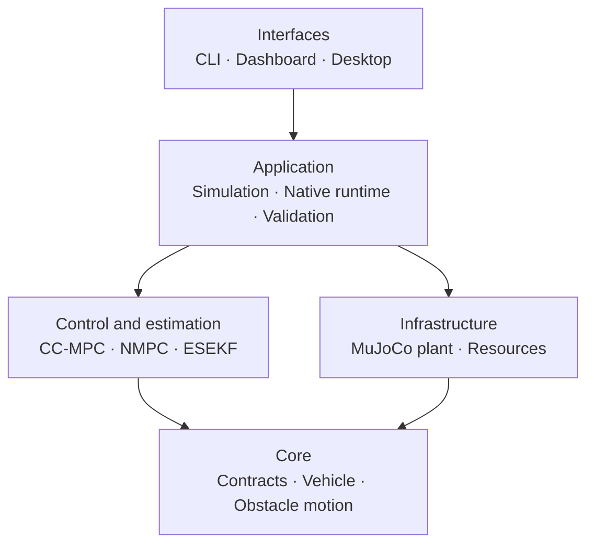

# Architecture

All executable Python code lives under the `quadrotor_mpc` package. The package
separates stable domain contracts, controller mathematics, estimation,
infrastructure adapters, application orchestration and user-facing interfaces.
The `2.Code` root contains only package-independent assets and project tooling.



The 9-state plant is the executable research baseline. The optional 13-state quaternion/MuJoCo
track is deliberately separate and is used to study model mismatch. Both must not be described as
the same physical model.

## Layer ownership

| Layer | Modules | Responsibility |
|---|---|---|
| Core | `quadrotor_mpc/core/` | belief/control contracts, vehicle parameters and shared obstacle motion |
| Control | `quadrotor_mpc/control/ccmpc/`, `control/nmpc/` | 9-state CC-MPC, quaternion NMPC, covariance, risk allocation and safety supervision |
| Estimation | `quadrotor_mpc/estimation/` | exact-truth adapter, seeded sensors, 12D ESEKF and obstacle trackers |
| Infrastructure | `quadrotor_mpc/infrastructure/` | source/wheel resource resolution and the MuJoCo plant adapter |
| Application | `quadrotor_mpc/application/` | ODE and native closed loops, experiments, telemetry, replay and Monte Carlo validation |
| Reporting | `quadrotor_mpc/reporting/` | Plotly, Matplotlib and HTML report generation |
| Interfaces | `quadrotor_mpc/interfaces/` | six console adapters, Streamlit workbench, MuJoCo viewer and Qt panel |

The import rules are guarded by `tests/test_architecture.py`. Core cannot import
outer layers; control and estimation cannot import application or interfaces;
infrastructure cannot depend on presentation code. Package `__init__.py` files
remain lightweight so importing numerical helpers does not initialize do-mpc,
MuJoCo, Qt or Streamlit.

## Package map

```text
quadrotor_mpc/
├── core/                   stable contracts and domain values
├── control/
│   ├── ccmpc/              9-state QP/CC-MPC mathematics
│   └── nmpc/               native quaternion NMPC and safety
├── estimation/             sensor simulation and belief estimation
├── infrastructure/
│   └── mujoco/             true-plant adapter
├── application/
│   ├── simulation/         ODE closed-loop use case
│   ├── native/             MuJoCo runtime, telemetry and replay
│   ├── experiments/        manifests, aggregation and sweeps
│   └── validation/         paired native Monte Carlo evidence
├── reporting/              figures and reports
└── interfaces/
    ├── cli/                console entry points
    ├── dashboard/          Streamlit workbench
    └── desktop/            MuJoCo viewer and Qt safety panel
```

The native viewer is connected through the `CoupledRuntime` lifecycle protocol.
It never owns the controller or advances physics, so closing/rendering the window
cannot create a second simulation path. `4.Reference` is not a production dependency.

The Qt panel runs in a child process because Qt and GLFW both have main-thread
event-loop requirements. Only plain command and telemetry dictionaries cross the
process boundary. The simulation process remains the sole owner of do-mpc and
MuJoCo state.

The Qt process also receives a read-only `PanelRuntimeContext` derived from the
validated effective configuration. It uses policy thresholds only to label
already-recorded telemetry; it cannot accept/reject a solution or send an
applied control command directly.

## Native controller boundary

`application/native/runtime.py` does not call `mpc.make_step` or read do-mpc
prediction data. It calls the backend-independent contract:

```python
controller.reset(vehicle_belief)
solution = controller.solve(vehicle_belief, obstacle_beliefs, goal, time_s)
```

The deterministic baseline creates zero-covariance beliefs from MuJoCo truth in
`estimation/truth.py`. The estimated configuration instead routes truth through
the seeded sensor simulator, 12D vehicle error-state EKF and one 6D
constant-velocity tracker per obstacle in `estimation/native.py`. Both paths
produce the same controller contract without changing runtime signatures.

With Stage 3 enabled, the controller linearizes a shifted nominal quaternion
trajectory in the 12D local-error chart and returns vehicle and obstacle
covariance horizons. Stage 4 can project these arrays onto collision normals and
tighten time-varying spherical safety radii. Stage 5 allocates either legacy
individual risk or a uniform joint budget over the complete constraint grid.
Stage 6 wraps the controller output with solver, residual, slack, bound and
deadline gates before choosing primary NMPC or a bounded fallback command.
Stage 7 projects the resulting telemetry through an immutable presentation
model before Qt renders status cards, bounded plots and transition alerts.
Stage 8 executes that complete headless path over paired seeds and covariance
levels, then applies finite-sample, slack, fallback, risk-accounting and timing
gates to auditable trial records.
Disabling chance constraints and the supervisor keeps the deterministic path
unchanged.

All obstacle centers are TVPs in the native NMPC model. Geometry and obstacle
count define the compiled NLP; estimated mean trajectories can change at every
control tick without rebuilding it.
