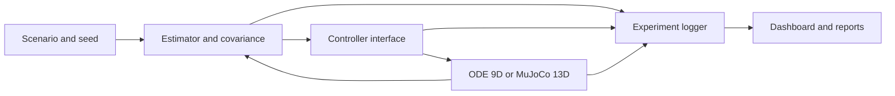

# Architecture

The workbench separates the controller model, true plant, estimator and experiment layer.

The 9-state plant is the executable research baseline. The optional 13-state quaternion/MuJoCo
track is deliberately separate and is used to study model mismatch. Both must not be described as
the same physical model.

Core ownership:

| Layer | Modules | Responsibility |
|---|---|---|
| Mathematics | `ccmpc/` | dynamics, uncertainty, ellipsoid risk and QP |
| Runtime | `simulation/` | controller adapter, plant loop, metrics and static report |
| Experiments | `experiments/` | run identity, manifest, paired statistics and sweeps |
| Reporting | `reporting/` | interactive Plotly figures and HTML |
| UI | `dashboard/` | Learn, Run, Compare and Explore workflows |
| Native MuJoCo | `mujoco_plant.py`, `mujoco_native.py` | sourced Crazyflie plant and passive desktop viewer |
| Native interaction | `runtime_control.py`, `native_desktop_panel.py` | command queue and separate Qt telemetry process |
| Native evidence | `native_telemetry.py`, `native_replay.py` | bounded data, recording bundle and solver-free replay |
| Obstacle motion | `obstacle_motion.py` | one predictor shared by controller, plant, metrics and viewer |

Dependencies point inward: UI and reporting consume experiment/runtime data; the mathematics layer
does not depend on the dashboard.

The native viewer is connected through the `CoupledRuntime` lifecycle protocol.
It never owns the controller or advances physics, so closing/rendering the window
cannot create a second simulation path. `4.Reference` is not a production dependency.

The Qt panel runs in a child process because Qt and GLFW both have main-thread
event-loop requirements. Only plain command and telemetry dictionaries cross the
process boundary. The simulation process remains the sole owner of do-mpc and
MuJoCo state.
