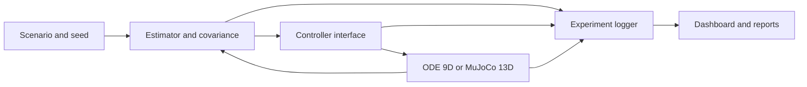

# Architecture

The workbench separates the controller model, true plant, estimator and experiment layer.

The 9-state plant is the executable research baseline. The optional 13-state quaternion/MuJoCo
track is deliberately separate and is used to study model mismatch. Both must not be described as
the same physical model.

Core ownership:

| Layer | Modules | Responsibility |
|---|---|---|
| Mathematics | `ccmpc/` | dynamics, uncertainty, ellipsoid risk and QP |
| Runtime | `simulation/` | controller adapter, plant loop, metrics and static report |
| Experiments | `experiments/` | run identity, manifest, paired statistics and sweeps |
| Reporting | `reporting/` | interactive Plotly figures and HTML |
| UI | `dashboard/` | Learn, Run, Compare and Explore workflows |

Dependencies point inward: UI and reporting consume experiment/runtime data; the mathematics layer
does not depend on the dashboard.
