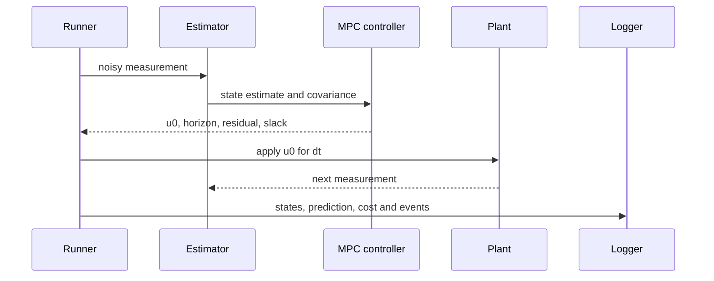

# Closed-loop flow

At every plant step the runner propagates the true state and covariance. At controller ticks it
also solves a new finite-horizon problem and applies only the first command.

The update interval of the controller may differ from the plant integration step. Solver deadline
misses are recorded against the controller interval, not the plant step.
