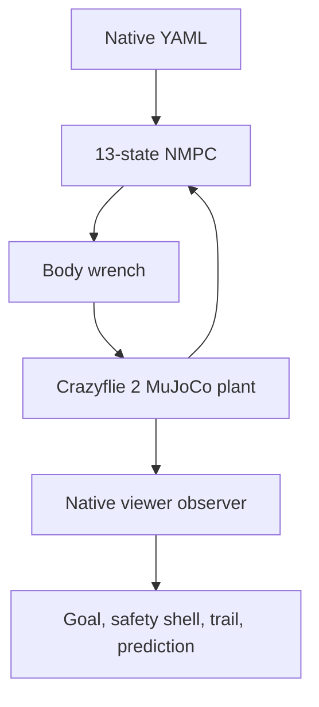

# Native MuJoCo Viewer

`run_mujoco_native.py` opens the production 13-state NMPC/MuJoCo track in a
desktop MuJoCo window. The viewer is an observer: `run_coupled.py` remains the
only owner of controller execution and physics stepping.

## Model provenance

The production plant uses the
[Bitcraze Crazyflie 2 model from Google DeepMind MuJoCo Menagerie](https://github.com/google-deepmind/mujoco_menagerie/tree/main/bitcraze_crazyflie_2),
vendored at commit `71f066ad0be9cd271f7ed58c030243ef157af9f4` under
`models/bitcraze_crazyflie_2/`. The upstream MIT license is preserved.

The upstream model supplies:

| Quantity | Value |
|---|---:|
| Mass | `0.027 kg` |
| $I_{xx}$ | `2.3951e-5 kg m^2` |
| $I_{yy}$ | `2.3951e-5 kg m^2` |
| $I_{zz}$ | `3.2347e-5 kg m^2` |
| Hover thrust | `0.26487 N` |
| Upstream maximum combined thrust | `0.35 N` |

The workbench loads the upstream MJCF and meshes unchanged through MuJoCo's
virtual file system, then adds a separate ground, goal and obstacle scene. The
old box-and-sphere `models/quadrotor.xml` was removed because it duplicated the
reference model without trustworthy vehicle provenance.

Upstream explicitly says that its body-moment `ctrlrange` values are arbitrary.
Therefore `vehicle.py` distinguishes sourced mass/inertia from conservative
workbench torque assumptions. Results must not present the latter as measured
Crazyflie actuator limits.

## Runtime architecture



No production module imports code from `4.Reference`. That directory is only a
behavioral reference for the desired desktop experience.

## Install and run on Linux

```bash
cd 2.Code
python3 -m venv .venv
source .venv/bin/activate
python -m pip install -r requirements-ui.txt

MUJOCO_GL=glfw python run_mujoco_native.py
```

Validate the YAML without opening a window:

```bash
python run_mujoco_native.py --validate-config
```

Useful overrides:

```bash
python run_mujoco_native.py --camera fixed
python run_mujoco_native.py --realtime-factor 0
python run_mujoco_native.py --no-trail --no-prediction
python run_mujoco_native.py --show-contacts
```

Closing the native window cleanly terminates the control loop. The result reports
one of `completed`, `goal_reached`, `collision` or `viewer_closed`.

## Configuration

The default file is `config/mujoco_native.yaml`. It defines:

- initial position and attitude;
- goal position and attitude;
- actuator bounds and safety margin;
- MPC and MuJoCo timesteps;
- horizon, solver iterations and stop conditions;
- camera, real-time pacing and overlays;
- static spheres and sinusoidally moving spheres.

The orange transparent shell is the controller safety envelope
`obstacle radius + margin + vehicle collision radius`. The solid obstacle is the
actual contact geometry. Blue is the executed trail and green is the most recent
NMPC predicted position horizon.

## Current fidelity boundary

The model is a sourced rigid body with detailed visual/collision meshes, but the
control interface remains a combined body wrench. It does not yet model:

- four motor electrical dynamics;
- individual rotor RPM, thrust coefficient and drag coefficient;
- propeller gyroscopic moments, induced flow or ground effect;
- battery voltage sag;
- sensor latency and bias in the optional 13-state track.

FOV and covariance are intentionally not drawn in this viewer because the
13-state NMPC pipeline does not currently produce those quantities. They belong
to the separate 9-state CC-MPC research baseline and must not be fabricated as
viewer-only graphics.
