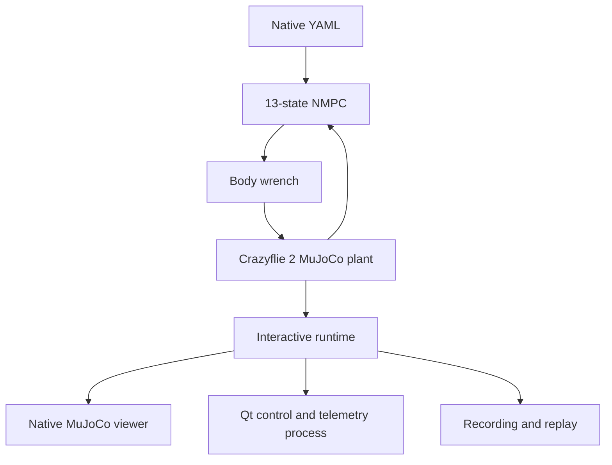

# Native MuJoCo Viewer

`run_mujoco_native.py` opens the production 13-state NMPC/MuJoCo track in a
desktop MuJoCo window. The viewer is an observer: `run_coupled.py` remains the
only owner of controller execution and physics stepping.

## Model provenance

The production plant uses the
[Bitcraze Crazyflie 2 model from Google DeepMind MuJoCo Menagerie](https://github.com/google-deepmind/mujoco_menagerie/tree/main/bitcraze_crazyflie_2),
vendored at commit `71f066ad0be9cd271f7ed58c030243ef157af9f4` under
`models/bitcraze_crazyflie_2/`. The upstream MIT license is preserved.

The upstream model supplies:

| Quantity | Value |
|---|---:|
| Mass | `0.027 kg` |
| $I_{xx}$ | `2.3951e-5 kg m^2` |
| $I_{yy}$ | `2.3951e-5 kg m^2` |
| $I_{zz}$ | `3.2347e-5 kg m^2` |
| Hover thrust | `0.26487 N` |
| Upstream maximum combined thrust | `0.35 N` |

The workbench loads the upstream MJCF and meshes unchanged through MuJoCo's
virtual file system, then adds a separate ground, goal and obstacle scene. The
old box-and-sphere `models/quadrotor.xml` was removed because it duplicated the
reference model without trustworthy vehicle provenance.

Upstream explicitly says that its body-moment `ctrlrange` values are arbitrary.
Therefore `vehicle.py` distinguishes sourced mass/inertia from conservative
workbench torque assumptions. Results must not present the latter as measured
Crazyflie actuator limits.

## Runtime architecture



No production module imports code from `4.Reference`. That directory is only a
behavioral reference for the desired desktop experience.

## Install and run on Linux

```bash
cd 2.Code
python3 -m venv .venv
source .venv/bin/activate
python -m pip install -r requirements-ui.txt

MUJOCO_GL=glfw python run_mujoco_native.py
```

On minimal Debian/Ubuntu installations, Qt/GLFW may also require the system
OpenGL/XCB runtime packages:

```bash
sudo apt install libgl1 libegl1 libxcb-cursor0 libxkbcommon-x11-0
```

Run the dynamic crossing scenario:

```bash
MUJOCO_GL=glfw python run_mujoco_native.py \
  --config config/mujoco_native_dynamic.yaml
```

Validate the YAML without opening a window:

```bash
python run_mujoco_native.py --validate-config
```

Useful overrides:

```bash
python run_mujoco_native.py --camera fixed
python run_mujoco_native.py --realtime-factor 0
python run_mujoco_native.py --no-trail --no-prediction
python run_mujoco_native.py --show-contacts
python run_mujoco_native.py --no-panel
python run_mujoco_native.py --no-record
```

Closing the native window cleanly terminates the control loop. In interactive
mode, reaching the goal, a configured collision stop, or the scenario duration
puts the simulation into a held `COMPLETED` state instead of closing either
window. The process exits only after Stop/Esc or window close. Headless runs
still terminate automatically for batch and Monte Carlo workflows.

## Interactive controls

The MuJoCo window and Qt panel send commands through the same queue. Commands
are processed only by `run_coupled.py`; neither UI is allowed to advance physics.

| Keyboard | Panel | Action |
|---|---|---|
| `Space` | Pause / Resume | Toggle the controller/plant loop |
| `N` | Step | Execute exactly one MPC tick while paused |
| `R` | Reset | Reset plant, controller history, clock and current telemetry |
| `Enter` | Run again | Reset the complete episode and immediately resume |
| `Esc` | Stop | End the run cleanly |
| `S` | Snapshot | Write the latest telemetry sample into the run bundle |
| `T` | Trail | Toggle the executed path |
| `P` | MPC prediction | Toggle the predicted vehicle horizon |
| `C` | Safety shells | Toggle obstacle safety envelopes |
| `F` | Follow camera | Toggle follow/fixed camera |

The panel plots position, goal error, clearance, control input and measured NMPC
solve time. Its history is bounded and updates at a lower rate than MuJoCo, so it
does not retain an unbounded session or redraw at the 500 Hz physics rate.
After `COMPLETED`, press **Run again** to repeat the same scenario without
restarting Python. **Reset** preserves the current pause/run mode, while
**Run again** always resumes.

## Configuration

The default file is `config/mujoco_native.yaml`. It defines:

- initial position and attitude;
- goal position and attitude;
- actuator bounds and safety margin;
- MPC and MuJoCo timesteps;
- horizon, solver iterations and stop conditions;
- camera, real-time pacing and overlays;
- static spheres and dynamic obstacle motion;
- control-panel update/history options;
- recording directory and buffer limit.

The orange transparent shell is the controller safety envelope
`obstacle radius + margin + vehicle collision radius`. The solid obstacle is the
actual contact geometry. Blue is the executed trail and green is the most recent
NMPC predicted position horizon.

### Dynamic obstacle schema

All motion is evaluated by `obstacle_motion.py`, which is shared by NMPC TVPs,
MuJoCo mocap bodies, clearance metrics and viewer overlays. This prevents the
controller from predicting a different obstacle path than the plant uses.

Constant velocity:

```yaml
- name: crossing
  type: dynamic
  radius: 0.24
  motion:
    type: constant_velocity
    initial_position: [1.85, -0.80, 1.80]
    velocity: [0.0, 0.38, 0.0]
```

Three-axis sinusoid:

```yaml
- name: oscillating
  type: dynamic
  radius: 0.20
  motion:
    type: sinusoidal
    center: [2.35, 1.55, 2.10]
    amplitude: [0.0, 0.0, 0.45]
    period_s: 4.5
    phase_rad: 0.0
```

Piecewise-linear waypoints:

```yaml
- name: patrol
  type: dynamic
  radius: 0.20
  motion:
    type: waypoints
    repeat: true
    points:
      - {time_s: 0.0, position: [1.0, -0.5, 1.5]}
      - {time_s: 2.0, position: [1.0,  0.5, 1.5]}
      - {time_s: 4.0, position: [2.0,  0.5, 2.0]}
```

The older `amp`/`period` y-axis sinusoid remains accepted for backward
compatibility and is normalized at configuration load time.

## Recording and replay

An enabled run writes a self-contained directory under `outputs/native/`:

```text
<timestamp>_<scenario>/
├── scenario.yaml
├── summary.yaml
├── telemetry.csv
├── trajectory.npz
├── events.jsonl
└── snapshot-*.json
```

`telemetry.csv` is the portable analysis table. `trajectory.npz` preserves the
13-state trajectory, vehicle prediction and obstacle prediction as numeric arrays
with pickle disabled during replay. `events.jsonl` records pause, step, reset,
overlay and stop commands.

Replay does not call do-mpc/IPOPT:

```bash
MUJOCO_GL=glfw python run_mujoco_native.py \
  --replay outputs/native/<timestamp>_<scenario>
```

It reconstructs the effective scenario, drives the same Crazyflie MuJoCo model
through recorded states and feeds the recorded telemetry back into the panel.

## Current fidelity boundary

The model is a sourced rigid body with detailed visual/collision meshes, but the
control interface remains a combined body wrench. It does not yet model:

- four motor electrical dynamics;
- individual rotor RPM, thrust coefficient and drag coefficient;
- propeller gyroscopic moments, induced flow or ground effect;
- battery voltage sag;
- sensor latency and bias in the optional 13-state track.

FOV and covariance are intentionally not drawn in this viewer because the
13-state NMPC pipeline does not currently produce those quantities. They belong
to the separate 9-state CC-MPC research baseline and must not be fabricated as
viewer-only graphics.
