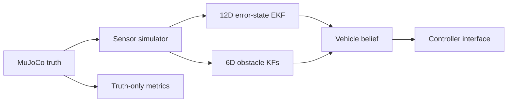

# Native sensor simulation and estimation

Stage 2 replaces the native controller's perfect-information input with a
seeded measurement and estimation pipeline while preserving the deterministic
baseline as an explicit configuration choice.

## Runtime boundary



The controller receives only `VehicleBelief` and `ObstacleBelief`. MuJoCo truth
is retained outside the controller for sensor generation, contact detection,
estimator error and validation metrics.

## Vehicle state and local error

The nominal state is:

```text
x = [p_world, v_world, q_wxyz, omega_body] ∈ R13
```

The covariance belongs to the local error:

```text
δx = [δp, δv, δtheta, δω] ∈ R12
P  ∈ R12x12
```

Attitude uses a right-multiplicative error:

```text
q_true = q_nominal (*) Exp(δtheta)
```

The ESEKF prediction propagates the nominal state with the same rigid-body RK4
model used by the deterministic controller. Its discrete error transition
matrix is evaluated by local-state finite perturbations around the current
nominal trajectory. White linear and angular acceleration noise generate the
discrete process covariance.

The simulated full-state measurement contains noisy position, velocity,
attitude and body angular rate. The measurement residual is formed directly in
the 12D tangent space. The update uses Joseph covariance form followed by a
small eigenvalue floor.

## Obstacle tracking

Each known obstacle identity has an independent constant-velocity Kalman filter:

```text
x_obs = [p_obs, v_obs] ∈ R6
```

Only world-frame position is measured. Velocity is inferred over time. The
mean obstacle horizon supplied to the controller is extrapolated from the
tracker state; it is not copied from the configured truth motion.

Data association, false positives, births and deaths are outside Stage 2. The
simulator preserves obstacle identity so this stage isolates state-estimation
and covariance behavior.

## Timing

At startup and after `Reset`/`Run again`:

1. reset the RNG to the configured seed;
2. generate forced noisy startup measurements;
3. initialize the vehicle ESEKF and obstacle KFs;
4. reset the controller with the resulting vehicle belief.

At each control tick:

1. solve from the current beliefs;
2. apply the command to MuJoCo;
3. predict both estimators with the elapsed control interval;
4. sample the new truth through the sensor simulator;
5. update filters for measurements that were not dropped;
6. expose the new beliefs to the next controller tick and telemetry.

This ordering prevents a measurement from the future from entering the command
that generated it.

## Configuration

Use the estimated dynamic scenario:

```bash
MUJOCO_GL=glfw python run_mujoco_native.py \
  --config config/mujoco_native_estimation.yaml
```

Relevant YAML:

```yaml
estimation:
  enabled: true
  type: error_state_ekf
  seed: 7
  sensor:
    position_std_m: 0.03
    velocity_std_mps: 0.06
    attitude_std_rad: 0.015
    angular_rate_std_radps: 0.02
    obstacle_position_std_m: 0.05
    vehicle_dropout_probability: 0.0
    obstacle_dropout_probability: 0.0
  vehicle_filter:
    acceleration_process_std_mps2: 0.35
    angular_acceleration_process_std_radps2: 0.60
  obstacle_filter:
    acceleration_process_std_mps2: 0.50
    initial_velocity_std_mps: 0.75
```

All bias random-walk standard deviations default to zero and can be enabled
independently. Dropout probabilities apply after startup.

`config/mujoco_native.yaml` and `config/mujoco_native_dynamic.yaml` keep
`estimation.enabled: false`; they remain exact deterministic regression
baselines.

## Recorded evidence

The native result and compressed trajectory include:

- estimated vehicle state;
- 12x12 vehicle error covariance;
- estimated obstacle states;
- 6x6 obstacle covariances;
- tracker-generated obstacle horizons;
- raw vehicle and obstacle measurements, with missing samples preserved;
- vehicle and per-obstacle measurement availability.

Truth and estimated states are recorded separately. Replay remains backward
compatible with Stage 1 bundles.

## Stage boundary

Stage 2 produces calibrated current-time beliefs. It does not yet propagate the
vehicle and obstacle covariance along the controller horizon. That propagation,
including feedback-aware alternatives, belongs to Stage 3.
